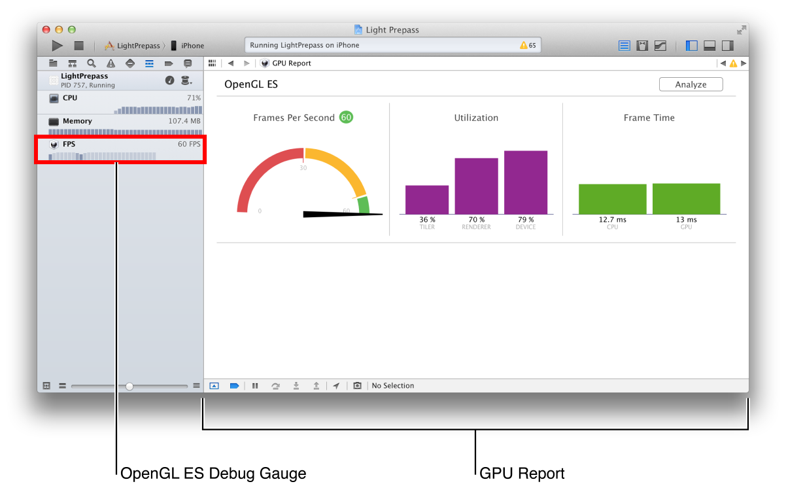
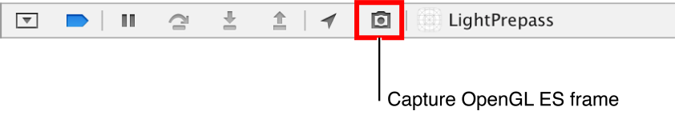

# Appendix B: Xcode OpenGL ES Tools Overview

OpenGL ES 애플리케이션을 디버깅, 분석 및 튜닝하는 Xcode 도구는 모든 개발 단계에서 유용하다. FPS 디버그 게이지와 GPU 보고서는 Xcode에서 실행할 때마다 앱의 GPU 성능을 요약하므로 렌더러를 설계하고 구축하면서 성능 문제를 신속하게 파악할 수 있다. 문제가 발생한 지점을 찾았으면 프레임을 캡처하고 Xcode의 OpenGL ES Frame Debugger 인터페이스를 사용하여 렌더링 문제를 정확히 파악하고 성능 문제를 해결하라.

Xcode OpenGL ES 기능을 효과적으로 사용하려면 Xcode의 디버깅 인터페이스에 어느 정도 익숙해야 한다. 백그라운드 정보는 _Xcode Overview_를 참조하라.

### Using the FPS Debug Gauge and GPU Report

Figure B-1에 표시된 FPS 디버그 게이지와 함께 제공되는 GPU 보고서는 실행 중에 앱의 OpenGL ES 성능을 개괄적으로 요약하여 제공한다. 앱을 개발할 때 이러한 디스플레이를 모니터링하면 성능 문제가 발생할 때 이를 발견하고 튜닝 작업에 집중할 위치를 고려할 수 있다.

**Figure B-1** FPS Debug Gauge and GPU Report

> **참고:** FPS 게이지 및 GPU 보고서의 일부 기능은 디스플레이 링크 타이머에 의존한다. [`CADisplayLink`](https://developer.apple.com/documentation/quartzcore/cadisplaylink) 또는 [`GLKViewController`](https://developer.apple.com/documentation/glkit/glkviewcontroller) 클래스를 사용하여 OpenGL ES 디스플레이를 애니메이션화하지 않으면 게이지 및 보고서는 목표 프레임 속도에 비해 성능을 표시하거나 정확한 CPU 프레임 시간 정보를 제공할 수 없다.

디버그 게이지 및 보고서에는 다음과 같은 디스플레이가 포함되어 있다:

* _FPS 게이지_. 앱의 현재 애니메이션 속도, 초당 프레임 수\(FPS\) 및 FPS 판독의 최근 기록을 표시하라. Xcode의 기본 편집기에 GPU 보고서를 표시하려면 이 게이지를 클릭하라.
* _초당 프레임_. 앱에서 설정한 목표 프레임 속도\(흔히 30 또는 60 FPS\)에 관련된 현재 프레임 속도를 표시한다. 파란색 호는 최근 FPS 판독 범위를 나타낸다.
* _Utilization._ 세 개의 막대를 표시하고, 앱이 GPU에서 서로 다른 처리 자원을 사용하는 것을 분해하고, 그래픽 하드웨어 사용에서 성능 병목 현상의 가능한 위치를 표시한다. Tile bar는 GPU의 기하학적 처리 자원의 사용을 측정한다. 높은 타일러 활용은 비효율적인 정점 셰이더 코드를 사용하거나 각 프레임마다 과도한 수의 정점 또는 프리미티브를 그리는 것과 같이 OpenGL ES 파이프라인의 정점 및 원시 처리 단계에서 성능 병목 현상을 나타낼 수 있다. 렌더러 바는 GPU의 픽셀 처리 자원의 사용을 측정한다. 렌더러 활용도가 높으면 색 혼합을 위해 비효율적인 프레그먼트 셰이더 코드를 사용하거나 각 프레임에 추가 프레그먼트를 처리하는 등 OpenGL ES 파이프라인의 프레그먼트 및 픽셀 처리 단계에서 성능 병목 현상을 나타낼 수 있다. 장치 표시줄은 tiler 및 렌더러 사용을 모두 포함하는 전체 GPU 사용량을 보여준다.
* 프레임 시간. CPU와 GPU 모두에서 각 프레임을 처리하는 데 소요되는 시간을 표시한다. 이 그래프는 앱이 CPU/GPU 병렬성을 효과적으로 사용하는지 여부를 나타낼 수 있다. 앱이 CPU 처리에 더 많은 시간을 할애할 경우 GPU로 작업을 이동하여 성능을 향상시킬 수 있을 것이다. 예를 들어, 각 프레임에 유사한 많은 `glDrawArrays` 또는 `glDrawElements` 호출이 필요한 경우 하드웨어 인스턴싱을 사용하여 CPU 오버헤드를 줄일 수 있다. \(자세한 내용은 [Use Instanced Drawing to Minimize Draw Calls](https://developer.apple.com/library/archive/documentation/3DDrawing/Conceptual/OpenGLES_ProgrammingGuide/Performance/Performance.html#//apple_ref/doc/uid/TP40008793-CH105-SW20)를 참조하라.\) 앱이 GPU 처리에 더 많은 시간을 할애할 경우 작업을 CPU로 이동하여 성능을 향상시킬 수 있다. 예를 들어, 셰이더가 특정 그리기 호출 중에 모든 정점 또는 프레그먼트에 대해 동일한 결과를 사용하여 동일한 계산을 수행하면 CPU에서 한 번 계산을 수행하고 그 결과를 균일한 변수의 셰이더에 전달할 수 있다. \([Use Uniforms or Constants Instead of Computing Values in a Shader](https://developer.apple.com/library/archive/documentation/3DDrawing/Conceptual/OpenGLES_ProgrammingGuide/BestPracticesforShaders/BestPracticesforShaders.html#//apple_ref/doc/uid/TP40008793-CH7-SW11) 참조.\)
* 프로그램 성능. 프레임 캡처 후\(아래 [Capturing and Analyzing an OpenGL ES Frame](https://developer.apple.com/library/archive/documentation/3DDrawing/Conceptual/OpenGLES_ProgrammingGuide/ToolsOverview/ToolsOverview.html#//apple_ref/doc/uid/TP40008793-A2-SW1) 참조\)에만 표시되며 캡처된 프레임을 렌더링하는 동안 각 셰이더 프로그램에서 소요된 시간을 밀리초 단위 및 전체 프레임 렌더링 시간의 백분율로 나타낸다. 프로그램에 대한 목록을 확장하면 해당 프로그램을 사용하여 작성된 그리기 호출과 각 프로그램에서 작성된 렌더링 시간 기여도가 표시된다. 보조 편집기에서 셰이더 소스 코드를 보려면 목록에서 프로그램을 선택하거나 그리기 호출 옆에 있는 화살표 아이콘을 눌러 프레임 탐색기에서 해당 호출을 선택하라\(아래 [Navigator Area](https://developer.apple.com/library/archive/documentation/3DDrawing/Conceptual/OpenGLES_ProgrammingGuide/ToolsOverview/ToolsOverview.html#//apple_ref/doc/uid/TP40008793-A2-SW2) 참조\).

> 참고: 프로그램 성능 뷰는 OpenGL ES 3.0을 지원하는 장치에서 디버깅할 때만 표시된다.\(앱에서 OpenGL ES 3.0 또는 2.0 컨텍스트를 사용하는지 여부와 관계 없이\)

앱을 튜닝할 때 이 그래프를 사용하여 최적화의 기회를 찾을 수 있다. 예를 들어 한 프로그램이 프레임 렌더링 시간의 50%를 차지하면 프레임 시간의 10%만 차지하는 프로그램의 속도를 향상시키는 것보다 최적화함으로써 더 많은 성능을 얻을 수 있다. 이 뷰는 셰이더 프로그램별로 프레임 시간을 구성하지만, 셰이더 알고리즘을 개선하는 것만이 앱의 성능을 최적화하는 유일한 방법이 아니라는 점만 기억하라. 예를 들어, 값비싼 셰이더 프로그램을 사용하는 그리기 호출 수 를 줄이거나 느린 프레그먼트 셰이더에 의해 처리되는 프레그먼트 수를 줄일 수 있다.

* 문제 & 해결책. Xcode가 프레임 캡처를 분석한 후에만 나타난다\([Capturing and Analyzing an OpenGL ES Frame](https://developer.apple.com/library/archive/documentation/3DDrawing/Conceptual/OpenGLES_ProgrammingGuide/ToolsOverview/ToolsOverview.html#//apple_ref/doc/uid/TP40008793-A2-SW1) 참조\) 이 영역은 성능 향상을 위한 분석 및 권장 사항 중에 발견된 가능한 문제를 나열한다.

캡처된 프레임에서 GLSL 셰이더 프로그램을 변경할 때\(아래 [Editing Shader Programs](https://developer.apple.com/library/archive/documentation/3DDrawing/Conceptual/OpenGLES_ProgrammingGuide/ToolsOverview/ToolsOverview.html#//apple_ref/doc/uid/TP40008793-A2-SW3) 참조\), 프레임 시간 및 프로그램 성능 그래프는 원래 캡처된 프레임의 기준 렌더링 시간과 편집된 셰이더를 사용한 현재 렌더링 시간을 모두 표시하도록 확장된다.

### Capturing and Analyzing an OpenGL ES Frame

앱의 OpenGL ES 사용법을 자세히 보려면 애니메이션의 단일 프레임을 렌더링하는 데 사용되는 OpenGL ES 명령 순서를 캡처하라. Xcode는 프레임 캡처를 시작할 수 있는 몇 가지 방법을 제공한다:

* Manual Capture. Xcode에서 앱을 실행하는 동안 디버그 바\(Figure B-2\)에서 카메라 아이콘을 클릭하거나 디버그 메뉴에서 OpenGL ES 프레임 캡처를 선택한다.

**Figure B-2**  Debug Bar with Capture OpenGL ES Frame button

> 참고: Capture OpenGL ES Frame 버튼은 프로젝트가 OpenGL ES 또는 Sprite Kit 프레임워크와 연결된 경우에만 자동으로 나타난다. 활성 스키마를 편집하여 다른 프로젝트에 표시할지 여부를 선택할 수 있다. \([About the Scheme Editing Dialog](http://help.apple.com/xcode) 참조\)

* _Breakpoint action._ 

