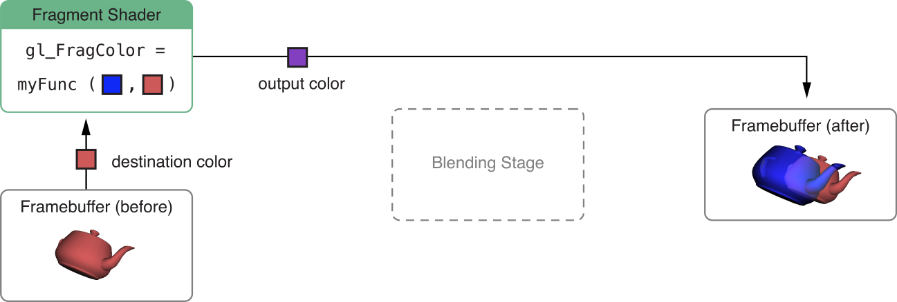

# Best Practices for Shaders

셰이더는 뛰어난 유연성을 제공하지만 너무 많은 계산을 수행하거나 비효율적으로 수행할 경우 심각한 병목 현상이 될 수도 있다.

### Compile and Link Shaders During Initialization

셰이더 프로그램을 만드는 것은 다른 OpenGL ES 상태 변화에 비해 비용이 많이 드는 작업이다. 프로그램이 초기화되면 프로그램을 컴파일, 링크 및 검증하라. 당신이 셰이더를 모두 만들었으면 앱은 `glUseProgram`을 호출하여 셰이더 사이를 효율적으로 전환할 수 있다.

#### Check for Shader Program Errors When Debugging

셰이더 프로그램을 컴파일하거나 링크한 후 진단 정보를 읽는 것은 앱의 릴리즈 빌드에서 필요하지 않으며 성능을 줄일 수 있다. Listing 10-1에 나온 것처럼, OpenGL ES 함수를 사용하여 앱 개발 빌드에서만 셰이더 컴파일 또는 링크 로그를 읽어라.

**Listing 10-1**  Read shader compile/link logs only in development builds

```text
// After calling glCompileShader, glLinkProgram, or similar
 
#ifdef DEBUG
// Check the status of the compile/link
glGetProgramiv(prog, GL_INFO_LOG_LENGTH, &logLen);
if(logLen > 0) {
    // Show any errors as appropriate
    glGetProgramInfoLog(prog, logLen, &logLen, log);
    fprintf(stderr, “Prog Info Log: %s\n”, log);
}
#endif
```

마찬가지로 glValidateProgram 함수는 개발 빌드에서만 호출 해야 한다. 셰이더 프로그램이 요구하는 모든 텐스처 유닛을 바인딩하지 못하는 등의 개발 오류를 찾기 위해 이 함수를 사용할 수 있다. 그러나 프로그램을 검증하면 전체 OpenGL ES 컨텍스트 상태와 대조되기 떄문에 비용이 많이 드는 작업이다. 프로그램 검증 결과는 개발 중에만 의미가 있으므로 앱 릴리즈 빌드에서 이 함수를 호출해서는 안 된다.

#### Use Separate Shader Objects to Speed Compilation and Linking

많은 OpenGL ES 앱은 여러 버텍스 및 프레그먼트 셰이더를 사용하며, 다른 프레그먼트 셰이더를 사용하거나 그 반대로 동일한 프레그먼트 셰이더를 재사용하는 것이 유용하다. 코어 OpenGL ES 사양은 버텍스와 버텍스 셰이더를 혼합하고 일치시키면 프로그램 수가 많아져 앱을 초기화할 때 전체 셰이더 컴파일 및 링크 시간이 증가한다.

iOS의 OpenGL ES 2.0 및 3.0 컨텍스트는 EXT\_separate\_shader\_objects 확장을 지원한다. 이 확장에서 제공하는 함수를 사용하여 버텍스 및 프레그먼트 셰이더를 별도로 컴파일하고 프로그램 파이프라인 객체를 사용하여 렌더링 시 사전 컴파일된 셰이더 단계를 혼합하여 일치시킬 수 있다. 또한 이 확장자는 Listing 10-2에 표시된 셰이더를 컴파일하고 사용하기 위한 간단한 인터페이스를 제공한다.

```text
- (void)loadShaders
{
    const GLchar *vertexSourceText = " ... vertex shader GLSL source code ... ";
    const GLchar *fragmentSourceText = " ... fragment shader GLSL source code ... ";
 
    // Compile and link the separate vertex shader program, then read its uniform variable locations
    _vertexProgram = glCreateShaderProgramvEXT(GL_VERTEX_SHADER, 1, &vertexSourceText);
    _uniformModelViewProjectionMatrix = glGetUniformLocation(_vertexProgram, "modelViewProjectionMatrix");
    _uniformNormalMatrix = glGetUniformLocation(_vertexProgram, "normalMatrix");
 
    // Compile and link the separate fragment shader program (which uses no uniform variables)
    _fragmentProgram =  glCreateShaderProgramvEXT(GL_FRAGMENT_SHADER, 1, &fragmentSourceText);
 
    // Construct a program pipeline object and configure it to use the shaders
    glGenProgramPipelinesEXT(1, &_ppo);
    glBindProgramPipelineEXT(_ppo);
    glUseProgramStagesEXT(_ppo, GL_VERTEX_SHADER_BIT_EXT, _vertexProgram);
    glUseProgramStagesEXT(_ppo, GL_FRAGMENT_SHADER_BIT_EXT, _fragmentProgram);
}
 
- (void)glkView:(GLKView *)view drawInRect:(CGRect)rect
{
    // Clear the framebuffer
    glClearColor(0.65f, 0.65f, 0.65f, 1.0f);
    glClear(GL_COLOR_BUFFER_BIT | GL_DEPTH_BUFFER_BIT);
 
    // Use the previously constructed program pipeline and set uniform contents in shader programs
    glBindProgramPipelineEXT(_ppo);
    glProgramUniformMatrix4fvEXT(_vertexProgram, _uniformModelViewProjectionMatrix, 1, 0, _modelViewProjectionMatrix.m);
    glProgramUniformMatrix3fvEXT(_vertexProgram, _uniformNormalMatrix, 1, 0, _normalMatrix.m);
 
    // Bind a VAO and render its contents
    glBindVertexArrayOES(_vertexArray);
    glDrawElements(GL_TRIANGLE_STRIP, _indexCount, GL_UNSIGNED_SHORT, 0);
}

```

### Respect the Hardware Limits on Shaders

OpenGL ES는 버텍스 또는 프레그먼트 셰이더에서 사용할 수 있는 각 변수 유형의 수를 제한한다. OpenGL ES 규격은 이러한 제한이 초과되었을 때 소프트웨어 폴백을 제공하기 위해 구현을 요구하지 않는다. 대신, 셰이더는 컴파일이나 링크에 실패한다. 앱을 개발할 때는 Listing 10-1과 같이 셰이더 컴파일 중에 오류가 발생하지 않도록 해야 한다.

### Use Precision Hints

임베디드 장치의 작은 하드웨어 한계와 일치하는 컴팩트 셰이더 변수의 필요성을 다루기 위해 GLSL ES 언어 규격에 정밀 힌트를 추가했다. 각 셰이더는 기본 정밀도를 지정해야 한다. 개별 셰이더 변수는 앱에서 해당 변수가 사용되는 방법에 대한 힌트를 컴파일러에 제공하기 위해 이 정밀도를 재정의할 수 있다. OpenGL ES 구현은 힌트 정보를 사용할 필요는 없지만, 보다 효율적인 셰이더를 생성하기 위해 구현될 수 있다. GLSL ES 사양에는 각 힌트의 범위와 정밀도가 열거되어 있다.

> **중요:** 정밀 힌트에 의해 정의된 범위 제한은 시행되지 않는다. 데이터가 이 범위에 고정되어 있다고 가정할 수 없다.

다음 지침을 따르라:

* 의심이 들 때, 고정밀도를 기본으로 하라.
* 0.0 ~ 1.0 범위의 색상은 일반적으로 저정밀 변수를 사용하여 나타낼 수 있다.
* 위치 데이터는 보통 높은 정밀도로 저장해야 한다.
* 조명 계산에 사용되는 정규 및 벡터는 보통 중간 정밀도로 저장할 수 있다.
* 정밀도를 낮춘 후 앱을 다시 테스트하여 예상한 결과가 맞는지 확인하라.

Listing 10-3은 기본 값을 고정밀 변수를 기본으로 하지만 더 높은 정밀도가 필요하지 않기 때문에 낮은 정밀도 변수를 사용하여 색상 출력을 계산한다.

**Listing 10-3** Low precision is acceptable for fragment color

```text
precision highp float; // Defines precision for float and float-derived (vector/matrix) types.
uniform lowp sampler2D sampler; // Texture2D() result is lowp.
varying lowp vec4 color;
varying vec2 texCoord;   // Uses default highp precision.
 
void main()
{
    gl_FragColor = color * texture2D(sampler, texCoord);
}
```

셰이더 변수의 실제 정밀도는 각 정밀도 수준에서 동작 성능처럼 iOS 장치마다 다를 수 있다. 장치별 고려사항은 [_iOS Device Compatibility Reference_](https://developer.apple.com/library/archive/documentation/DeviceInformation/Reference/iOSDeviceCompatibility/Introduction/Introduction.html#//apple_ref/doc/uid/TP40013599)를 참조하라.

### Perform Vector Calculations Lazily

모든 그래픽 프로세서에 벡터 프로세서가 포함되지는 않는다. 그들은 스칼라 프로세서에서 벡터 계산을 수행할 수 있다. 셰이더에서 계산을 수행할 때, 스칼라 프로세서에서 계산을 수행하더라도 계산이 효율적으로 수행되도록 작업 순서를 고려하라.

Listing 10-4의 코드가 벡터 프로세서에서 실행되었다면, 각각의 곱셈은 벡터의 네 가지 구성 요소 모두에 걸쳐 병렬로 실행될것이다. 그러나 괄호 위치 때문에 세 가지 파라미터 중 두 가지가 스칼라 값임에도 불구하고 스칼라 프로세서에서 동일한 작업을 수행하면 여덟 배가 소요된다.

**Listing 10-4**  Poor use of vector operators

```text
highp float f0, f1;
highp vec4 v0, v1;
v0 = (v1 * f0) * f1;
```

같은 계산은 Listing 10-5와 같이 괄호를 이동시켜 보다 효율적으로 수행할 수 있다. 이 예에서 스칼라 값은 먼저 함께 곱하고 결과는 벡터 파라미터에 대해 곱한다. 전체 연산은 다섯 번의 곱으로 계산할 수 있다.

**Listing 10-5**  Proper use of vector operations

```text
highp float f0, f1;
highp vec4 v0, v1;
v0 = v1 * (f0 * f1);
```

마찬가지로, 앱이 결과의 모든 구성요소를 사용하지 않는 경우 항상 벡터 연산을 위한 쓰기 마스크를 지정해야 한다. 스칼라 프로세서에서 마스크에 지정되지 않은 구성품에 대한 계산을 건너뛸 수 있다. Listing 10-6은 스칼라 프로세서에서 두 개의 구성 요소만 필요하도록 지정하기 때문에 두 배의 속도로 실행된다.

**Lisiting 10-6** Specifying a write mask

```text
highp vec4 v0;
highp vec4 v1;
highp vec4 v2;
v2.xz = v0 * v1;
```

### Use Uniforms or Constants Instead of Computing Values in a Shader

셰이더 외부에서 값을 계산할 수 있을 때마다 셰이더에 uniform 또는 상수로 전달하라. 동적 값을 계산하는 것은 잠재적으로 셰이더에서 매우 비쌀 수 있다.

#### Use Branching Instructions with Caution

3D 그래픽 프로세서에서 병렬로 작업을 실행할 수 있는 동작을 줄일 수 있기 때문에 셰이더에서 분기는 부족하다. \(이러한 성능 비용은 OpenGL ES 3.0 지원장치에서 절감되지만\)

완전히 분기하지 않으면 앱이 가장 잘 작동할 수 있다. 예를 들어, 많은 조건부 옵션이 있는 대형 셰이더를 만드는 대신 특정 렌더링 작업에 전문화된 작은 셰이더를 만든다. 셰이더의 가지 수를 줄이는 것과 셰이더 수를 늘리는 것 사이에는 상충이 있다. 다른 옵션을 테스트하고 가장 빠른 솔루션을 선택하라. 

셰이더가 브랜치를 사용해야 하는 경우 다음 권장 사항을 따르라:

* Best performance: Branch on a constant known when the shader is compiled.
* Acceptable: Branch on a uniform variable.
* Potentially slow: Branch on a value computed inside the shader.

#### Eliminate Loops

루프를 풀거나 벡터를 사용하여 작업을 수행함으로써 많은 루프를 제거할 수 있다. 예를 들어, 이 코드는 매우 비효율적이다:

```text
    int i;
    float f;
    vec4 v;
 
    for(i = 0; i < 4; i++)
        v[i] += f;
```

구성요소 추가 기능을 사용하여 동일한 작업을 직접 수행할 수 있다:

```text
    float f;
    vec4 v;
    v += f;
```

루프를 제거할 수 없을 때, 동적 분기를 피하기 위해 루프에 일정한 제한이 있는 것이 바람직하다.

#### Avoid Computing Array Indices in Shaders

셰이더에서 계산된 인덱스를 사용하는 것은 상수 또는 uniform 배열보다 더 비싸다. uniform 배열에 접근하는 것이 임시 배열에 접근하는 것보다 일반적으로 더 저렴하다.

### Fetch Framebuffer Data for Programmable Blending

전통적인 OpenGL 및 OpenGL ES 구현은 Figure 10-1에 구현된 고정-기능 블렌딩 단계를 제공한다. 그리기 호출을 발행하기 전에, 가능한 파라미터의 고정된 집합에서 블렌딩 작업을 지정하라. 당신의 프레그먼트 셰이더가 픽셀에 대한 컬러 데이터를 출력한 후, OpenGL ES 블렌딩 단계는 목적지 프레임버퍼에서 해당 픽세렝 대한 컬러 데이터를 읽은 다음, 지정된 블렌딩 동작에 따라 두 개를 결합하여 출력 컬러를 생성한다.

**Figure 10-1**  Traditional fixed-function blending


iOS 6.0 이상에서는 EXT\_shader\_framebuffer\_fetch 확장을 사용하여 프로그래밍 가능한 블렌딩 및 기타 효과를 구현할 수 있다. 당신의 프레그먼트 셰이더는 OpenGL ES에 의해 혼합될 소스 색상을 공급하는 대신 처리되고 있는 프레그먼트에 해당하는 대상 프레임버퍼의 내용을 읽는다. 그러면 Figure 10-2와 같이 프레그먼트 셰이더는 출력 색상을 생성하기 위해 선택한 알고리즘을 사용할 수 있다.

**Figure 10-2** Programmable blending with framebuffer fetch



이 확장을 통해 다음과 같은 여러 고급 렌더링 기법을 사용할 수 있다:

* _추가 블렌딩 모드_. 소스와 목적지 색상을 조합하는 자신만의 GLSL ES 함수를 정의함으로써 OpenGL ES 고정 함수 블렌딩 단계에서는 불가능한 블렌딩 모드를 구현할 수 있다. 예를 들어, Listing 10-8은 인기 그래픽 소프트웨어에서 찾을 수 있는 Overlay와 Difference 블렌딩 모드를 구현한다.
* _후-처리 효과_. 장면을 렌더링한 후 현재 프레그먼트 색상을 읽고 변환해 출력 색상을 생성하는 프레그먼트 셰이더를 사용하여 전체 화면 쿼드를 그릴 수 있다. Listing 10-9의 셰이더는 이 기술로 장면을 회색조로 변환한다.
* 무색 프레글먼트 작업. 프레임 버퍼는 무색 데이터를 포함할 수 있다. 예를 들어, 지연 셰이딩 알고리즘은 깊이 및 정규 정보를 저장하기 위해 여러 렌더 타겟을 사용한다. 프레그먼트 셰이더는 하나의 렌더 대상에서 이러한 데이터를 읽고 다른 렌더 대상에서 출력 색상을 생성하는 데 사용할 수 있다.

이러한 효과는 프레임 버퍼 가져오기 확장 없이 가능하다. 예를 들어, 회색조 변환은 장면을 텍스처로 렌더링한 다음, 그 텍스처를 사용하여 전체 화면 쿼드와 텍셀 색상을 회색조로 변환하는 프레그먼트 셰이더를 그리는 방식으로 가능하다. 그러나 이 확장을 사용하면 일반적으로 성능이 향상된다.

이 기능을 사용하려면 Listing 10-8 및 10-9에서와 같이 프레그먼트 셰이더가 EXT\_shader\_framebuffer\_fetch 확장을 필요로 한다고 선언해야 한다. 이 기능을 구현하기 위한 셰이더 코드는 OpenGL ES 셰이딩 언어\(GLSL ES\) 버전과 다르다.

#### Using Framebuffer Fetch in GLSL ES 1.0

`#version 300 es` 셰이더를 사용하지 않는 OpenGL ES 2.0 컨텍스트와 OpenGL ES 3.0 컨텍스트의 경우 `gl_FragColor` 내장 변수를 사용하여 프레그먼트 셰이더 출력과 `gl_LastFragData` 내장 변수를 사용하여 Listing 10-8에서 설명한 바와 같이 프레임버퍼 데이터를 읽는다.

**Listing 10-8**  Fragment shader for programmable blending in GLSL ES 1.0

```text
#extension GL_EXT_shader_framebuffer_fetch : require
 
#define kBlendModeDifference 1
#define kBlendModeOverlay    2
#define BlendOverlay(a, b) ( (b<0.5) ? (2.0*b*a) : (1.0-2.0*(1.0-a)*(1.0-b)) )
 
uniform int blendMode;
varying lowp vec4 sourceColor;
 
void main()
{
    lowp vec4 destColor = gl_LastFragData[0];
    if (blendMode == kBlendModeDifference) {
        gl_FragColor = abs( destColor - sourceColor );
    } else if (blendMode == kBlendModeOverlay) {
        gl_FragColor.r = BlendOverlay(sourceColor.r, destColor.r);
        gl_FragColor.g = BlendOverlay(sourceColor.g, destColor.g);
        gl_FragColor.b = BlendOverlay(sourceColor.b, destColor.b);
        gl_FragColor.a = sourceColor.a;
    } else { // normal blending
        gl_FragColor = sourceColor;
    }
}

```

#### Using Framebuffer Fetch in GLSL ES 3.0

GLSL ES 3.0에서는 프레그먼트 셰이더 출력에 대해 `out` 한정자로 선언된 사용자 정의 변수를 사용한다. inout 한정자로 프레그먼트 셰이더 출력 변수를 선언하는 경우, 프레그먼트 셰이더가 실행될 때 프레임 버퍼 데이터를 포함할 것이다. Listing 10-9는 `inout` 변수를 사용한 회색조 전처리 기법을 보여준다.

**Listing 10-9** Fragment shader for color post-processing in GLSL ES 3.0

```text
#version 300 es
#extension GL_EXT_shader_framebuffer_fetch : require
 
layout(location = 0) inout lowp vec4 destColor;
 
void main()
{
    lowp float luminance = dot(vec3(0.3, 0.59, 0.11), destColor.rgb);
    destColor.rgb = vec3(luminance);
}
```

### Use Textures for Larger Memory Buffers in Vertex Shaders

iOS 7.0 이상에서 버텍스 셰이더는 현재 바인딩된 텍스처 단위에서 읽을 수 있다. 이 기술을 사용하면 버텍스 처리 중에 훨씬 더 큰 메모리 버퍼에 접근할 수 있으며, 일부 고급 렌더링 기법에 대해 고성능을 제공할 수 있다. 예를 들면:

* 변위 매핑. 기본 버텍스 위치가 있는 메쉬를 그린 다음 버텍스 셰이더에서 읽어 각 버텍스의 위치를 변경하라. Listing 10-10은 이 기법을 사용하여 회색조 높이 맵 텍스처로부터 3차원 기하학을 생성할 수 있다.
* Instanced drawing. [Use Instanced Drawing to Minimize Draw Calls](https://developer.apple.com/library/archive/documentation/3DDrawing/Conceptual/OpenGLES_ProgrammingGuide/Performance/Performance.html#//apple_ref/doc/uid/TP40008793-CH105-SW20)에서 설명된 대로, instanced drawing은 유사한 객체가 많은 장면을 렌더링할 때 CPU 오버헤드를 극적으로 줄일 수 있다. 텍스처는 많은 인스턴스에 대한 광범위한 정보를 저장할 수 있다. 예를 들어, 단순 큐브만 설명하는 버텍스 데이터에서 수백 개의 인스턴스를 그려서 광대한 도시 경관을 렌더링할 수 있다. 각 인스턴스에 대해 버텍스 셰이더는 gl\_InstanceID를 사용해 텍스처로 부터 샘플을 얻거나 트랜스폼 매트릭스를 얻거나 색상 변경, 텍스처 좌표 간격 띄우기, 높이 변동을 할 수 있다.

**Listing 10-10**  Vertex shader for rendering from a height map

```text
attribute vec2 xzPos;
 
uniform mat4 modelViewProjectionMatrix;
uniform sampler2D heightMap;
 
void main()
{
    // Use the vertex X and Z values to look up a Y value in the texture.
    vec4 position = texture2D(heightMap, xzPos);
    // Put the X and Z values into their places in the position vector.
    position.xz = xzPos;
 
    // Transform the position vector from model to clip space.
    gl_Position = modelViewProjectionMatrix * position;
}
```

또한 uniform 배열과 uniform 버퍼 객체\(OpenGL ES 3.0\)를 사용하여 버텍스 셰이더에 대량 데이터를 제공할 수 있지만, 버텍스 텍스처 접근은 몇 가지 잠재적인 이점을 제공한다. uniform 배열이나 uniform 버퍼 객체보다 훨씬 많은 데이터를 텍스처에 저장할 수 있으며 텍스처 래핑 및 필터링 옵션을 사용하여 텍스처에 저장된 데이터를 보간할 수 있다. 또한 GPU를 이용하여 나중에 버텍스 처리 단계에서 사용할 데이터를 생성하여 텍스처로 렌더링할 수 있다.

장치에서 버텍스 텍스처 샘플링을 사용할 수 있는지 여부 \(및 버텍스 셰이더에 사용할 수 있는 텍스처 단위 수\)를 확인하려면 런타임에 MAX\_VERTEX\_TEXTURE\_IMAGE\_UNITS 한계 값을 확인하라. \([Verifying OpenGL ES Capabilities](https://developer.apple.com/library/archive/documentation/3DDrawing/Conceptual/OpenGLES_ProgrammingGuide/OpenGLESontheiPhone/OpenGLESontheiPhone.html#//apple_ref/doc/uid/TP40008793-CH101-SW3) 참조\)

