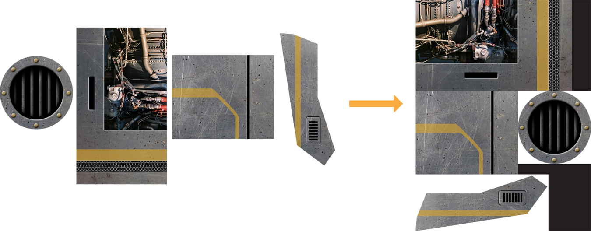

# Best Practices for Working with Texture Data

텍스처 데이터는 종종 프레임 렌더링에 사용하는 데이터 중 가장 큰 부분을 차지하며, 텍스처는 사용자에게 멋진 이미지를 제공하는 데 필요한 세부 정보를 제공한다. 앱에서 최상의 성능을 얻으려면 앱 텍스처를 주의 깊게 관리하라. 가이드를 요약하려면:

* 앱이 초기화될 때 텍스처를 만들고 렌더링 루프에서 텍스처를 변경하지 마라.
* 텍스처가 사용하는 메모리 양을 줄여라.
* 더 작은 텍스처를 더 큰 텍스처 아틀라스에 결합하라.
* 텍스처 데이터를 가져오는 데 필요한 대역폭을 줄이려면 mipmaps를 사용하라.
* 단일 패스로 텍스처 작업을 수행하려면 멀티텍스처링을 사용하라.

### Load Textures During Initialization

텍스처를 만들고 로드하는 것은 비용이 많이 드는 작업이다. 최상의 결과를 얻으려면 앱이 실행되는 동안 새로운 텍스처를 만들지 마라. 대신 초기화 중에 텍스처 데이터를 작성하고 로드하라.

텍스처를 생성한 후 프레임의 시작 또는 끝을 제외하고 텍스처를 변경하지 마라. 현재 모든 iOS 장치는 타일 기반 지연 렌더러를 사용하여 glTexSubImage 및 glCopyTexSubImage 함수에 특히 비싼 호출을 한다. 자세한 내용은 [Tile-Based Deferred Rendering](https://developer.apple.com/library/archive/documentation/OpenGLES/Conceptual/OpenGLESHardwarePlatformGuide_iOS/OpenGLESPlatforms/OpenGLESPlatforms.html#//apple_ref/doc/uid/TP40012935-CH106-SW6)를 참조하라.

#### Use the GLKit Framework to Load Texture Data

텍스처 데이터를 로드하는 것은 올바르게 하기 위해 중요한 기본적인 작업이다. GLKit 프레임워크를 사용하여 GLKTextureLoader 클래스를 사용하면 새 텍스처를 쉽게 만들고 로드할 수 있다. GLKTextureLoader 클래스는 파일, URL, 인메모리 표현, CGImages 등 다양한 소스에서 텍스처 데이터를 로드할 수 있다. 입력 소스에 관계없이 GLKTextureLoader 클래스는 데이터에서 새로운 텍스처를 생성하여 로드하고 텍스처 정보를 GLKTextureInfo 객체로 반환한다. GLKTextureInfo 객체의 속성에 접근하여 텍스처를 컨텍스트에 바인딩하고 그리기를 가능하게 하는 등 다양한 작업을 수행할 수 있다.

> **참고:** GLKTextureInfo 객체는 설명한 OpenGL ES 텍스처 객체를 소유하지 않는다. glDeleteTextures 함수를 호출하여 텍스처 객체를 사용할 때 처리해야 한다.

Listing 9-1은 파일에서 새로운 텍스처를 로드하고 나중에 사용할 수 있도록 텍스처를 바인딩하고 활성화하는 일반적인 전략을 제시한다.

**Listing 9-1** Loading a two-dimensional texture from a file

```text
GLKTextureInfo *spriteTexture;
NSError *theError;
 
NSString *filePath = [[NSBundle mainBundle] pathForResource:@"Sprite" ofType:@"png"]; // 1
 
spriteTexture = [GLKTextureLoader textureWithContentsOfFile:filePath options:nil error:&theError]; // 2
glBindTexture(spriteTexture.target, spriteTexture.name); // 3
```

목록의 번호가 매겨진 단계에 해당하는 코드는 다음과 같다:

1. 텍스처 데이터를 포함하는 이미지의 경로를 만들어라. 이 경로는 GLKTextureLoader 클래스 메서드 [textureWithContentsOfFile:options:error:](https://developer.apple.com/documentation/glkit/glktextureloader/1488932-texturewithcontentsoffile)에 대한 파라미터로 전달된다.
2. 이미지 파일에서 새 텍스처를 로드하고 텍스처 정보를 GLKTextureInfo 객체에 저장하라. 다양한 텍스처 로딩 옵션을 사용할 수 있다. 자세한 내용은 [_GLKTextureLoader Class Reference_](https://developer.apple.com/documentation/glkit/glktextureloader)를 참조하라.
3. GLKTextureInfo 객체의 적절한 속성을 파라미터로 사용하여 텍스처를 컨텍스트에 바인딩하라.

GLKTextureLoader 클래스는 가장 일반적인 영상 형식의 큐브맵 텍스처를 로드할 수 있다. 그리고, 만약 당신의 앱이 실행되는 동안 새로운 텍스처를 로드하고 생성해야 한다면, GLKTextureLoader 클래스는 또한 비동기 텍스처 메서드를 제공한다. 자세한 내용은 [_GLKTextureLoader Class Reference_](https://developer.apple.com/documentation/glkit/glktextureloader)를 참조하라.

### Reduce Texture Memory Usage

iOS 앱에서 사용하는 메모리 양을 줄이는 것은 항상 앱 튜닝의 중요한 부분이다. 즉, OpenGL ES 앱은 텍스처를 로드하는 데 사용할 수 있는 총 메모리 양에서도 제약을 받는다. 가능한 경우, 앱은 항상 텍스처 데이터를 저장하는 데 사용하는 메모리 양을 줄이도록 노력해야 한다. 텍스처가 사용하는 메모리를 줄이는 것은 거의 항상 이미지 품질을 희생시키므로, 당신은 당신의 앱이 질감에 대해 변경한 모든 사항과 최종 렌더링된 프레임의 품질 수준을 균형을 맞춰야 한다. 최상의 결과를 얻으려면 아래에 설명된 기법을 사용해 보고, 적절한 품질 수준에서 최고의 메모리 절감 효과를 제공하는 기법을 선택하라.

#### Compress Textures

텍스처 압축은 보통 메모리 절약과 품질의 최상의 균형을 제공한다. iOS용 OpenGL ES는 여러 압축 텍스처 형식을 지원한다.

모든 iOS 기기는 [GL\_IMG\_texture\_compression\_pvrtc](http://www.khronos.org/registry/gles/extensions/IMG/IMG_texture_compression_pvrtc.txt) 확장을 구현하여 PVRTC\(PowerVR 텍스처 압축\) 형식을 지원한다. PVRTC 압축은 픽셀당 4비트, 픽셀당 2비트로 압축되지 않은 32비트 텍스처 형식에 대해 각각 8:1과 16:1의 압축비를 제공한다. 압축된 PVRTC 텍스처는 여전히 상당한 수준의 품질을 제공하며, 특히 4비트 수준에서 더욱 그러하다. 텍스처를 PVRTC 형식으로 압축하는 방법에 대한 자세한 내용은 Compress Textures를 참조하라.

OpenGL ES 3.0은 ETC2 및 EAC 압축 텍스처 형식도 지원하지만 iOS 기기에는 PVRTC 텍스처가 권장된다.

#### Use Lower-Precision Color Formats

앱에서 압축된 텍스처를 사용할 수 없는 경우 더 낮은 정밀도의 픽셀 형식을 사용하는 것을 고려하라. RGB565, RGBA5551 또는 RGBA4444 형식의 텍스처는 RGBA8888 형식의 텍스처 메모리를 절반으로 사용한다. RGBA8888은 당신의 앱이 그 정도의 품질을 필요로 하는 경우에만 사용하라.

#### Use Properly Sized Textures

iOS 기반 장치가 표시하는 이미지는 매우 작다. 앱은 화면에 허용 가능한 이미지를 표시하기 위해 큰 텍스처를 제공할 필요가 없다. 텍스처의 두 차원을 모두 반감하면 텍스처에 필요한 메모리 양이 원래 텍스처의 4분의 1로 줄어든다.

텍스처를 축소하기 전에 텍스처를 압축하거나 낮은 정밀도의 색상 형식을 먼저 사용하라. PVRTC 형식으로 압축된 텍스처는 일반적으로 텍스처를 축소하는 것보다 높은 화질을 제공하며 메모리도 적게 사용한다.

### Combine Textures into Texture Atlases

텍스처에 바인딩하는 것은 OpenGL ES가 처리하는 데 시간이 걸린다. OpenGL ES 상태에 대한 변경 횟수를 줄이는 앱은 더 나은 성능을 발휘한다. 텍스처의 경우, 새로운 텍스처에 결합하지 않는 한 가지 방법은 여러 개의 작은 텍스처를 텍스처 아틀라스로 사용할 때 단일 텍스처를 결합한 다음 텍스처를 사용하는 여러 그리기 호출을 하거나 여러 그리기 호출을 단일 그리기 호출로 결합할 수 있다. 정점 데이터에 제공된 텍스처 좌표는 아틀라스 내에서 텍스처의 작은 부분을 선택하도록 수정된다.



텍스처 아틀라스에는 몇 가지 제한이 있다:

* GL\_REPEAT 텍스처 랩 파라미터를 사용하는 경우에는 텍스처 아틀라스를 사용할 수 없다.
* 필터링은 때때로 텍셀을 예상 범위를 벗어나게 할 수 있다. 텍스처 아틀라스에 이러한 텍스처를 사용하려면 텍스처 아틀라스를 구성하는 텍스처 사이에 패딩을 배치해야 한다.
* 텍스처 아틀라스는 여전히 텍스처이기 때문에 OpenGL ES 구현의 최대 텍스처 크기뿐만 아니라 다른 텍스처 속성도 적용된다.

Xcode는 이미지 모음에서 자동으로 텍스처 아틀라스를 만들 수 있다. 텍스처 아틀라스 생성에 대한 자세한 내용은 Xcode 도움말을 참조하라. 이 기능은 주로 Sprite Kit 프레임워크를 사용하는 개발자를 위해 제공되지만, 어떤 앱도 그것이 생산하는 텍스처 아틀라스 파일을 사용할 수 있다. 프로젝트의 각 .atlas 폴더에 대해 Xcode는 하나 이상의 컴파일된 아틀라스 이미지와 속성 목록\(.plist\) 파일을 포함하는 .atlasc 폴더를 앱 번들에 생성한다. 속성 목록 파일은 아틀라스를 구성하는 개별 이미지와 아틀라스 이미지 내에서 그 위치를 설명한다. 이 정보를 사용하여 OpenGL ES 그리기에 사용할 적절한 텍스처 좌표를 계산할 수 있다.

### Use Mipmapping to Reduce Memory Bandwidth Usage

당신의 앱은 2D 스케일되지 않은 이미지를 그리는 데 사용되는 것을 제외한 모든 텍스처에 대한 mipmap을 제공해야 한다. mipmap은 추가 메모리를 사용하지만 텍스처링 아티팩트를 방지하고 화질을 개선한다. 더 중요한 것은 작은 mipmaps를 샘플링할 때 텍스처 메모리에서 가져오는 텍셀의 수가 줄어들어 그래픽 하드웨어에 필요한 메모리 대역폭이 줄어 성능이 향상된다는 점이다.

GL\_LINEAR\_MIPMAP\_LINEAR 필터 모드는 텍스처링 시 최상의 품질을 제공하지만 메모리에서 추가로 텍셀을 가져와야 한다. 대신 GL\_LINEAR\_MIPMAP\_NEAREST 필터 모드를 지정하면 더 나은 성능을 위해 일부 영상 화질을 교환할 수 있다.

mipmap과 텍스처 아틀라스를 결합할 경우 OpenGL ES 3.0의 TEXTURE\_MAX\_LEVEL 파라미터를 사용하여 텍스처가 필터링되는 방식을 제어하라. \(이 기능은 APPLE\_texture\_max\_level 확장을 통해 OpenGL ES 1.1 및 2.0에서도 사용할 수 있다.\)

### Use Multitexturing Instead of Multiple Passes

많은 앱이 모델을 그리기 위해 여러 패스를 수행하여 각 패스에 대한 그래픽 파이프라인 구성을 변경한다. 이것은 그래픽 파이프라인을 재구성하는 데 추가 시간이 필요할 뿐만 아니라 모든 패스에 대해 정점 정보를 재처리하고 나중에 패스할 때 프레임 버퍼에서 픽셀 데이터를 다시 읽어야 한다.

iOS에 구현된 모든 OpenGL ES는 최소 2개의 텍스처 유닛을 지원하며, 대부분의 장치는 최소 8개를 지원한다. 앱은 이러한 텍스처 단위를 사용하여 각 패스에서 알고리즘에서 가능한 많은 단계를 수행해야 한다. glGetIntegerv을 호출하고 GL\_MAX\_TEFLATE\_UNITS 매개변수를 전달하여 앱에서 사용할 수 있는 텍스처 유닛 수를 검색할 수 있다.

* 모든 통과 시 위치 데이터가 변경되지 않았는지 확인하라.
* 두 번째 및 이후 단계에서는 GL\_EQUAL을 파라미터로 하여 glDepthFunc 함수를 호출하여 모델 표면에 있는 픽셀을 테스트하라.


