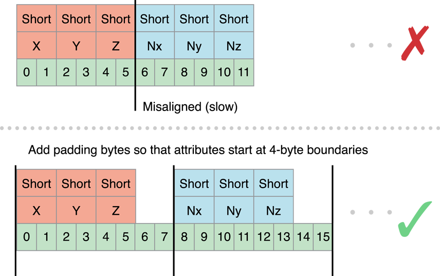

# Best Practices for Working with Vertex Data

OpenGL ES를 사용하여 프레임을 렌더링하려면 앱에서 그래픽 파이프라인을 구성하고 그릴 그래픽 기본 요소를 제출하라. 일부 앱에서는 모든 기본 요소를 동일한 파이프라인 구성을 사용하여 그린다. 다른 앱은 다른 기법을 사용하여 프레임의 다른 요소를 렌더링할 수 있다. 그러나 앱에서 어떤 원시 요소를 사용하든, 파이프라인이 어떻게 구성되든, 앱은 OpenGL ES에 정점을 제공한다. 이 장에서는 정점 데이터에 대한 새로 고침을 제공하며 정점 데이터를 효율적으로 처리하는 방법에 대한 표적 조언을 따른다.

꼭지점은 위치, 색상, 정상 또는 텍스처 좌표와 같은 하나 이상의 속성으로 구성된다. OpenGL ES 2.0 또는 3.0 앱은 자체 속성을 자유롭게 정의할 수 있으며, 꼭지점 데이터의 각 속성은 꼭지점 셰이더의 입력 역할을 하는 속성 변수에 해당한다. OpenGL 1.1 앱은 고정 기능 파이프라인에 의해 정의된 속성을 사용한다.

속성을 1~4개의 _성분_으로 구성된 벡터로 정의하라. 속성의 모든 구성요소는 공통 데이터 유형을 공유한다. 예를 들어, 색상은 4개의 GLUBYTE 구성 요소\(빨간색, 녹색, 파란색, 알파\)로 정의될 수 있다. 속성이 셰이더 변수에 로드되면, 앱 데이터에 제공되지 않는 모든 구성요소는 OpenGL ES에 의해 기본값으로 채워진다. 마지막 구성요소는 그림 8-1과 같이 1로 채워지고, 기타 불특정 구성요소는 0으로 채워진다.

**Figure 8-1**  Conversion of attribute data to shader variables


당신의 앱은 attribute를 상수로 구성할 수 있다. 즉, draw 명령의 일부로 제출되는 모든 정점에 동일한 값이 사용됨을 의미하며, 이는 각각의 정점들이 그 속성에 대한 값을 의미한다는 것을 의미한다. 앱이 OpenGL ES에서 정점 집합을 그리기 위해 함수를 호출하면 정점 데이터가 앱에서 그래픽 하드웨어로 복사된다. 정점 데이터에 작용하는 것보다 그래픽 하드웨어를 사용하여 셰이더에서 각 정점을 처리하고 원시 형상을 조립하여 프레임 버퍼로 레스터화한다. OpenGL ES의 한 가지 장점은 단일 기능 집합에서 정점 데이터를 OpenGL ES에 제출하도록 표준화하여 OpenGL이 제공하던 낡고 효율성이 떨어지는 메커니즘을 제거한다는 점이다.

프레임을 렌더링하기 위해 많은 수의 프리미티브를 제출해야 하는 앱은 정점 데이터를 신중하게 관리하고 OpenGL ES에 제공하는 방법을 관리해야 한다. 이 장에서 설명한 원리는 몇 가지 기본 원칙으로 요약할 수 있다:

* 정점 데이터의 크기를 줄여라.
* OpenGL ES가 정점 데이터를 그래픽 하드웨어로 전송하기 전에 반드시 발생해야 하는 전처리를 줄여라.
* 정점 데이터를 그래픽 하드웨어에 복사하는 데 소요되는 시간을 단축하라.
* 각 정점에 대해 수행된 계산을 줄여라.

### Simplify Your Models

iOS 기반 장치의 그래픽 하드웨어는 매우 강력하지만, 그것이 표시하는 이미지는 종종 매우 작다. iOS에서 매력적인 그래픽을 제시하기 위해 매우 복잡한 모델이 필요하지 않다. 모델을 직접 그리는 데 사용되는 정점 수를 줄이면 정점 데이터의 크기와 정점 데이터에 대해 수행된 계산이 감소한다.

다음과 같은 기법을 사용하여 모델의 복잡성을 줄일 수 있다:

* 여러 수준의 상세 수준에서 여러 버전의 모델을 제공하고 카메라에서 객체의 거리와 디스플레이의 치수에 따라 런타임에 적절한 모델을 선택한다.
* 텍스처를 사용하여 일부 정점 정보의 필요성을 제거합니다. 예를 들어, 범프 맵을 사용하여 더 많은 정점 데이터를 추가하지 않고 모델에 상세 정보를 추가할 수 있다.
* 일부 모델을 조명 세부 정보나 렌더링 품질을 개선하기 위해 정점을 추가한다. 이것은 일반적으로 각 정점에 대해 값을 계산하고 래스터화 단계에서 삼각형을 통해 보간할 때 수행된다. 예를 들어, 삼각형의 중심에서 스포트라이트를 지시하면 스포트라이트의 가장 밝은 부분이 정점을 향하지 않기 때문에 그 효과가 눈에 띄지 않을 수 있다. 정점을 추가하면 정점 데이터의 크기와 모델에서 수행된 계산을 늘리는 비용으로 보간점을 추가로 제공한다. 추가 정점을 추가하는 대신 파이프라인의 단편 단계로 계산을 이동하는 것을 고려하라.
  * 앱이 OpenGL ES 2.0 이상을 사용하는 경우, 앱이 버텍스 셰이더에서 계산을 수행하고 다양한 변수에 할당한다. 가변 값은 그래픽 하드웨어에 의해 보간되며 입력으로 프레그먼트 셰이더에 전달된다. 대신 다양한 변수에 계산 입력을 할당하고 프레그먼트 셰이더에서 계산을 수행한다. 이렇게 하면 그 계산을 수행하는 데 드는 비용이 버텍스당 비용에서 프레그먼트당 비용으로 변경되고, 파이프라인의 프레그먼트 단계의 압력을 더 많이 줄인다. 버텍스 프로세싱에서 앱이 차단되면, 계산 비용이 저렴하고 버텍스 수를 크게 줄일 수 있다.
  * 앱에서 OpenGL ES 1.1을 사용하는 경우 DOT3 조명을 사용하여 프레그먼트당 조명을 수행할 수 있다. 범프 맵 텍스처를 추가하여 정상 정보를 보유하고 텍스처 결합 연산을 사용하여 범프 맵을 GL\_DOT3\_RGB 모드로 적용하는 방식으로 진행한다.

### Avoid Storing Constants in Attribute Arrays

모델이 전체 모델에서 일정하게 유지되는 데이터를 사용하는 속성이 포함된 경우 각 버텍스에 대해 해당 데이터를 복제하지 마라. OpenGL ES 2.0 및 3.0 앱은 상수 버텍스 attribute를 설정하거나 uniform 셰이더 값을 사용하여 값을 대신 보유할 수 있다. OpenGL ES 1.1 앱은 대신 glColor4ub 또는 glTexCoord2f와 같은 pre-vertex attribute 함수를 사용해야 한다.

### Use the Smallest Acceptable Types for Attributes

각 attribute의 크기를 지정할 때 허용 가능한 결과를 제공하는 가장 작은 데이터 유형을 선택하라. 다음은 몇 가지 지침이다:

* 네 개의 unsigned byte 구성 요소 \(GL\_UNSIGNED\_BYTE\)를 사용하여 버텍스 색상을 지정하라.
* 2개 또는 4개의 unsigned byte \(GL\_UNSIGNED\_BYTE\) 또는 unsigned short \(GL\_UNSIGNED\_SHORT\)를 사용하여 텍스처 좌표를 지정하라. 여러 텍스처 좌표 세트를 단일 attribute로 포장하지 마라.
* OpenGL ES GL\_FIXED 데이터 타입을 사용하지 마라. GL\_FLOAT와 동일한 양의 메모리를 요구하지만, 더 작은 범위의 값을 제공한다. 모든 iOS 기기는 하드웨어 부동 소수점 단위를 지원하므로 부동 소수점 값을 보다 빠르게 처리할 수 있다.
* OpenGL ES 3.0 컨텍스트는 GL\_HALF\_FLOAT과 GL\_INT\_2\_10\_10\_10\_REV와 같은 광범위한 소규모 데이터 타입을 지원한다. 이것들은 종종 GL\_FLOAT 보다 작은 footprint를 가진 normals와 같은 attributes에 충분한 정밀도를 제공한다.

더 작은 컴포넌트를 지정하는 경우 버텍스 데이터가 잘못 정렬되지 않도록 버텍스 형식을 다시 정렬하라. [Avoid Misaligned Vertex Data](https://developer.apple.com/library/archive/documentation/3DDrawing/Conceptual/OpenGLES_ProgrammingGuide/TechniquesforWorkingwithVertexData/TechniquesforWorkingwithVertexData.html#//apple_ref/doc/uid/TP40008793-CH107-SW7)를 참조하라.

### Use Interleaved Vertex Data

버텍스 데이터를 배열의 연속\(배열의 구조라고도 함\) 또는 각 요소가 다중 attributes\(구조체의 배열\)을 포함하는 배열로 지정할 수 있다.

**Figure 8-2**  Interleaved memory structures place all data for a vertex together in memory


이 규칙의 예외는 앱이 다른 버텍스 데이터와 다른 속도로 일부 버텍스 데이터를 업데이트해야 하거나 두 개 이상의 모델 간에 일부 데이터를 공유할 수 있는 경우이다. 어느 경우든 attribute 데이터를 둘 이상의 구조로 분리할 수 있다.

**Figure 8-3**  Use multiple vertex structures when some data is used differently


### Avoid Misaligned Vertex Data

버텍스 구조체를 설계할 때 각 속성의 시작 부분을 구성 요소 크기의 배수 또는 4바이트 중 더 큰 오프셋에 맞춰라. 속성이 잘못 정렬된 경우, iOS는 데이터를 그래픽 하드웨어에 전달하기 전에 추가 처리를 수행해야 한다.

Figure 8-4에서 위치와 정규 데이터는 각각 총 6 바이트에 대해 3개의 short integer로 정의된다. 정규 데이터는 기본 크기 \(2바이트\)의 배수인 오프셋 6에서 시작되지만 4바이트의 배수는 아니다. 이 버텍스 데이터가 iOS에 제출된 경우 iOS는 하드웨어에 데이터를 전달하기 전에 데이터를 복사하고 정렬하는 데 추가 시간이 소요된다. 이를 수정하려면 각 attribute 뒤에 패딩 2 바이트를 명시적으로 추가하라.

**Figure 8-4**  Align Vertex Data to avoid additional processing



### Use Triangle Strips to Batch Vertex Data

삼각형 스트립을 사용하면 OpenGL ES가 모델에 대해 수행해야하는 버텍스 계산 횟수가 크게 감소한다. Figure 8-5의 왼쪽에는 총 9개의 버텍스를 사용하여 3개의 삼각형이 지정되어 있다. C, E, G는 실제로 동일한 버텍스를 지정한다! 데이터를 삼각형 스트립으로 지정하면 버텍스 수를 9개에서 5개로 줄일 수 있다.

**Figure 8-5**  Triangle strip


때때로, 앱은 하나 이상의 삼각형 스트립을 하나의 더 큰 삼각형 스트립으로 결합할 수 있다. 모든 스트립은 동일한 렌더링 요구사항을 공유해야 한다. 이것은 의미한다:

* 삼각형 스트립을 모두 그리려면 같은 셰이더를 사용해야 한다.
* OpenGL 상태를 변경하지 않고 모든 삼각형 스트립을 렌더링할 수 있어야 한다.
* 삼각형 스트립은 동일한 버텍스 attribute를 공유해야 한다.

두 삼각형 스트립을 병합하려면 Figure 8-6과 같이 첫 번째 스트립의 마지막 버텍스와 두 번째 스트립의 첫 번째 버텍스를 복제하라. 이 스트립을 OpenGL ES에 제출할 때 삼각형 DEE, EEF, EFF 및 FFG는 변딜된 것으로 간주되며 가공 또는 래스터화되지 않는다.

**Figure 8-6** Use degenerate triangles to merge triangle strips


최선의 성능을 위해, 모델을 하나의 인덱스된 삼각형 스트립으로 제출해야 한다. 버텍스 버퍼에서 동일한 버텍스에 대한 데이터를 여러 번 지정하지 않으려면 별도의 인덱스 버퍼를 사용하고 glDrawElements 함수를 사용하여 삼각형 스트립을 그린다. \(또는 적절한 경우 glDrawElementsInstanced 또는 glDrawRangeElements 함수\).

OpenGL ES 3.0에서는 프리미티브 재시작 기능을 사용하여 퇴행성 삼각형을 사용하지 않고 삼각형 스트립을 병합할 수 있다. 이 기능이 활성화되면 OpenGL ES는 인덱스 버퍼에서 가장 큰 가능한 값을 하나의 삼각형 스트립을 끝내고 다른 트리플 스트립을 시작하라는 명령으로 처리한다. Listing 8-1은 이 접근 방식을 설명한다.

**Listing 8-1** OpenGL ES 3.0에서 초기 재시작 사용

```text
// Prepare index buffer data (not shown: vertex buffer data, loading vertex and index buffers)
GLushort indexData[11] = {
    0, 1, 2, 3, 4,    // triangle strip ABCDE
    0xFFFF,           // primitive restart index (largest possible GLushort value)
    5, 6, 7, 8, 9,    // triangle strip FGHIJ
};
 
// Draw triangle strips
glEnable(GL_PRIMITIVE_RESTART_FIXED_INDEX);
glDrawElements(GL_TRIANGLE_STRIP, 11, GL_UNSIGNED_SHORT, 0);
```

가능한 경우 공통 버텍스를 공유하는 삼각형이 삼각형 스트립에서 서로 상당히 가깝게 그려지도록 버텍스와 인덱스 데이터를 정렬하라. 그래픽 하드웨어는 버텍스를 다시 계산하지 않기 위해 종종 최근의 버텍스 계산을 캐싱한다.

### Use Vertex Buffer Objects to Manage Copying Vertex Data

Listing 8-2는 간단한 앱이 버텍스 셰이더에 위치 및 색상 데이터를 제공하는 데 사용할 수 있는 기능을 제공한다. 두 개의 속성을 활성화하고 각 attribute를 인터리빙된 버텍스 구조체를 가리키도록 구성한다. 마지막으로, `glDrawElements` 함수를 호출하여 모델을 단일 삼각형 스트립으로 렌더링한다.

**Listing 8-2**  Submitting vertex data to a shader program

```text
typedef struct _vertexStruct
{
    GLfloat position[2];
    GLubyte color[4];
} vertexStruct;
 
void DrawModel()
{
    const vertexStruct vertices[] = {...};
    const GLubyte indices[] = {...};
 
    glVertexAttribPointer(GLKVertexAttribPosition, 2, GL_FLOAT, GL_FALSE,
        sizeof(vertexStruct), &vertices[0].position);
    glEnableVertexAttribArray(GLKVertexAttribPosition);
    glVertexAttribPointer(GLKVertexAttribColor, 4, GL_UNSIGNED_BYTE, GL_TRUE,
        sizeof(vertexStruct), &vertices[0].color);
    glEnableVertexAttribArray(GLKVertexAttribColor);
 
    glDrawElements(GL_TRIANGLE_STRIP, sizeof(indices)/sizeof(GLubyte), GL_UNSIGNED_BYTE, indices);
}
```

이 코드는 작동하지만 비효율적이다. `DrawModel`이 호출될 때마다 인덱스와 버텍스 데이터는 OpenGL ES에 복사되고 그래픽 하드웨어로 전송된다. 호출 간에 버텍스 데이터가 변경되지 않으면 이러한 불필요한 복사본이 성능에 영향을 미칠 수 있다. 불필요한 복사를 방지하려면 앱에서 버텍스 데이터를 VBO\(버텍스 버퍼 객체\)에 저장해야 한다. OpenGL ES는 버텍스 버퍼 객체의 메모리를 소유하기 때문에 그래픽 하드웨어에 더 접근하기 쉬운 버퍼를 메로리에 저장하거나 데이터를 그래픽 하드웨어에 대해 선호하는 형식으로 사전 처리할 수 있다.

> **참고:** OpenGL ES 3.0에서 버텍스 배열 객체를 사용할 때는 버텍스 버퍼 객체도 사용해야 한다.

Listing 8-3은 한 쌍의 버텍스 버퍼 객체가 생성되는데, 하나는 버텍스 데이터를 저장할 것이고, 두 번째는 스트립의 인덱스를 저장할 것이다. 각각의 경우에 코드는 새로운 객체를 생성하여 그것을 현재 버퍼로 바인딩하고 버퍼를 채운다. 앱이 초기화되면 `CreateVertexBuffers`가 호출된다.

**Listing 8-3** Creating a vertex buffer object

```text
GLuint    vertexBuffer;
GLuint    indexBuffer;
 
void CreateVertexBuffers()
{
 
    glGenBuffers(1, &vertexBuffer);
    glBindBuffer(GL_ARRAY_BUFFER, vertexBuffer);
    glBufferData(GL_ARRAY_BUFFER, sizeof(vertices), vertices, GL_STATIC_DRAW);
 
    glGenBuffers(1, &indexBuffer);
    glBindBuffer(GL_ELEMENT_ARRAY_BUFFER, indexBuffer);
    glBufferData(GL_ELEMENT_ARRAY_BUFFER, sizeof(indices), indices, GL_STATIC_DRAW);
 
}
```

Listing 8-4는 버텍스 버퍼 객체를 사용하도록 Listing 8-2를 수정한다. Listing 8-4의 핵심 차이점은 `glVertexAttribPointer` 함수에 대한 파라미터가 더 이상 버텍스 배열을 가리키지 않는다는 것이다. 대신, 각각은 버텍스 버퍼 객체로의 오프셋이다.

**Listing 8-4**  Drawing with a vertex buffer object

```text
void DrawModelUsingVertexBuffers()
{
    glBindBuffer(GL_ARRAY_BUFFER, vertexBuffer);
    glVertexAttribPointer(GLKVertexAttribPosition, 2, GL_FLOAT, GL_FALSE,
        sizeof(vertexStruct), (void *)offsetof(vertexStruct, position));
    glEnableVertexAttribArray(GLKVertexAttribPosition);
    glVertexAttribPointer(GLKVertexAttribColor, 4, GL_UNSIGNED_BYTE, GL_TRUE,
        sizeof(vertexStruct), (void *)offsetof(vertexStruct, color));
    glEnableVertexAttribArray(GLKVertexAttribColor);
 
    glBindBuffer(GL_ELEMENT_ARRAY_BUFFER, indexBuffer);
    glDrawElements(GL_TRIANGLE_STRIP, sizeof(indices)/sizeof(GLubyte), GL_UNSIGNED_BYTE, (void*)0);
}
```

#### Buffer Usage Hints

앞의 예는 버텍스 버퍼를 한 번 초기화한 후 그내용을 변경하지 않았다. 버텍스 버퍼의 내용을 변경할 수 있다. 버텍스 버퍼 객체 설계의 핵심 부분은 앱이 버퍼에 저장된 데이터를 어떻게 사용하는지 OpenGL ES에 알릴 수 있다는 것이다. OpenGL ES 구현은 버텍스 데이터를 저장하는 데 사용하는 전략을 변경하기 위해 이 힌트를 사용할 수 있다. Listing 8-3에서 glBufferData 함수에 대한 각 호출을 마지막 파라미터로 사용량 힌트를 제공한다. GL\_STATIC\_DRAW를 glBufferData에 전달하면 OpenGL ES에 두 버퍼의 콘텐츠가 절대 변경될 것으로 예상되지 않는다는 것을 알려줌으로써 OpenGL ES는 데이터가 저장되는 방법과 위치를 최적화할 수 있는 기회를 더 많이 갖게 된다.

OpenGL ES 사양은 다음 사용 사례를 정의한다:

* `GL_STATIC_DRAW`는 여러 번 렌더링되고 콘텐츠가 한 번 지정되고 변경되지 않는 버텍스 버퍼를 위한 것이다.
* `GL_DYNAMIC_DRAW`는 여러 번 렌더링되고 렌더링 루프 중에 콘텐츠가 변경되는 버텍스 버퍼를 위한 것이다.
* `GL_STREAM_DRAW`는 적은 횟수로 렌더링한 다음 버려지는 버텍스 버퍼에 대한 것이다.

iOS에서는 GL\_DYNAMIC\_DRAW와 GL\_STREAM\_DRAW가 동등하다. glBufferSubData 함수를 사용하여 버퍼 콘텐츠를 업데이트할 수 있지만, 그렇게 하면 명령버퍼를 플러시하고 모든 명령이 완료되기를 기다리기 때문에 성능 패널티가 발생한다. 이중 또는 삼중 버퍼링은 이러한 성능 비용을 다소 줄일 수 있다. \([Use Double Buffering to Avoid Resource Conflicts](https://developer.apple.com/library/archive/documentation/3DDrawing/Conceptual/OpenGLES_ProgrammingGuide/OpenGLESApplicationDesign/OpenGLESApplicationDesign.html#//apple_ref/doc/uid/TP40008793-CH6-SW5) 참조.\) 더 나은 성능을 위해 OpenGL ES 3.0의 glMapBufferRange 함수 또는 OpenGL ES 2.0 또는 1.1의 EXT\_map\_buffer\_range 확장에서 제공하는 해당 함수를 사용하라.

버텍스 형식 내부의 다른 속성이 다른 사용 패턴이 필요한 경우 버텍스 데이터를 여러 구조로 분할하고 공통 사용 특성을 공유하는 attributes의 각 집합에 대해 별도의 버텍스 버퍼 객체를 할당한다. Listing 8-5는 이전 예제가 별도의 버퍼를 사용하여 색상 데이터를 유지하도록 수정된다. OpenGL ES는 GL\_DYNAMIC\_DRAW 힌트를 사용하여 컬러 버퍼를 할당함으로써 앱이 합리적인 성능을 유지하도록 버퍼를 할당할 수 있다.

**Listing 8-5** 여러 개의 버텍스 버퍼 객체 그리기

```text
typedef struct _vertexStatic
{
    GLfloat position[2];
} vertexStatic;
 
typedef struct _vertexDynamic
{
    GLubyte color[4];
} vertexDynamic;
 
// Separate buffers for static and dynamic data.
GLuint    staticBuffer;
GLuint    dynamicBuffer;
GLuint    indexBuffer;
 
const vertexStatic staticVertexData[] = {...};
vertexDynamic dynamicVertexData[] = {...};
const GLubyte indices[] = {...};
 
void CreateBuffers()
{
// Static position data
    glGenBuffers(1, &staticBuffer);
    glBindBuffer(GL_ARRAY_BUFFER, staticBuffer);
    glBufferData(GL_ARRAY_BUFFER, sizeof(staticVertexData), staticVertexData, GL_STATIC_DRAW);
 
// Dynamic color data
// While not shown here, the expectation is that the data in this buffer changes between frames.
    glGenBuffers(1, &dynamicBuffer);
    glBindBuffer(GL_ARRAY_BUFFER, dynamicBuffer);
    glBufferData(GL_ARRAY_BUFFER, sizeof(dynamicVertexData), dynamicVertexData, GL_DYNAMIC_DRAW);
 
// Static index data
    glGenBuffers(1, &indexBuffer);
    glBindBuffer(GL_ELEMENT_ARRAY_BUFFER, indexBuffer);
    glBufferData(GL_ELEMENT_ARRAY_BUFFER, sizeof(indices), indices, GL_STATIC_DRAW);
}
 
void DrawModelUsingMultipleVertexBuffers()
{
    glBindBuffer(GL_ARRAY_BUFFER, staticBuffer);
    glVertexAttribPointer(GLKVertexAttribPosition, 2, GL_FLOAT, GL_FALSE,
        sizeof(vertexStruct), (void *)offsetof(vertexStruct, position));
    glEnableVertexAttribArray(GLKVertexAttribPosition);
 
    glBindBuffer(GL_ARRAY_BUFFER, dynamicBuffer);
    glVertexAttribPointer(GLKVertexAttribColor, 4, GL_UNSIGNED_BYTE, GL_TRUE,
        sizeof(vertexStruct), (void *)offsetof(vertexStruct, color));
    glEnableVertexAttribArray(GLKVertexAttribColor);
 
    glBindBuffer(GL_ELEMENT_ARRAY_BUFFER, indexBuffer);
    glDrawElements(GL_TRIANGLE_STRIP, sizeof(indices)/sizeof(GLubyte), GL_UNSIGNED_BYTE, (void*)0);
}
```

### Consolidate Vertex Array State Changes Using Vertex Array Objects

 Listing 8-5에서 DrawModelUsingMultipleVertexBuffers 함수를 자세히 살펴봐라. 여러 attributes를 활성화하고, 여러 버텍스 버퍼 객체를 바인딩하며, 버퍼를 가리키도록 attributes를 구성한다. 초기화 코드는 본질적으로 정적이다. 파라미터 중 프레임에서 프레임으로 변경되는 것은 없다. 앱이 프레임을 렌더링할 때마다 이 함수가 호출되면 그래픽 파이프라인을 재구성하는 불필요한 오버헤드가 많이 발생한다. 앱이 많은 종류의 모델을 그릴 경우, 파이프라인을 재구성하는 것은 병목현상이 될 수 있다. 대신 버텍스 배열 객체를 사용하여 전체 attribute 구성을 저장하라. Vertex 배열 객체는 코어 OpenGL ES 3.0 사양에 속하며 OES\_vertex\_array\_object 확장을 통해 OpenGL ES 2.0 및 1.1에서 사용할 수 있다.

Figure 8-7은 두 개의 버텍스 배열 객체가 있는 예제 구성을 보여준다. 각 구성은 서로 독립적이다. 각 버텍스 배열 객체는 서로 다른 버텍스 attributes 집합을 참조할 수 있으며, 동일한 버텍스 버퍼 객체에 저장되거나 여러 버텍스 버퍼 객체로 분할될 수 있다.

**Figure 8-7** 버텍스 배열 객체 구성


Listing 8-6은 위에 표시된 첫 번째 버텍스 배열 객체를 구성하는 데 사용되는 코드를 제공한다. 이 방법은 새로운 버텍스 배열 객체에 대한 식별자를 생성한 다음 버텍스 배열 객체를 컨텍스트에 결합시킨다. 이 후, 코드가 버텍스 배열 객체를 사용하지 않을 경우와 마찬가지로 버텍스 속성을 구성하기 위한 동일한 호출을 한다. 구성은 컨텍스트 대신 바운드 버텍스 배열 객체에 저장된다.

**Listing 8-6**  Configuring a vertex array object

```text
void ConfigureVertexArrayObject()
{
    // Create and bind the vertex array object.
    glGenVertexArrays(1,&vao1);
    glBindVertexArray(vao1);
         // Configure the attributes in the VAO.
    glBindBuffer(GL_ARRAY_BUFFER, vbo1);
    glVertexAttribPointer(GLKVertexAttribPosition, 3, GL_FLOAT, GL_FALSE,
        sizeof(staticFmt), (void*)offsetof(staticFmt,position));
    glEnableVertexAttribArray(GLKVertexAttribPosition);
    glVertexAttribPointer(GLKVertexAttribTexCoord0, 2, GL_UNSIGNED_SHORT, GL_TRUE,
        sizeof(staticFmt), (void*)offsetof(staticFmt,texcoord));
    glEnableVertexAttribArray(GLKVertexAttribTexCoord0);
    glVertexAttribPointer(GLKVertexAttribNormal, 3, GL_FLOAT, GL_FALSE,
        sizeof(staticFmt), (void*)offsetof(staticFmt,normal));
    glEnableVertexAttribArray(GLKVertexAttribNormal);
 
    glBindBuffer(GL_ARRAY_BUFFER, vbo2);
    glVertexAttribPointer(GLKVertexAttribColor, 4, GL_UNSIGNED_BYTE, GL_TRUE,
        sizeof(dynamicFmt), (void*)offsetof(dynamicFmt,color));
    glEnableVertexAttribArray(GLKVertexAttribColor);
 
    // Bind back to the default state.
    glBindBuffer(GL_ARRAY_BUFFER,0);
    glBindVertexArray(0); }
```

그리기 위해 코드는 버텍스 배열 객체를 바인딩한 다음 이전처럼 그리기 명령을 제출한다.

> **참고:** OpenGL ES 3.0에서는 버텍스 배열 데이터의 클라이언트 저장이 허용되지 않는다. 버텍스 배열 객체는 버텍스 버퍼 객체를 사용해야 한다.

최상의 성능을 위해 앱은 각 버텍스 배열 객체를 한 번 구성하고 런타임에 변경하지 않아야 한다. 모든 프레임에서 버텍스 배열 객체를 변경해야 하는 경우, 대신 여러 버텍스 배열 객체를 생성한다. 예를 들어, 이중 버퍼링을 사용하는 앱은 홀수 프레임에 대한 버텍스 배열 객체 세트 1개와 짝수 프레임에 대한 두 번째 세트를 구성할 수 있다. 각 버텍스 배열 객체 세트는 해당 프레임을 렌더링하는 데 사용되는 버텍스 버퍼 객체를 가리킨다. 버텍스 배열 객체의 구성이 변경되지 않을 때 OpenGL ES는 버텍스 형식에 대한 정보를 캐시하고 버텍스 속성을 처리하는 방법을 개선할 수 있다.

### Map Buffers into Client Memory for Fast Updates

OpenGL ES 앱 설계에서 가장 어려운 문제 중 하나는 동적 리소스, 특히 버텍스 데이터가 모든 프레임을 변경해야 하는 경우 작업하는 것이다. CPU와 GPU 간의 병렬성을 효율적으로 균형 있게 조정하려면 앱의 메모리 공간과 OpenGL ES 메모리 사이의 데이터 전송을 주의 깊게 관리해야 한다. glBufferSubData 함수를 사용하는 것과 같은 전통적인 기술은 GPU가 데이터가 전송되는 동안 기다리도록 강요하기 때문에 성능을 감소시킬 수 있다. 그렇지 않으면 동일한 버퍼의 다른 데이터에서 렌더링할 수 있다.

예를 들어, 버텍스 버퍼를 수정하고 높은 프레임률 렌더링 루프를 통해 각 패스에 내용을 그릴 수 있다. CPU가 다음 프레임을 그릴 준비를 위해 버퍼 메모리에 접근하려고 시도하는 동안 마지막 프레임의 그리기 명령은 여전히 GPU를 사용할 수 있으며, GPU가 완료될 때까지 버퍼 업데이트 호출을 통해 추가 CPU 작업을 차단할 수 있다. 이러한 시나리오에서는 CPU와 GPU 접근을 버퍼에 수동으로 동기화하여 성능을 향상시킬 수 있다.

glMapBufferRange 함수는 버텍스 버퍼를 동적으로 업데이트하는 보다 효율적인 방법을 제공한다. \(이 함수는 OpenGL ES 3.0에서는 코어 API로 OpenGL ES 1.1 및 2.0에서는 EXT\_map\_buffer\_range 확장을 통해 이용할 수 있다.\) 이 함수를 사용하여 OpenGL ES 메모리 영역에 대한 포인터를 검색한 다음 새 데이터를 쓰는 데 사용할 수 있다. glMapBufferRange 함수는 버퍼 데이터 저장소의 하위 범위를 클라이언트 메모리에 매핑할 수 있다. 또한 Listing 8-7에서와 같이 OpenGL 동기화 객체와 함께 이 함수를 사용할 때 비동기 버퍼 수정을 허용하는 힌트도 지원한다.

**Listing 8-7** Dynamically updating a vertex buffer with manual synchronization

```text
GLsync fence;
GLboolean UpdateAndDraw(GLuint vbo, GLuint offset, GLuint length, void *data) {
    GLboolean success;
 
    // Bind and map buffer.
    glBindBuffer(GL_ARRAY_BUFFER, vbo);
    void *old_data = glMapBufferRange(GL_ARRAY_BUFFER, offset, length,
        GL_MAP_WRITE_BIT | GL_MAP_FLUSH_EXPLICIT_BIT |
        GL_MAP_UNSYNCHRONIZED_BIT );
 
    // Wait for fence (set below) before modifying buffer.
    glClientWaitSync(fence, GL_SYNC_FLUSH_COMMANDS_BIT,
        GL_TIMEOUT_IGNORED);
 
    // Modify buffer, flush, and unmap.
    memcpy(old_data, data, length);
    glFlushMappedBufferRange(GL_ARRAY_BUFFER, offset, length);
    success = glUnmapBuffer(GL_ARRAY_BUFFER);
 
    // Issue other OpenGL ES commands that use other ranges of the VBO's data.
 
    // Issue draw commands that use this range of the VBO's data.
    DrawMyVBO(vbo);
 
    // Create a fence that the next frame will wait for.
    fence = glFenceSync(GL_SYNC_GPU_COMMANDS_COMPLETE, 0);
    return success;
}
```

이 예제의 `UpdateAndDraw` 함수는 특정 버퍼 객체를 사용하는 그리기 명령을 제출한 직후 `glFenceSyce` 함수를 사용하여 동기화 지점 또는 fence를 설정한다. 그런 다음 `glClientWaitSync` 함수\(렌더링 루프를 통과하는 다음 패스\)를 사용하여 버퍼 객체를 수정하기 전에 동기화 포인트를 확인한다. 렌더링 루프가 다시 나타나기 전에 그리기 명령들이 GPU에서 실행을 마치면 CPU 실행이 차단되지 않고 UpdateAndDraw 함수가 버퍼를 계속 수정하고 다음 프레임을 그린다. GPU가 이러한 명령을 실행하지 않으면 glClientWaitSync 함수는 GPU가 fence에 도달할 때까지 추가 CPU 실행을 차단한다. 코드 섹션에만 동기화 포인트를 잠재적인 리소스 충돌과 함께 수동으로 배치함으로써 CPU가 GPU를 기다리는 시간을 최소화할 수 있다.


