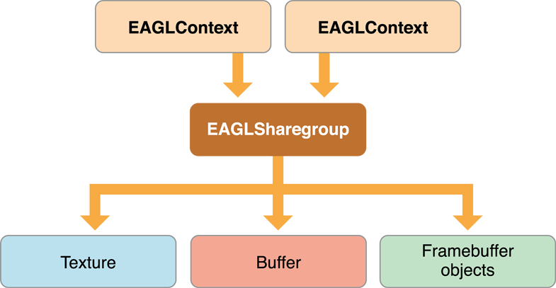

# Configuring OpenGL ES Contexts

OpenGL ES의 모든 구현은 OpenGL ES 규격에 필요한 상태를 관리하기 위한 렌더링 컨텍스트를 생성할 수 있는 방법을 제공한다. 이 컨텍스트를 문맥에 배치함으로써, 여러 앱이 다른 앱의 상태를 방해하지 않고 그래픽 하드웨어를 쉽게 공유할 수 있다.

### EAGL Is the iOS Implementation of an OpenGL ES Rendering Context

앱이 OpenGL ES 함수를 호출하려면 먼저 EAGLContext 객체를 초기화해야 한다. 또한 EAGLContext 클래스는 OpenGL ES 콘텐츠를 Core Animation과 통합하는 데 사용되는 방법을 제공한다.

### The Current Context Is the Target for OpenGL ES Function Calls

iOS 앱의 모든 쓰레드를 현재 컨텍스트를 가지고 있다. OpenGL ES 함수를 호출할 때, 이것은 호출에 의해 상태가 변경되는 컨텍스트다. 쓰레드의 현재 컨텍스트를 설정하려면 해당 쓰레드에서 실행할 때, EAGLContext 클래스 메서드 setCurrentContext: 를 호출하라.

```objectivec
[EAGLContext setCurrentContext: myContext];
```

스레드의 현재 컨텍스트를 검색하려면 IGILContext 클래스 메서드 currentContext를 호출하라.

> **참고**: 앱이 같은 쓰레드에서 둘 이상의 컨텍스트 간에 전환되는 경우 새 컨텍스트를 현재 컨텍스트로 설정하기 전에 `glFlush` 함수를 호출하라. 이를 통해 이전에 제출된 명령이 적시에 그래픽 하드웨어에 전달될 수 있다.

OpenGL ES는 현재 컨텍스트에 해당하는 EGILContext 객체에 대한 강력한 참조를 보유하고 있다. \(수동 기준 카운트를 사용하는 경우 OpenGL ES는 이 개체를 유지한다.\) setCurrentContext: 메서드를 호출하여 현재 컨텍스트를 변경하면 OpenGL ES는 더 이상 이전 컨텍스트를 참조하지 않는다. \(수동 참조 카운트를 사용하는 경우 OpenGL ES는 EGILContext 객체를 해제한다.\) 현재 컨텍스트가 아닌 경우 EGILContext 객체가 할당 해제되는 것을 방지하려면 앱에서 해당 객체에 대한 강력한 참조를 유지하거나 유지해야 한다.

### Every Context Targets a Specific Version of OpenGL ES

이글콘텍스트 오브젝트는 OpenGL ES의 한 버전만 지원한다. 예를 들어 OpenGL ES 1.1용으로 작성된 코드는 OpenGL ES 2.0 또는 3.0 컨텍스트와 호환되지 않는다. 코어 OpenGL ES 2.0 기능을 사용하는 코드는 OpenGL ES 3.0 컨텍스트와 호환되며, OpenGL ES 2.0 확장을 위해 설계된 코드는 사소한 변경으로 OpenGL ES 3.0 컨텍스트에서 자주 사용할 수 있다. 많은 새로운 OpenGL ES 3.0 기능과 향상된 하드웨어 기능에는 OpenGL ES 3.0 컨텍스트가 필요하다.

앱이 EAGLContext 객체를 생성하고 초기화할 때 지원할 OpenGL ES 버전을 결정하십시오. 장치가 요청된 OpenGL ES 버전을 지원하지 않는 경우 initWithAPI: 메서드는 nil을 반환한다. 앱은 컨텍스트를 사용하기 전에 컨텍스트가 성공적으로 초기화되었는지 테스트해야 한다.

앱에서 여러 버전의 OpenGL ES를 렌더링 옵션으로 지원하려면 먼저 대상으로 지정할 최신 버전의 렌더링 컨텍스트를 초기화하십시오. 반환된 객체가 nil이면 이전 버전의 컨텍스트를 초기화하십시오. 목록 2-1은 이것을 어떻게 하는지 보여준다.

**Listing 2-1**  Supporting multiple versions of OpenGL ES in the same app

```text
EAGLContext* CreateBestEAGLContext()
{
   EAGLContext *context = [[EAGLContext alloc] initWithAPI:kEAGLRenderingAPIOpenGLES3];
   if (context == nil) {
      context = [[EAGLContext alloc] initWithAPI:kEAGLRenderingAPIOpenGLES2];
   }
   return context;
}
```

컨텍스트의 API 속성은 컨텍스트가 지원하는 OpenGL ES 버전을 명시한다. 앱은 컨텍스트의 API 속성을 테스트하여 올바른 렌더링 경로를 선택하는 데 사용해야 한다. 이 동작을 구현하는 일반적인 패턴은 각 렌더링 경로에 대한 클래스를 만드는 것이다. 앱에서 컨텍스트를 테스트하고 초기화할 때 렌더러를 한 번 생성하십시오.

### An EAGL Sharegroup Manages OpenGL ES Objects for the Context

컨텍스트는 OpenGL ES 컨텍스트를 유지하지만 OpenGL ES 객체를 직접관리하지는 않는다. 대신, OpenGL ES 객체는 EGLSharegroup 객체에 의해 생성되고 유지 관리된다. 모든 컨텍스트에는 객체 생성을 위임하는 EAGLSharegroup 객체가 포함되어 있다.

그림 2-1에서와 같이 두 개 이상의 컨텍스트가 동일한 공유 그룹을 참조할 때 공유 그룹의 이점이 분명해진다. 여러 컨텍스트가 공통 공유 그룹에 연결되면 모든 컨텍스트에서 생성된 OpenGL ES 개체를 사용할 수 있다. 이 컨텍스트를 만든 컨텍스트보다 다른 컨텍스트에서 동일한 객체 식별자에 바인딩하면 동일한 OpenGL ES 개체를 참조한다. 모바일 기기에서는 자원이 부족한 경우가 많다. 여러 컨텍스트에서 동일한 콘텐츠의 여러 사본을 만드는 것은 낭비적이다. 공통 리소스를 공유하면 장치의 사용 가능한 그래픽 리소스를 더 잘 사용할 수 있습니다.

공유 그룹은 불투명한 객체로, 앱에서 호출할 수 있는 메서드나 속성이 없다. 공유 그룹 객체를 사용하는 컨텍스트는 해당 객체를 강력하게 참조한다.

**Figure 2-1**  Two contexts sharing OpenGL ES objects



공유 그룹은 다음 두 가지 특정 시나리오에서 가장 유용하다:

* 컨텍스트 간에 공유되는 자원의 대부분이 불변할 때.
* 애플리케이션이 렌더러의 메인 쓰레드가 아닌 다른 쓰레드에서 새 OpenGL ES 객체를 만들 수 있도록 하려면 이 경우 두 번째 컨텍스트는 별도의 쓰레드에서 실행되며 데이터를 가져오고 리소스를 생성하는 데 전념한다. 리소스가 로드된 후 첫 번째 컨텍스트는 객체에 바인딩되어 즉시 사용할 수 있다. GLTextureLoader 클래스는 이 패턴을 사용하여 비동기식 텍스처 로딩을 제공한다.

동일한 공유 그룹을 참조하는 여러 컨텍스트들을 만드려면 initWith를 호출하여 첫 번째 컨텍스트를 초기화하라. 컨텍스트에 대해 공유 그룹이 자동으로 생성된다. 두 번째 및 이후의 컨텍스트는 initWithAPI: sharegroup: 메서드를 대신 호출하여 첫 번째 컨텍스트의 공유 그룹을 사용하도록 초기화한다. Listing 2-2를 나열하면 이것이 어떻게 작동하는지 알 수 있다. 첫 번째 컨텍스트는 Listing 2-1에서 정의된 편의 함수를 이용하여 생성된다. 두 번째 컨텍스트는 첫 번째 컨텍스트로부터 API 버전 및 공유 그룹을 추출함으로써 생성된다.

> 중요: 동일한 그룹과 관련된 모든 컨텍스트는 초기 컨텍스트와 동일한 버전의 OpenGL ES API를 사용해야 한다.

**Listing 2-2**  Creating two contexts with a common sharegroup

```text
EAGLContext* firstContext = CreateBestEAGLContext();
EAGLContext* secondContext = [[EAGLContext alloc] initWithAPI:[firstContext API] sharegroup: [firstContext sharegroup]];
```

공유 그룹이 여러 컨텍스트에 의해 공유될 때 OpenGL ES 객체에 대한 상태 변경을 관리하는 것은 앱의 책임이다. 다음은 규칙이다:

* 객체가 수정되지 않은 경우 앱은 여러 컨텍스트에서 동시에 객체에 접근할 수 있다. 
* 객체가 컨텍스트로 전송된 명령에 의해 수정되는 동안 객체는 다른 컨텍스트에서 읽거나 수정되어서는 안된다. 객체가 수정된 후 모든 컨텍스트는 변경사항을 보려면 객체를 다시 바인딩해야 한다. 
* 컨텍스트가 바인딩하기 전에 참조하는 경우 객체의 내용은 정의되지 않는다.

OpenGL ES 객체를 업데이트 하려면 다음과 같이 하라:

1. 객체를 사용할 수 있는 모든 컨텍스트에서 `glFlush`를 호출하라.
2. 객체를 수정하려는 컨텍스트에서 하나 이상의 OpenGL ES 함수를 호출하여 객체를 변경하라.
3. 상태 수정 명령을 받은 컨텍스트에서 `glFlush`를 호출하라. 
4. 다른 모든 컨텍스트에서 객체 식별자를 다시 바인딩하라.

> **참고**: 객체를 공유하는 또 다른 방법은 단일 렌더링 컨텍스트를 사용하지만 여러 대상 프레임 버퍼를 사용하는 것이다. 렌더링 시 앱은 적절한 프레임버퍼를 결합하고 필요에 따라 프레임을 렌더링한다. OpenGL ES 객체는 모두 단일 컨텍스트에서 참조되기 때문에 동일한 OpenGL ES 데이터를 본다. 이 패턴은 리소스를 적게 사용하지만 컨텍스트의 상태를 주의 깊게 제어할 수 있는 단일 쓰레드 앱에만 유용하다.

