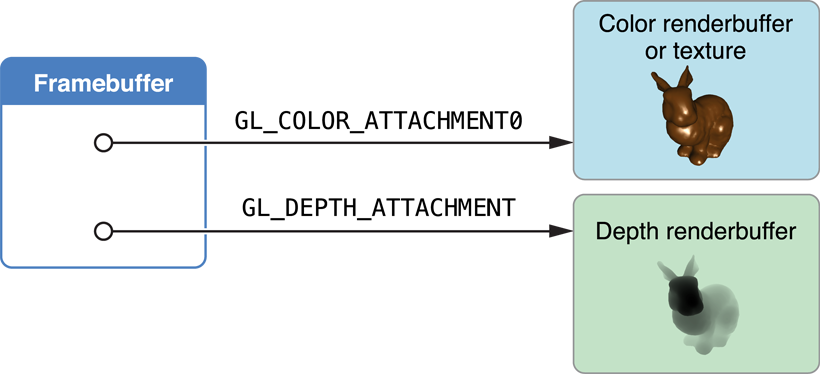

# Drawing to Other Rendering Destinations

프레임버퍼 객체는 렌더링 명령을 위한 대상이다. 프레임 버퍼 객체를 작성할 때 색상, 깊이 및 스텐실 데이터에 대한 저장소에 대한 정확한 제어가 가능하다. Figure 4-1과 같이 프레임 버퍼에 이미지를 부착하여 이 저장소를 제공한다. 가장 일반적인 이미지 첨부 파일은 렌더버퍼 객체이다. 또한 프레임 버퍼의 색상 부착 지점에 OpenGL ES 텍스처를 부착할 수 있다. 즉, 모든 그리기 명령이 텍스처에 렌더링된다. 나중에, 텍스처는 미래의 렌더링 명령에 대한 입력으로 작용할 수 있다. 또한 단일 렌더링 컨텍스트에서 여러 프레임버퍼 객체를 작성할 수 있다. 여러 프레임 버퍼 간에 동일한 렌더링 파이프라인 및 OpenGL ES 리소스를 공유할 수 있도록 이 작업을 수행할 수 있다.

**Figure 4-1** 색상 및 깊이 렌더버퍼가 있는 프레임버퍼



이러한 모든 접근방식은 OpenGL ES 컨텍스트에서 렌더링 결과를 저장할 프레임 버퍼 및 렌더버퍼 객체를 수동으로 생성해야 하며, 화면에 콘텐츠를 표시하는 추가 코드를 작성해야 하며 \(필요한 경우\) 애니메이션 루프를 실행해야 한다.

### Creating a Framebuffer Object

앱이 수행하려는 작업에 따라 앱은 프레임버퍼 객체에 부착할 다른 객체를 구성한다. 대부분의 경우 프레임 버퍼를 구성하는 차이점은 프레임 버퍼 객체의 색상 부착 지점에 부착된 객체에 있다:

* 화면 밖 이미지 처리에 프레임 버퍼를 사용하려면 렌더 버퍼를 연결하라. [Creating Offscreen Framebuffer Objects](https://developer.apple.com/library/archive/documentation/3DDrawing/Conceptual/OpenGLES_ProgrammingGuide/WorkingwithEAGLContexts/WorkingwithEAGLContexts.html#//apple_ref/doc/uid/TP40008793-CH103-SW6)을 참조하라.
* 프레임 버퍼 이미지를 나중에 렌더링 단계에 대한 입력으로 사용하려면 텍스처를 부착하라. [Using Framebuffer Objects to Render to a Texture](https://developer.apple.com/library/archive/documentation/3DDrawing/Conceptual/OpenGLES_ProgrammingGuide/WorkingwithEAGLContexts/WorkingwithEAGLContexts.html#//apple_ref/doc/uid/TP40008793-CH103-SW7)를 참조하라.
* Core Animation 레이어 구성에서 프레임 버퍼를 사용하려면 특수 Core Animation 렌더버퍼를 사용하라. [Rendering to a Core Animation Layer](https://developer.apple.com/library/archive/documentation/3DDrawing/Conceptual/OpenGLES_ProgrammingGuide/WorkingwithEAGLContexts/WorkingwithEAGLContexts.html#//apple_ref/doc/uid/TP40008793-CH103-SW8)를 참조하라.

#### Creating Offscreen Framebuffer Objects

화면 바깥쪽 렌더링을 위한 프레임 버퍼는 모든 첨부파일을 OpenGL ES 렌더버퍼로 할당한다. 다음 코드는 프레임 버퍼 객체에 색상 및 깊이 부착물을 할당한다.

프레임 버퍼를 만들어 바인딩한다.

```text
GLuint framebuffer;
glGenFramebuffers(1, &framebuffer);
glBindFramebuffer(GL_FRAMEBUFFER, framebuffer);
```

컬러 렌더버퍼를 만들고 스토리지를 할당한 후 프레임버퍼의 컬러 부착 지점에 부착한다.

```text
GLuint colorRenderbuffer;
glGenRenderbuffers(1, &colorRenderbuffer);
glBindRenderbuffer(GL_RENDERBUFFER, colorRenderbuffer);
glRenderbufferStorage(GL_RENDERBUFFER, GL_RGBA8, width, height);
glFramebufferRenderbuffer(GL_FRAMEBUFFER, GL_COLOR_ATTACHMENT0, GL_RENDERBUFFER, colorRenderbuffer);
```

깊이 또는 깊이/스텐실 렌더버퍼를 작성하고 저장소를 할당한 후 프레임버퍼의 깊이 부착점에 부착한다.

```text
GLuint depthRenderbuffer;
glGenRenderbuffers(1, &depthRenderbuffer);
glBindRenderbuffer(GL_RENDERBUFFER, depthRenderbuffer);
glRenderbufferStorage(GL_RENDERBUFFER, GL_DEPTH_COMPONENT16, width, height);
glFramebufferRenderbuffer(GL_FRAMEBUFFER, GL_DEPTH_ATTACHMENT, GL_RENDERBUFFER, depthRenderbuffer);
```

프레임 버퍼의 완전성을 테스트하라. 이 테스트는 프레임 버퍼의 구성이 변경되었을 때만 수행하면 된다.

```text
GLenum status = glCheckFramebufferStatus(GL_FRAMEBUFFER) ;
if(status != GL_FRAMEBUFFER_COMPLETE) {
    NSLog(@"failed to make complete framebuffer object %x", status);
}
```

화면 밖 렌더버퍼로 그리기를 작성한 후 glReadPixels 함수를 사용하여 해당 내용을 CPU에 반환하여 추가 처리할 수 있다.

#### Using Framebuffer Objects to Render to a Texture

이 프레임 버퍼를 만드는 코드는 화면 밖 예제와 거의 동일하지만 이제 텍스처가 할당되고 색상 부착점에 부착된다.

1. 프레임 버퍼 객체\([Creating Offscreen Framebuffer Objects](https://developer.apple.com/library/archive/documentation/3DDrawing/Conceptual/OpenGLES_ProgrammingGuide/WorkingwithEAGLContexts/WorkingwithEAGLContexts.html#//apple_ref/doc/uid/TP40008793-CH103-SW6)와 동일한 절차 사용\) 생성
2. 목표 텍스처를 작성하여 프레임버퍼의 색상 부착점에 부착한다.

```text
// create the texture
GLuint texture;
glGenTextures(1, &texture);
glBindTexture(GL_TEXTURE_2D, texture);
glTexParameteri(GL_TEXTURE_2D, GL_TEXTURE_MIN_FILTER, GL_LINEAR);
glTexImage2D(GL_TEXTURE_2D, 0, GL_RGBA8,  width, height, 0, GL_RGBA, GL_UNSIGNED_BYTE, NULL);
glFramebufferTexture2D(GL_FRAMEBUFFER, GL_COLOR_ATTACHMENT0, GL_TEXTURE_2D, texture, 0);
```

3. 깊이 버퍼\(이전과 같이\)를 할당하고 부착하라.

4. 프레임 버퍼의 완전성을 테스트하라 \(이전과 같이\).

이 예제에서는 색상 텍스처를 렌더링한다고 가정하지만 다른 옵션이 가능하다. 예를 들어, 확장을 사용하여 깊이 부착 지점에 텍스처를 부착하여 씬\(scene\)의 깊이 정보를 텍스처로 저장할 수 있다. 이 깊이 정보를 사용하여 최종 렌더링 장면의 그림자를 계산할 수 있다.

#### Rendering to a Core Animation Layer

Core Animation은 iOS에서 그래픽 렌더링과 애니메이션을 위한 중심 인프라다. UIKit, Quartz 2D, OpenGL ES와 같이 다른 iOS 하위 시스템을 사용하여 렌더링된 콘텐츠를 호스팅하는 레이어를 사용하여 앱의 사용자 인터페이스 또는 기타 비주얼 디스플레이를 구성할 수 있다. OpenGL ES는 콘텐츠가 OpenGL ES 렌더버퍼에서 제공되는 특별한 유형의 Core Animation 레이어인 CAEAGLLayer 클래스를 통해 Core Animation에 연결된다. Core Animation은 렌더버퍼의 콘텐츠를 다른 레이어와 합성하고 결과 이미지를 화면에 표시한다.

**Figure 4-2**  Core Animation shares the renderbuffer with OpenGL ES


CAEAGLLayer는 두 가지 주요 기능을 제공함으로써 OpenGL ES에 이 지원을 제공한다. 첫째, 렌더버퍼에 대한 공유 스토리지를 할당한다. 둘째, 렌더버퍼를 Core Animation으로 제시하여, 레이어의 이전 콘텐츠를 렌더버퍼의 데이터로 대체한다. 이 모델의 장점은 렌더링된 이미지가 변경될 때만 Core Animation 레이어의 내용을 모든 프레임에서 그릴 필요가 없다는 것이다.

