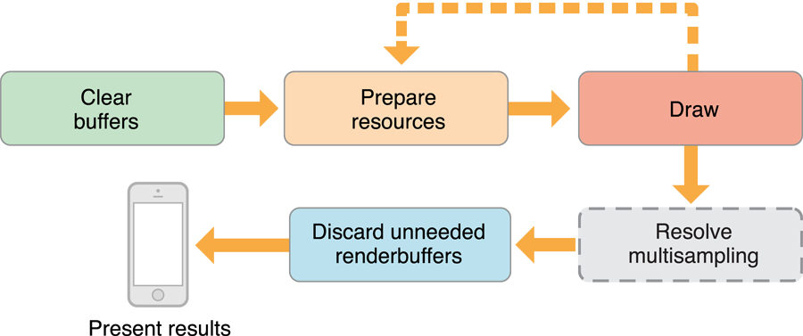

# Drawing to Other Rendering Destinations

프레임버퍼 객체는 렌더링 명령을 위한 대상이다. 프레임 버퍼 객체를 작성할 때 색상, 깊이 및 스텐실 데이터에 대한 저장소에 대한 정확한 제어가 가능하다. Figure 4-1과 같이 프레임 버퍼에 이미지를 부착하여 이 저장소를 제공한다. 가장 일반적인 이미지 첨부 파일은 렌더버퍼 객체이다. 또한 프레임 버퍼의 색상 부착 지점에 OpenGL ES 텍스처를 부착할 수 있다. 즉, 모든 그리기 명령이 텍스처에 렌더링된다. 나중에, 텍스처는 미래의 렌더링 명령에 대한 입력으로 작용할 수 있다. 또한 단일 렌더링 컨텍스트에서 여러 프레임버퍼 객체를 작성할 수 있다. 여러 프레임 버퍼 간에 동일한 렌더링 파이프라인 및 OpenGL ES 리소스를 공유할 수 있도록 이 작업을 수행할 수 있다.

**Figure 4-1** 색상 및 깊이 렌더버퍼가 있는 프레임버퍼


이러한 모든 접근방식은 OpenGL ES 컨텍스트에서 렌더링 결과를 저장할 프레임 버퍼 및 렌더버퍼 객체를 수동으로 생성해야 하며, 화면에 콘텐츠를 표시하는 추가 코드를 작성해야 하며 \(필요한 경우\) 애니메이션 루프를 실행해야 한다.

### Creating a Framebuffer Object

앱이 수행하려는 작업에 따라 앱은 프레임버퍼 객체에 부착할 다른 객체를 구성한다. 대부분의 경우 프레임 버퍼를 구성하는 차이점은 프레임 버퍼 객체의 색상 부착 지점에 부착된 객체에 있다:

* 화면 밖 이미지 처리에 프레임 버퍼를 사용하려면 렌더 버퍼를 연결하라. [Creating Offscreen Framebuffer Objects](https://developer.apple.com/library/archive/documentation/3DDrawing/Conceptual/OpenGLES_ProgrammingGuide/WorkingwithEAGLContexts/WorkingwithEAGLContexts.html#//apple_ref/doc/uid/TP40008793-CH103-SW6)을 참조하라.
* 프레임 버퍼 이미지를 나중에 렌더링 단계에 대한 입력으로 사용하려면 텍스처를 부착하라. [Using Framebuffer Objects to Render to a Texture](https://developer.apple.com/library/archive/documentation/3DDrawing/Conceptual/OpenGLES_ProgrammingGuide/WorkingwithEAGLContexts/WorkingwithEAGLContexts.html#//apple_ref/doc/uid/TP40008793-CH103-SW7)를 참조하라.
* Core Animation 레이어 구성에서 프레임 버퍼를 사용하려면 특수 Core Animation 렌더버퍼를 사용하라. [Rendering to a Core Animation Layer](https://developer.apple.com/library/archive/documentation/3DDrawing/Conceptual/OpenGLES_ProgrammingGuide/WorkingwithEAGLContexts/WorkingwithEAGLContexts.html#//apple_ref/doc/uid/TP40008793-CH103-SW8)를 참조하라.

#### Creating Offscreen Framebuffer Objects

화면 바깥쪽 렌더링을 위한 프레임 버퍼는 모든 첨부파일을 OpenGL ES 렌더버퍼로 할당한다. 다음 코드는 프레임 버퍼 객체에 색상 및 깊이 부착물을 할당한다.

프레임 버퍼를 만들어 바인딩한다.

```text
GLuint framebuffer;
glGenFramebuffers(1, &framebuffer);
glBindFramebuffer(GL_FRAMEBUFFER, framebuffer);
```

컬러 렌더버퍼를 만들고 스토리지를 할당한 후 프레임버퍼의 컬러 부착 지점에 부착한다.

```text
GLuint colorRenderbuffer;
glGenRenderbuffers(1, &colorRenderbuffer);
glBindRenderbuffer(GL_RENDERBUFFER, colorRenderbuffer);
glRenderbufferStorage(GL_RENDERBUFFER, GL_RGBA8, width, height);
glFramebufferRenderbuffer(GL_FRAMEBUFFER, GL_COLOR_ATTACHMENT0, GL_RENDERBUFFER, colorRenderbuffer);
```

깊이 또는 깊이/스텐실 렌더버퍼를 작성하고 저장소를 할당한 후 프레임버퍼의 깊이 부착점에 부착한다.

```text
GLuint depthRenderbuffer;
glGenRenderbuffers(1, &depthRenderbuffer);
glBindRenderbuffer(GL_RENDERBUFFER, depthRenderbuffer);
glRenderbufferStorage(GL_RENDERBUFFER, GL_DEPTH_COMPONENT16, width, height);
glFramebufferRenderbuffer(GL_FRAMEBUFFER, GL_DEPTH_ATTACHMENT, GL_RENDERBUFFER, depthRenderbuffer);
```

프레임 버퍼의 완전성을 테스트하라. 이 테스트는 프레임 버퍼의 구성이 변경되었을 때만 수행하면 된다.

```text
GLenum status = glCheckFramebufferStatus(GL_FRAMEBUFFER) ;
if(status != GL_FRAMEBUFFER_COMPLETE) {
    NSLog(@"failed to make complete framebuffer object %x", status);
}
```

화면 밖 렌더버퍼로 그리기를 작성한 후 glReadPixels 함수를 사용하여 해당 내용을 CPU에 반환하여 추가 처리할 수 있다.

#### Using Framebuffer Objects to Render to a Texture

이 프레임 버퍼를 만드는 코드는 화면 밖 예제와 거의 동일하지만 이제 텍스처가 할당되고 색상 부착점에 부착된다.

1. 프레임 버퍼 객체\([Creating Offscreen Framebuffer Objects](https://developer.apple.com/library/archive/documentation/3DDrawing/Conceptual/OpenGLES_ProgrammingGuide/WorkingwithEAGLContexts/WorkingwithEAGLContexts.html#//apple_ref/doc/uid/TP40008793-CH103-SW6)와 동일한 절차 사용\) 생성
2. 목표 텍스처를 작성하여 프레임버퍼의 색상 부착점에 부착한다.

```text
// create the texture
GLuint texture;
glGenTextures(1, &texture);
glBindTexture(GL_TEXTURE_2D, texture);
glTexParameteri(GL_TEXTURE_2D, GL_TEXTURE_MIN_FILTER, GL_LINEAR);
glTexImage2D(GL_TEXTURE_2D, 0, GL_RGBA8,  width, height, 0, GL_RGBA, GL_UNSIGNED_BYTE, NULL);
glFramebufferTexture2D(GL_FRAMEBUFFER, GL_COLOR_ATTACHMENT0, GL_TEXTURE_2D, texture, 0);
```

3. 깊이 버퍼\(이전과 같이\)를 할당하고 부착하라.

4. 프레임 버퍼의 완전성을 테스트하라 \(이전과 같이\).

이 예제에서는 색상 텍스처를 렌더링한다고 가정하지만 다른 옵션이 가능하다. 예를 들어, 확장을 사용하여 깊이 부착 지점에 텍스처를 부착하여 씬\(scene\)의 깊이 정보를 텍스처로 저장할 수 있다. 이 깊이 정보를 사용하여 최종 렌더링 장면의 그림자를 계산할 수 있다.

#### Rendering to a Core Animation Layer

Core Animation은 iOS에서 그래픽 렌더링과 애니메이션을 위한 중심 인프라다. UIKit, Quartz 2D, OpenGL ES와 같이 다른 iOS 하위 시스템을 사용하여 렌더링된 콘텐츠를 호스팅하는 레이어를 사용하여 앱의 사용자 인터페이스 또는 기타 비주얼 디스플레이를 구성할 수 있다. OpenGL ES는 콘텐츠가 OpenGL ES 렌더버퍼에서 제공되는 특별한 유형의 Core Animation 레이어인 CAEAGLLayer 클래스를 통해 Core Animation에 연결된다. Core Animation은 렌더버퍼의 콘텐츠를 다른 레이어와 합성하고 결과 이미지를 화면에 표시한다.

**Figure 4-2**  Core Animation shares the renderbuffer with OpenGL ES


CAEAGLLayer는 두 가지 주요 기능을 제공함으로써 OpenGL ES에 이 지원을 제공한다. 첫째, 렌더버퍼에 대한 공유 스토리지를 할당한다. 둘째, 렌더버퍼를 Core Animation으로 제시하여, 레이어의 이전 콘텐츠를 렌더버퍼의 데이터로 대체한다. 이 모델의 장점은 렌더링된 이미지가 변경될 때만 Core Animation 레이어의 내용을 모든 프레임에서 그릴 필요가 없다는 것이다.


### Drawing to a Framebuffer Object

이제 프레임 버퍼 객체를 갖게 되었으니 채울 필요가 있다. 이 절에서는 새 프레임을 렌더링하고 사용자에게 표시하는 데 필요한 단계를 설명한다. 텍스처 또는 오프스크린 프레임 버퍼로 렌더링하는 것은 앱이 최종 프레임을 사용하는 방식에서만 다르게 작동한다.

#### Rendering on Demand or with an Animation Loop

GLKit 뷰 및 뷰 컨트롤러로 그리는 것과 마찬가지로 Core Animation 레이어에 렌더링할 때 OpenGL ES 콘텐츠를 그릴 시기를 선택하라. 오프스크린 프레임 버퍼 또는 텍스처로 렌더링하는 경우, 해당 유형의 프레임 버퍼를 사용하는 상황에 적합할 때마다 그려라.

온디맨드 그리기의 경우 렌더버퍼를 끌어다 표시하는 고유한 메서드를 구현하고 새로운 내용을 표시하려면 언제든지 호출하라. 애니메이션 루프를 사용하여 그리려면 CADisplayLink 객체를 사용하라. 디스플레이 링크는 그리기를 화면의 새로 고침 속도와 동기화할 수 있는 Core Animation에서 제공하는 타이머의 일종이다. Listing 4-1은 뷰를 표시하는 화면을 검색하고, 해당 화면을 사용하여 새 디스플레이 링크 객체를 만들고, 디스플레이 링크 객체를 런 루프에 추가하는 방법을 보여준다.

> **참고:** GLKViewController 클래스는 GLKView 콘텐츠를 애니메이션화하기 위해 CADisplayLink 객체의 사용을 자동화한다. GLKit 프레임워크에서 제공하는 것 이상의 동작이 필요한 경우에만 CADisplayLink 클래스를 직접 사용하라.

**Listing 4-1**  Creating and starting a display link

```text
displayLink = [myView.window.screen displayLinkWithTarget:self selector:@selector(drawFrame)];
[displayLink addToRunLoop:[NSRunLoop currentRunLoop] forMode:NSDefaultRunLoopMode];
```

drawFrame 메서드 구현에서 디스플레이 링크의 timestamp 속성을 읽어 다음 프레임을 렌더링할 timestamp를 얻어라. 이 값을 사용하여 다음 프레임에서 객체의 위치를 계산할 수 있다.

일반적으로 디스플레이 링크 객체는 화면이 새로 고쳐질 때마다 동작한다. 이 값은 보통 60Hz이지만 장치에 따라 다를 수 있다. 대부분의 앱은 화면을 초당 60회 업데이트할 필요가 없다. 메서드가 호출되기 전에 디스플레이 링크의 frameInterval 속성을 설정할수 있다.

> **중요:** 최상의 결과를 얻으려면 앱이 지속적으로 달성할 수 있는 프레임 률을 선택하라. 매끄럽고 일관된 프레임률은 불규칙적으로 변화하는 프레임률보다 더 쾌적한 사용자 경험을 만들어 낸다.

#### Rendering a Frame

Figure 4-3은 프레임을 렌더링하고 표시하기 위해 OpenGL ES 앱이 iOS에 대해 취해야 하는 단계를 보여준다. 이러한 단계에는 앱의 성능을 향상시키기 위한 많은 힌트가 포함되어 있다.

**Figure 4-3**  iOS OpenGL Rendering Steps



**Clear Buffers**

모든 프레임을 시작할 때 다음 프레임을 그리기 위해 이전 프레임의 내용이 필요하지 않은 모든 프레임 버퍼 첨부파일의 내용을 지워라. Listing 4-2에 표시된 대로 모든 버퍼가 삭제될 비트 마스크로 전달하여 `glClear` 함수를 호출하라.

**Listing 4-2** Clear framebuffer attachments

```text
glBindFramebuffer(GL_FRAMEBUFFER, framebuffer);
glClear(GL_DEPTH_BUFFER_BIT | GL_COLOR_BUFFER_BIT);
```

렌더 버퍼나 텍스처의 기존 콘텐츠를 폐기할 수 있도록 `glClear` "hints"를 OpenGL ES에 사용함으로써 이전 콘텐츠를 메모리에 로드하는 비용이 많이 드는 작업을 피한다.

**Prepare Resources and Execute Drawing Commands**

이 두 단계는 앱의 아키텍처를 설계할 때 내리는 대부분의 주요 의사결정을 포괄한다. 먼저 사용자에게 표시할 항목을 결정하고 정점 버퍼 객체, 텍스처, 셰이더 프로그램 및 입력 변수 등 해당 OpenGL ES 객체를 GPU에 업로드하도록 구성하라. 다음으로 리소스를 사용하여 프레임을 렌더링하는 방법을 GPU에 알려주는 그리기 설명을 제출하라.

렌더러 설계는 [OpenGL ES Design Guidelines](https://developer.apple.com/library/archive/documentation/3DDrawing/Conceptual/OpenGLES_ProgrammingGuide/OpenGLESApplicationDesign/OpenGLESApplicationDesign.html#//apple_ref/doc/uid/TP40008793-CH6-SW1)에서 다룬다. 현재 가장 중요한 성능 최적화는 새 프레임을 렌더링할 때만 OpenGL ES 객체를 수정하면 앱이 더 빨리 실행된다는 것이다. 앱은 객체 수정과 그리기 명령 제출 사이에서 번갈아 사용할 수 있지만 \(Figure 4-3의 점선에서 알 수 있듯이\), 각 단계를 프레임당 한 번만 수행하면 더 빨리 실행된다.

**Execute Drawing Commands**

이 단계는 이전 단계에서 준비한 객체를 사용하여 그리기 명령을 제출하여 사용한다. 렌더링 코드의 이 부분을 효율적으로 실행하도록 설계하는 것은 [OpenGL ES Design Guidelines](https://developer.apple.com/library/archive/documentation/3DDrawing/Conceptual/OpenGLES_ProgrammingGuide/OpenGLESApplicationDesign/OpenGLESApplicationDesign.html#//apple_ref/doc/uid/TP40008793-CH6-SW1)에서 자세히 설명한다. 현재 가장 중요한 성능 최적화는 앱이 새로운 프레임 렌더링을 시작할 때 OpenGL ES 객체만 수정할 경우 더 빨리 실행된다는 것이다. 앱은 객체 수정과 그리기 명령 제출 사이에서 번갈아 갈 수 있지만 \(점선에서 표시한 바와 같이\) 각 단계를 한 번만 수행하면 더 빨리 실행된다.

**Resolve Multisampling**

앱이 이미지 품질을 향상시키기 위해 멀티샘플링을 사용하는 경우, 앱은 픽셀이 사용자에게 표시되기 전에 픽셀을 해결해야 한다. 멀티샘플링은 [Using Multisampling to Improve Image Quality](https://developer.apple.com/library/archive/documentation/3DDrawing/Conceptual/OpenGLES_ProgrammingGuide/WorkingwithEAGLContexts/WorkingwithEAGLContexts.html#//apple_ref/doc/uid/TP40008793-CH103-SW4)에 자세히 설명되어 있다.

**Discard Unneeded Renderbuffers**

_버리기_ 작업은 하나 이상의 렌더버퍼의 내용이 더 이상 필요하지 않음을 OpenGL ES에 알려주는 성능 힌트이다. 렌더버퍼의 콘텐츠가 필요하지 않다는 것을 OpenGL ES에 암시함으로써 버퍼의 데이터를 폐기할 수 있으며 이러한 버퍼의 콘텐츠를 업데이트하기 위한 값비싼 작업을 피할 수 있다.

렌더링 루프에서 이 단계에서 앱은 프레임에 대한 모든 그리기 명령을 제출하였다. 당신의 앱은 화면에 표시하기 위해 컬러 렌더버퍼가 필요하지만, 그것은 깊이 버퍼의 내용이 필요하지 않을 것이다. Listing 4-3은 깊이 버퍼의 내용을 삭제한다.

**Listing 4-3** Discarding the depth framebuffer

```text
const GLenum discards[]  = {GL_DEPTH_ATTACHMENT};
glBindFramebuffer(GL_FRAMEBUFFER, framebuffer);
glDiscardFramebufferEXT(GL_FRAMEBUFFER,1,discards);
```

> 참고: `glDiscardFramebufferEXT` 함수는 OpenGL ES 1.1 및 2.0 EXT\_discard\_framebuffer 확장에서 제공한다. OpenGL ES 3.0 컨텍스트 대신 glInvalidateFramebuffer 함수를 사용하라.

**Present the Results to Core Animation**

이 단계에서는 컬러 렌더버퍼가 완성된 프레임을 고정하기 때문에 사용자에게 제시하기만 하면 된다. Listing 4-4는 렌더버퍼가 컨텍스트에 바인딩되어 제시된다. 이 때문에 완성된 프레임이 Core Animation에 넘겨지게 된다.

**Listing 4-4** Presenting the finished frame

```text
glBindRenderbuffer(GL_RENDERBUFFER, colorRenderbuffer);
[context presentRenderbuffer:GL_RENDERBUFFER];
```

기본적으로, 앱에서 렌더버퍼를 표시한 후 렌더버퍼의 내용이 버려졌다고 가정해야 한다. 이는 앱이 프레임을 제시할 때마다 프레임이 새로운 프레임을 렌더링할 때 프레임의 콘텐츠를 완전히 다시 만들어야 한다는 것을 의미한다. 위의 코드는 항상 이러한 이유로 색상 버퍼를 지운다.

앱에서 프레임 사이에 컬러 렌더버퍼의 내용을 보존하려면, CAEAGLLayer 객체의 drawableProperties 속성에 저장된 딕셔너리에 [`kEAGLDrawablePropertyRetainedBacking`](https://developer.apple.com/documentation/opengles/keagldrawablepropertyretainedbacking) 키를 추가하고 이전 glClear 함수 호출에서 GL\_COLOR\_BUFFER\_BIT 상수를 제거하라.

### Using Multisampling to Improve Image Quality

멀티샘플링은 대부분의 3D 앱에서 들쭉날쭉한 가장자리를 매끄럽게 하고 화질을 개선하는 _안티앨리어싱_의 일종이다. OpenGL ES 3.0에는 코어 사양으로 멀티샘플링이 포함되며, iOS는 APPLE\_framebuffer\_multisample 확장을 통해 OpenGL ES 1.1 및 2.0으로 제공한다. 멀티샘플링은 이미지를 렌더링하기 위해 더 많은 메모리와 단편 처리 시간을 사용하지만, 다른 접근법보다 낮은 성능 비용으로 영상 화질을 개선할 수 있다.

Figure 4-4는 멀티샘플링이 어떻게 작동하는지 보여준다. 하나의 프레임버퍼 객체를 만드는 대신, 앱은 두 개를 만든다. 멀티샘플링 버퍼에는 콘텐츠를 렌더링하는 데 필요한 모든 첨부 파일\(일반적으로 색상과 깊이 버퍼\)이 포함되어 있다. resolve buffer에는 [Creating a Framebuffer Object](https://developer.apple.com/library/archive/documentation/3DDrawing/Conceptual/OpenGLES_ProgrammingGuide/WorkingwithEAGLContexts/WorkingwithEAGLContexts.html#//apple_ref/doc/uid/TP40008793-CH103-SW5)의 적절한 절차에 따라 작성된 렌더 이미지를 사용자에게 표시하는 데 필요한 첨부 파일\(일반적으로 색상 렌더버퍼, 그러나 텍스처일 수 있음\)만 포함되어 있다. 멀티샘플 렌더버퍼는 resolve 프레임버퍼와 동일한 치수를 사용하여 할당되지만, 각각 픽셀마다 저장할 샘플 수를 지정하는 추가 파라미터를 포함한다. 앱은 모든 렌더링을 멀티샘플링 버퍼로 수행한 다음 해당 샘플을 resolve buffer에 resolve하여 최종 안티앨리어싱 이미지를 생성한다.

**Figure 4-4** How multisampling works


Listing 4-5는 멀티샘플링 버퍼를 생성하기 위한 코드를 보여준다. 이 코드는 이전에 만든 버퍼의 폭과 높이를 사용한다. 그것은 `glRenderbufferStorageMultisampleAPPLE` 함수를 호출하여 렌더버퍼에 대한 멀티샘플링 스토리지를 생성한다.

**Listing 4-5** Creating the multisample buffer

```text
glGenFramebuffers(1, &sampleFramebuffer);
glBindFramebuffer(GL_FRAMEBUFFER, sampleFramebuffer);
 
glGenRenderbuffers(1, &sampleColorRenderbuffer);
glBindRenderbuffer(GL_RENDERBUFFER, sampleColorRenderbuffer);
glRenderbufferStorageMultisampleAPPLE(GL_RENDERBUFFER, 4, GL_RGBA8_OES, width, height);
glFramebufferRenderbuffer(GL_FRAMEBUFFER, GL_COLOR_ATTACHMENT0, GL_RENDERBUFFER, sampleColorRenderbuffer);
 
glGenRenderbuffers(1, &sampleDepthRenderbuffer);
glBindRenderbuffer(GL_RENDERBUFFER, sampleDepthRenderbuffer);
glRenderbufferStorageMultisampleAPPLE(GL_RENDERBUFFER, 4, GL_DEPTH_COMPONENT16, width, height);
glFramebufferRenderbuffer(GL_FRAMEBUFFER, GL_DEPTH_ATTACHMENT, GL_RENDERBUFFER, sampleDepthRenderbuffer);
 
if (glCheckFramebufferStatus(GL_FRAMEBUFFER) != GL_FRAMEBUFFER_COMPLETE)
    NSLog(@"Failed to make complete framebuffer object %x", glCheckFramebufferStatus(GL_FRAMEBUFFER));
```

다음은 멀티샘플링을 지원하기 위해 렌더링 코드를 수정하는 단계이다.

버퍼 지우기 단계 중에 멀티샘플링 프레임 버퍼의 내용을 지워라.

```text
glBindFramebuffer(GL_FRAMEBUFFER, sampleFramebuffer);
glViewport(0, 0, framebufferWidth, framebufferHeight);
glClear(GL_COLOR_BUFFER_BIT | GL_DEPTH_BUFFER_BIT);
```

그리기 명령을 제출한 후 멀티샘플링 버퍼에서 resolve buffer로 내용을 resolve하라. 각 픽셀에 대해 저장된 샘플은 resolve buffer에서 단일 샘플로 결합된다.

```text
glBindFramebuffer(GL_DRAW_FRAMEBUFFER_APPLE, resolveFrameBuffer);
glBindFramebuffer(GL_READ_FRAMEBUFFER_APPLE, sampleFramebuffer);
glResolveMultisampleFramebufferAPPLE();
```

버리기 단계에서 멀티 샘플 프레임버퍼에 부착된 렌더버퍼를 모두 버릴 수 있다. 나타낼 내용이 resolve 프레임 버퍼에 저장되기 때문이다.

```text
const GLenum discards[]  = {GL_COLOR_ATTACHMENT0,GL_DEPTH_ATTACHMENT};
glDiscardFramebufferEXT(GL_READ_FRAMEBUFFER_APPLE,2,discards);
```

나타내기 결과 단계에서는 resolve 프레임버퍼에 부착된 색상 렌더버퍼를 표시한다.

```text
glBindRenderbuffer(GL_RENDERBUFFER, colorRenderbuffer);
[context presentRenderbuffer:GL_RENDERBUFFER];
```

멀티샘플링은 무료가 아니다. 추가 샘플을 저장하려면 추가 메모리가 필요하며, 샘플을 resolve 프레임버퍼로 분해하는 데는 시간이 걸린다. 앱에 멀티샘플링을 추가하는 경우 항상 앱 성능을 테스트하여 허용가능한지 확인하라.

> **참고:** 위의 코드는 OpenGL ES 1.1 또는 2.0 컨텍스트를 가정한다. 멀티샘플링은 코어 OpenGL ES 3.0 API의 일부지만 함수는 다르다. 자세한 내용은 사양을 참조하라.

