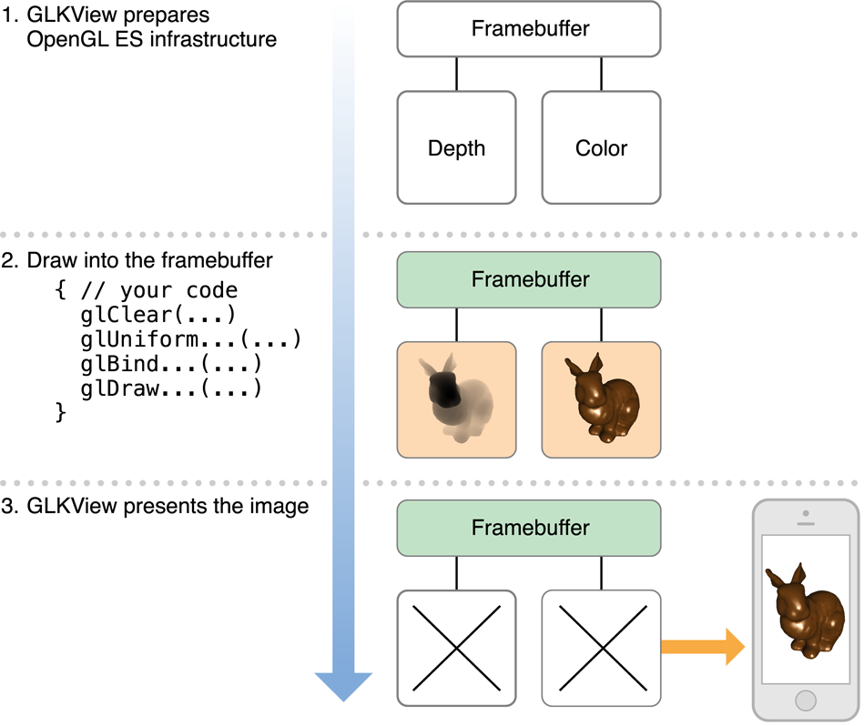

# Drawing with OpenGL ES and GLKit

GLKit 프레임워크는 OpenGL ES 콘텐츠를 그리거나 애니메이션화하는 데 필요한 설정 및 유지 관리 코드를 위한 장소를 제공하고, GLKViewController 클래스는 GLKit 뷰에서 OpenGL ES 콘텐츠의 원할한 애니메이션을 위한 렌더링 루프를 제공한다. 이러한 클래스는 뷰 콘텐츠를 그리고 뷰 프리젠테이션을 관리하기 위한 표준 UIKit 설계 패턴을 확장한다. 결과적으로, 당신은 주로 당신의 OpenGL ES 렌더링 코드에 당신의 노력을 집중할 수 있고 당신의 앱을 빠르게 작동시킬 수 있다. GLKit 프레임워크는 OpenGL ES 2.0 및 3.0 개발을 용이하게 하는 다른 기능도 제공한다.

### A GLKit View Draws OpenGL ES Content on Demand

GLKView 클래스는 표준 UIView 그리기 주기와 동등한 OpenGL ES 기반 동일성을 제공한다. UIView 인스턴스는 자동으로 그래픽 컨텍스트를 구성하여 drawRect: 구현은 Quartz 2D 그리기 명령만 수행하면 되고, GLKView 인스턴스는 자동으로 구성되므로 그리기 메서드는 OpenGL ES 그리기 명령만 수행하면 된다. GLKView 클래스는 OpenGL ES 그리기 명령의 결과를 저장하는 프레임 버퍼 객체를 유지한 후 그리기 방법이 돌아오면 이를 Core Animation에 자동으로 표시하여 이 기능을 제공한다.

표준 UIKit 뷰와 마찬가지로 GLKit 뷰는 요구 시 콘텐츠를 렌더링한다. 뷰가 처음 표시되면 그리기 메서드를 호출한다. Core Animation은 렌더링된 결과를 캐시하고 뷰가 표시될 때마다 표시한다. 뷰의 내용을 변경하려면 setNeedsDisplay 메서드를 호출하여 뷰가 다시 그리기 메서드를 호출하고 결과 이미지를 캐시하여 화면에 표시한다. 이 접근방식은 이미지를 렌더링하는 데 사용되는 데이터가 간헐적으로 변경되거나 사용자 작업에 대한 응답으로만 변경되는 경우에 유용하다. 필요한 경우에만 새 뷰 콘텐츠를 렌더링하여 장치의 배터리 전원을 절약하고 장치가 다른 작업을 수행할 수 있도록 더 많은 시간을 남겨 둬라.

**Figure 3-1** GLKit 뷰를 사용하여 OpenGL ES 콘텐츠 렌더링



#### Creating and Configuring a GLKit View

GLKView 객체를 프로그래밍 또는 인터페이스 빌더를 사용하여 만들고 구성할 수 있다. 그리기에 사용하기 전에 EAGLContext 객체와 연관시켜야 한다\(OpenGL ES Context 구성 참조\).

* 프로그래밍 방식으로 뷰를 작성할 때 먼저 컨텍스트를 작성한 후 뷰의 initWithFrame:context: 메서드에 전달하라.
* 스토리보드에서 뷰를 로드한 후 컨텍스트를 만들어 뷰의 context 속성 값으로 설정하라.

GLKit 뷰는 자동으로 자체 OpenGL ES 프레임 버퍼 객체 및 렌더 버퍼를 생성하고 구성한다. Listing 3-1에서 설명한 것처럼 뷰의 그리기 가능한 특성을 사용하여 이러한 객체의 속성을 제어한다. GLKit 뷰의 크기, 스케일 팩터 또는 그리기 가능한 특성을 변경하면 해당 프레임버퍼 객체를 자동으로 삭제하고 다시 생성하고 다음 번에 해당 내용을 그릴 때 렌더 버퍼를 생성한다.

**Listing 3-1** Configuring a GLKit view

```text
- (void)viewDidLoad
{
    [super viewDidLoad];
 
    // Create an OpenGL ES context and assign it to the view loaded from storyboard
    GLKView *view = (GLKView *)self.view;
    view.context = [[EAGLContext alloc] initWithAPI:kEAGLRenderingAPIOpenGLES2];
 
    // Configure renderbuffers created by the view
    view.drawableColorFormat = GLKViewDrawableColorFormatRGBA8888;
    view.drawableDepthFormat = GLKViewDrawableDepthFormat24;
    view.drawableStencilFormat = GLKViewDrawableStencilFormat8;
 
    // Enable multisampling
    view.drawableMultisample = GLKViewDrawableMultisample4X;
}
```

그릴 수 있는 drawableMultisample 속성을 사용하여 GLKView 인스턴스에 대해 멀티샘플링을 활성화할 수 있다. 멀티샘플링은 들쭉날쭉한 가장자리를 부드럽게 하여 더 많은 메모리와 단편 처리 시간을 소비하는 비용으로 대부분의 3D 앱에서 이미지 품질을 향상시키는 안티앨리어싱의 한 형태인데, 멀티샘플링을 활성화하는 경우 항상 앱의 성능을 테스트하여 허용 가능한 상태를 유지하도록 하라.

#### Drawing With a GLKit View

그림 3-1은 OpenGL ES 인프라 준비, 그리기 명령어 발급, 렌더링된 콘텐츠의 Core Animation 디스플레이를 위한 3가지 단계를 개략적으로 보여준다. GLKView 클래스는 1단계와 3단계를 구현한다. 두 번째 단계에서는 목록 3-2의 예와 같은 그리기 방법을 구현하십시오.

**Listing 3-2**  Example drawing method for a GLKit view

```text
- (void)drawRect:(CGRect)rect
{
    // Clear the framebuffer
    glClearColor(0.0f, 0.0f, 0.1f, 1.0f);
    glClear(GL_COLOR_BUFFER_BIT | GL_DEPTH_BUFFER_BIT);
 
    // Draw using previously configured texture, shader, uniforms, and vertex array
    glBindTexture(GL_TEXTURE_2D, _planetTexture);
    glUseProgram(_diffuseShading);
    glUniformMatrix4fv(_uniformModelViewProjectionMatrix, 1, 0, _modelViewProjectionMatrix.m);
    glBindVertexArrayOES(_planetMesh);
    glDrawElements(GL_TRIANGLE_STRIP, 256, GL_UNSIGNED_SHORT);
}
```

> 참고: glClear 함수는 OpenGL ES에 기존 프레임 버퍼 콘텐츠를 버릴 수 있음을 암시하여 이전 콘텐츠를 메모리에 로드하기 위한 비용이 많이 드는 메모리 작업을 방지한다. 최적의 성능을 보장하려면 그리기 전에 항상 이 함수를 호출하라.

GLKView 클래스는 OpenGL ES 렌더링 프로세스의 표준 부분을 관리하기 때문에 OpenGL ES 그리기에 대한 간단한 인터페이스를 제공할 수 있다.

* 그리기 메서드를 호출하기 전에, 뷰는:
  * EAGLContext 객체를 현재 컨텍스트로 만든다.
  * size, scale factor 및 drawable 속성을 기준으로 프레임 버퍼 객체 및 렌더 버퍼 작성 \(필요한 경우\)
  * 프레임 버퍼 객체를 그리기 명령의 현재 대상으로 바인딩한다.
  * 프레임 버퍼 크기에 맞게 OpenGL ES 뷰 포트를 설정한다.
* 그리기 메서드가 반환되면, 뷰는:
  * 멀티샘플링 버퍼를 해결한다.\(멀티샘플링이 활성화된 경우\)
  * 콘텐츠가 더 이상 필요하지 않은 렌더버퍼를 무시한다.
  * 캐싱 및 디스플레이를 위한 Core Animation에 렌더버퍼 콘텐츠를 제공한다.

### Rendering Using a Delegate Object

많은 OpenGL ES 앱은 사용자 정의 클래스에 렌더링 코드를 구현한다. 이 접근 방식의 장점은 각 렌더러 클래스를 다르게 정의하여 다중 렌더링 알고리즘을 쉽게 지원할 수 있다는 것이다. 공통 기능을 공유하는 렌더링 알고리즘은 슈퍼클래스로부터 이를 상속받을 수 있다. 예를 들어 다른 렌더러 클래스를 사용하여 OpenGL ES 2.0과 3.0을 모두 지원할 수 있다\([Configuring OpenGL ES Contexts](https://developer.apple.com/library/archive/documentation/3DDrawing/Conceptual/OpenGLES_ProgrammingGuide/WorkingwithOpenGLESContexts/WorkingwithOpenGLESContexts.html#//apple_ref/doc/uid/TP40008793-CH2-SW1) 참조\). 또는 이 렌더링을 사용하여 더 강력한 하드웨어가 있는 장치에서 더 나은 이미지 품질을 위해 렌더링을 사용자 지정할 수 있다.

GLKit는 이러한 접근방식에 매우 적합하다.  개체를 표준 GLKView 인스턴스의 대리인으로 만들 수 있다. 당신의 렌더러 클래스는 GLKView를 하위 분류하고 drawRet: 메서드를 구현하는 대신 GLKViewDelegate 프로토콜을 채택하고 glkView:drawInRirect: 메서드를 구현한다. Listing 3-3은 앱 출시 시점에 하드웨어 기능을 기반으로 렌더러 클래스를 선택하는 것을 보여준다.

**Listing 3-3** Choosing a renderer class based on hardware features

```text
- (BOOL)application:(UIApplication *)application didFinishLaunchingWithOptions:(NSDictionary *)launchOptions
{
    // Create a context so we can test for features
    EAGLContext *context = [[EAGLContext alloc] initWithAPI:kEAGLRenderingAPIOpenGLES2];
    [EAGLContext setCurrentContext:context];
 
    // Choose a rendering class based on device features
    GLint maxTextureSize;
    glGetIntegerv(GL_MAX_TEXTURE_SIZE, &maxTextureSize);
    if (maxTextureSize > 2048)
        self.renderer = [[MyBigTextureRenderer alloc] initWithContext:context];
    else
        self.renderer = [[MyRenderer alloc] initWithContext:context];
 
    // Make the renderer the delegate for the view loaded from the main storyboard
    GLKView *view = (GLKView *)self.window.rootViewController.view;
    view.delegate = self.renderer;
 
    // Give the OpenGL ES context to the view so it can draw
    view.context = context;
 
    return YES;
}

```

### A GLKit View Controller Animates OpenGL ES Content

기본적으로 GLKView 객체는 요청 시 콘텐츠를 렌더링한다. 즉, OpenGL ES로 그림을 그릴 때의 주요 장점은 복잡한 장면의 연속 애니메이션을 위해 그래픽 처리 하드웨어를 사용할 수 있다는 것이다. 즉, 게임과 시뮬레이션과 같은 애플리케이션은 정적 이미지를 거의 나타내지 않는다. 이러한 경우에, GLKit 프레임워크는 자신이 관리하는 GLKView 객체에 대해 애니메이션 루프를 유지하는 뷰 컨트롤러 클래스를 제공한다. 이 루프는 업데이트와 디스플레이의 두 단계로 게임과 시뮬레이션에서 공통적인 설계 패턴을 따른다. Figure 3-2는 애니메이션 루프의 단순화된 예를 보여준다.

**Figure 3-2** The animation loop


#### Understanding the Animation Loop

업데이트 단계의 경우 뷰 컨트롤러는 자체 업데이트 메서드\(또는 대리자의 glkViewControllerUpdate: method\)을 호출한다. 이 방법에서는 다음 프레임을 그릴 준비를 해야 한다. 예를 들어, 게임은 마지막 프레임 이후 수신된 입력 이벤트를 기반으로 플레이어와 적 캐릭터의 위치를 결정하기 위해 이 방법을 사용할 수 있으며, 과학적인 시각화는 이 방법을 사용하여 시뮬레이션 단계를 실행할 수 있다. 다음 프레임에 대한 앱의 상태를 결정하기 위해 타이밍 정보가 필요한 경우 timeFromLastUpdate 속성과 같은 뷰 컨트롤러의 타이밍 속성 중 하나를 사용하십시오. 그림 3-2에서 업데이트 위상은 각도 변수를 증가시켜 변환 매트릭스를 계산하는 데 사용한다.

디스플레이 단계의 경우 뷰 컨트롤러는 뷰의 display 메서드를 호출하며, 이는 다시 그리기 메서드를 호출한다. 그리기 메서드에서 OpenGL ES 그리기 명령을 GPU에 제출하여 내용을 렌더링한다. 최적의 성능을 위해 앱은 새 프레임 렌더링을 시작할 때 OpenGL ES 객체를 수정하고 이후 그리기 명령을 제출해야 한다. Figure 3-2에서 display 단계는 셰이더 프로그램의 균일한 변수를 업데이트 단계에서 계산된 행렬에 설정한 다음 새로운 콘텐츠를 렌더링하는 그리기 명령을 제출한다.

애니메이션 루프는 뷰 컨트롤러의 framesPerSecond 속성에 의해 표시된 속도로 이 두 페이즈 사이에서 번갈아 나타난다. preferredFramesPerSecond 속성을 사용하여 원하는 프레임률을 설정할 수 있으며, 현재 디스플레이 하드웨어의 성능을 최적화하기 위해 뷰 컨트롤러는 자동으로 원하는 값에 가까운 최적의 프레임률을 선택한다.

> **중요:** 최상의 결과를 얻으려면 앱이 지속적으로 달성할 수 있는 프레임률을 선택하라. 매끄럽고 일관된 프레임률은 불규칙적으로 변화하는 프레임률보다 더 쾌적한 사용자 경험을 만들어낸다.

#### Using a GLKit View Controller

Listing 3-4는 GLKViewController 하위 클래스 및 GLKView 인스턴스를 사용하여 애니메이션 OpenGL ES 콘텐츠를 렌더링하는 일반적인 전략을 보여준다.

**Listing 3-4**  Using a GLKit view and view controller to draw and animate OpenGL ES content

```text
@implementation PlanetViewController // subclass of GLKViewController
 
- (void)viewDidLoad
{
    [super viewDidLoad];
 
    // Create an OpenGL ES context and assign it to the view loaded from storyboard
    GLKView *view = (GLKView *)self.view;
    view.context = [[EAGLContext alloc] initWithAPI:kEAGLRenderingAPIOpenGLES2];
 
    // Set animation frame rate
    self.preferredFramesPerSecond = 60;
 
    // Not shown: load shaders, textures and vertex arrays, set up projection matrix
    [self setupGL];
}
 
- (void)update
{
    _rotation += self.timeSinceLastUpdate * M_PI_2; // one quarter rotation per second
 
    // Set up transform matrices for the rotating planet
    GLKMatrix4 modelViewMatrix = GLKMatrix4MakeRotation(_rotation, 0.0f, 1.0f, 0.0f);
    _normalMatrix = GLKMatrix3InvertAndTranspose(GLKMatrix4GetMatrix3(modelViewMatrix), NULL);
    _modelViewProjectionMatrix = GLKMatrix4Multiply(_projectionMatrix, modelViewMatrix);
}
 
- (void)glkView:(GLKView *)view drawInRect:(CGRect)rect
{
    // Clear the framebuffer
    glClearColor(0.0f, 0.0f, 0.1f, 1.0f);
    glClear(GL_COLOR_BUFFER_BIT | GL_DEPTH_BUFFER_BIT);
 
    // Set shader uniforms to values calculated in -update
    glUseProgram(_diffuseShading);
    glUniformMatrix4fv(_uniformModelViewProjectionMatrix, 1, 0, _modelViewProjectionMatrix.m);
    glUniformMatrix3fv(_uniformNormalMatrix, 1, 0, _normalMatrix.m);
 
    // Draw using previously configured texture and vertex array
    glBindTexture(GL_TEXTURE_2D, _planetTexture);
    glBindVertexArrayOES(_planetMesh);
    glDrawElements(GL_TRIANGLE_STRIP, 256, GL_UNSIGNED_SHORT, 0);
}
 
@end
```

이 예에서 PlanetViewController 클래스\(커스텀 GLKViewController 하위 클래스\)의 인스턴스는 표준 GLKView 인스턴스 및 그 도출 가능한 속성과 함께 스토리보드에서 로드된다. viewDidLoad 메서드는 OpenGL ES 컨텍스트를 생성하여 뷰에 제공하고 애니메이션 루프의 프레임률을 설정한다.

뷰 컨트롤러는 자동으로 뷰의 델리게이트이므로 애니메이션 루프의 업데이트 및 표시 단계를 모두 구현한다. 업데이트 메서드에서 회전하는 행성을 표시하는 데 필요한 트랜스폼 행렬을 계산한다. glkView:drawInRect: 메서드에서, 그것은 그 행렬을 셰이더 프로그램에 제공하고 행성 기하학을 렌더링하기 위한 그리기 명령을 제출한다.

### Using GLKit to Develop Your Renderer

GLKit 프레임워크는 뷰 및 뷰 컨트롤러 인프라 외에도 iOS에서 OpenGL ES 개발을 용이하게 하기 위해 몇 가지 다른 기능을 제공한다.

#### Handling Vector and Matrix Math

OpenGL ES 2.0 이상은 변환 매트릭스를 생성하거나 지정하기 위한 내장 함수를 제공하지 않는다. 대신, 프로그래밍 가능한 셰이더는 정점 변환을 제공하고, 당신은 일반적인 uniform 변수를 사용하여 셰이더 입력을 지정한다. GLKit 프레임워크는 iOS 하드웨어의 고성능에 최적화된 벡터 및 매트릭스 유형과 함수의 종합적인 라이브러리를 포함한다. \([_GLKit Framework Reference_](https://developer.apple.com/documentation/glkit) 참조\)

#### Migrating from the OpenGL ES 1.1 Fixed-Function Pipeline

OpenGL ES 2.0 및 이후 OpenGL ES 1.1 고정 함수 그래픽 파이프 라인과 관련된 모든 함수를 제거한다. 클래스는 OpenGL ES 1.1 파이프라인의 변환, 조명 및 음영 단계에 대한 Objective-C 아날로그를 제공하며, GLKSkyboxEfect 및 GLKReflectionMapEffect 클래스는 일반적인 시각 효과에 대한 지원을 추가한다. 자세한 내용은 이 클래스의 참조 설명서를 참조하라.

#### Loading Texture Data

GLKTextureLoader 클래스는 iOS에서 지원하는 이미지 형식에서 텍스처 데이터를 동기 또는 비동기로 OpenGL ES 컨텍스트로 로드하는 간단한 방법을 제공한다. \([Use the GLKit Framework to Load Texture Data](https://developer.apple.com/library/archive/documentation/3DDrawing/Conceptual/OpenGLES_ProgrammingGuide/TechniquesForWorkingWithTextureData/TechniquesForWorkingWithTextureData.html#//apple_ref/doc/uid/TP40008793-CH104-SW10) 참조하라.\)

