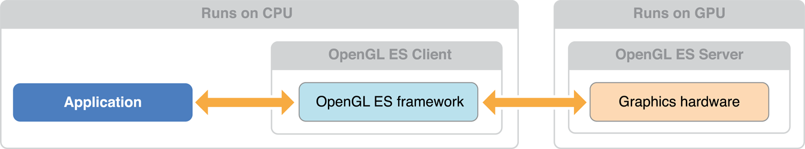
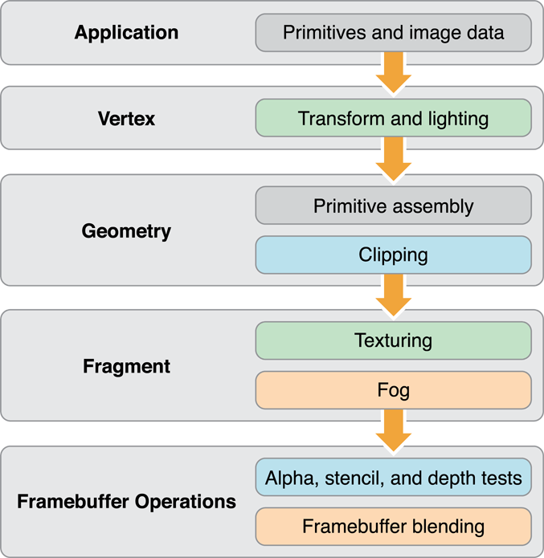

# OpenGL ES Design Guidelines

iOS 앱에서 OpenGL ES를 사용하는 기본 사항을 숙달했으므로 이 장의 정보를 사용하여 더 나은 성능을 위해 앱의 렌더링 엔진을 설계하는 데 도움을 받아라. 이 장에서는 렌더러 설계의 주요 개념을 소개하며, 이후 장에서는 이 정보를 구체적인 모범 사례와 성능 기법으로 확장한다.

### How to Visualize OpenGL ES

이 장에서는 OpenGL ES 설계를 클라이언트-서버 아키텍처와 파이프라인으로 시각화하기 위한 두 가지 관점을 설명한다. 두 가지 관점 모두 앱의 아키텍처를 계획하고 평가하는 데 유용할 수 있다.

#### OpenGL ES as a Client-Server Architecture

Figure 6-1은 OpenGL ES를 클라이언트-서버 아키텍처로 시각화한다. 앱에서 상태 변경, 텍스처 및 정점 데이터, 렌더링 명령을 OpenGL ES 클라이언트에 전달하라. 클라이언트는 이 데이터를 그래픽 하드웨어가 이해하는 형식으로 변환하여 GPU에 전달한다. 이러한 프로세스는 앱의 그래픽 성능에 오버헤드를 추가한다.

**Figure 6-1**  OpenGL ES client-server architecture

뛰어난 성능을 달성하려면 이러한 오버헤드를 주의 깊게 관리해야 한다. 잘 설계된 앱은 OpenGL ES로 호출 빈도를 줄이고, 하드웨어에 적합한 데이터 형식을 사용해 번역 비용을 최소화하며, 자신과 OpenGL ES 사이의 데이터 흐름을 세심하게 관리한다.

#### OpenGL ES as a Graphics Pipeline

Figure 6-2는 OpenGL ES를 그래픽 파이프라인으로 시각화한다. 앱은 그래픽 파이프라인을 구성한 다음 그리기 명령을 실행하여 정점 데이터를 파이프라인 아래로 전송한다. 파이프라인의 연속 단계는 정점 데이터를 처리하기 위해 정점 셰이더를 실행하고, 정점을 프리미티브로 조립하고, 프리미티브를 프래그먼트로 레스터화하고, 프레그먼트 셰이더를 실행하여 각 프레그먼트에 대한 색상 및 깊이 값을 계산하고, 프레그먼트를 디스플레이용 프레임버퍼에 혼합한다.

**Figure 6-2**  OpenGL ES graphics pipeline

새 프레임을 생성하기 위해 앱에서 수행하는 작업을 식별하려면 이 파이프라인을 멘탈 모델로 사용하라. 당신의 렌덜러 디자인은 파이프라인의 정점 및 프레그먼트 단계를 처리하기 위한 셰이더 프로그램 작성, 당신이 이 프로그램에 공급하는 정점 및 텍스처 데이터 정리, 파이프라인의 고정 기능 단계를 구동하는 OpenGL ES 상태 머신 구성으로 구성되어 있다.

그래픽 파이프라인의 개별 단계는 결과를 동시에 계산할 수 있다. 예를 들어, 앱은 새로운 프리미티브를 준비할 수 있고 그래픽 하드웨어의 개별 부분은 이전에 제출된 기하학에서 정점과 프레그먼트 계산을 수행할 수 있다. 그러나 이후 단계는 이전 단계의 출력에 따라 달라진다. 파이프라인 단계가 너무 많은 작업을 수행하거나 너무 천천히 수행하면 가장 느린 단계가 작업을 완료할 때까지 다른 파이프라인 작업이 한가하게 있다. 잘 설계된 앱은 그래픽 하드웨어 기능에 따라 각 파이프라인 단계에서 수행되는 작업의 균형을 맞춘다.

> **중요:** 앱의 성능을 조정할 때, 첫 번째 단계는 보통 앱이 어떤 단계에 병목 현상이 있는지, 그 이유는 무엇인지 파악하는 것이다.

