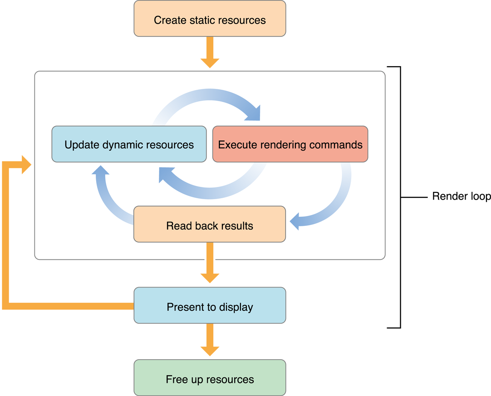
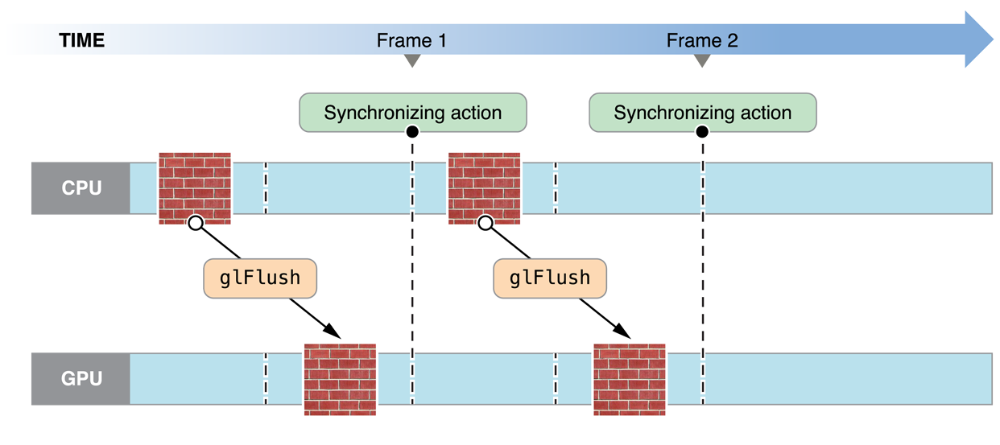
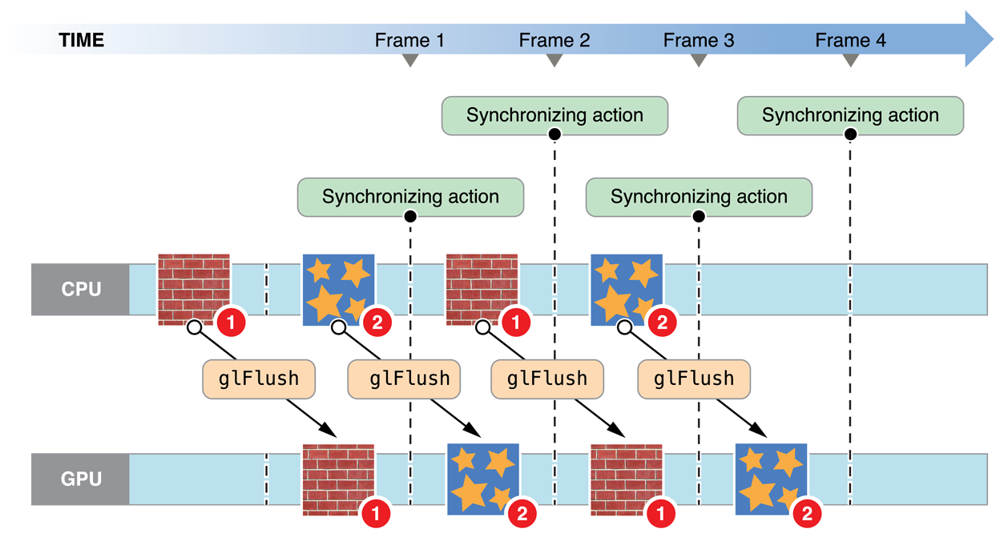

# OpenGL ES Design Guidelines

iOS 앱에서 OpenGL ES를 사용하는 기본 사항을 숙달했으므로 이 장의 정보를 사용하여 더 나은 성능을 위해 앱의 렌더링 엔진을 설계하는 데 도움을 받아라. 이 장에서는 렌더러 설계의 주요 개념을 소개하며, 이후 장에서는 이 정보를 구체적인 모범 사례와 성능 기법으로 확장한다.

### How to Visualize OpenGL ES

이 장에서는 OpenGL ES 설계를 클라이언트-서버 아키텍처와 파이프라인으로 시각화하기 위한 두 가지 관점을 설명한다. 두 가지 관점 모두 앱의 아키텍처를 계획하고 평가하는 데 유용할 수 있다.

#### OpenGL ES as a Client-Server Architecture

Figure 6-1은 OpenGL ES를 클라이언트-서버 아키텍처로 시각화한다. 앱에서 상태 변경, 텍스처 및 정점 데이터, 렌더링 명령을 OpenGL ES 클라이언트에 전달하라. 클라이언트는 이 데이터를 그래픽 하드웨어가 이해하는 형식으로 변환하여 GPU에 전달한다. 이러한 프로세스는 앱의 그래픽 성능에 오버헤드를 추가한다.

**Figure 6-1**  OpenGL ES client-server architecture

뛰어난 성능을 달성하려면 이러한 오버헤드를 주의 깊게 관리해야 한다. 잘 설계된 앱은 OpenGL ES로 호출 빈도를 줄이고, 하드웨어에 적합한 데이터 형식을 사용해 번역 비용을 최소화하며, 자신과 OpenGL ES 사이의 데이터 흐름을 세심하게 관리한다.

#### OpenGL ES as a Graphics Pipeline

Figure 6-2는 OpenGL ES를 그래픽 파이프라인으로 시각화한다. 앱은 그래픽 파이프라인을 구성한 다음 그리기 명령을 실행하여 정점 데이터를 파이프라인 아래로 전송한다. 파이프라인의 연속 단계는 정점 데이터를 처리하기 위해 정점 셰이더를 실행하고, 정점을 프리미티브로 조립하고, 프리미티브를 프래그먼트로 레스터화하고, 프레그먼트 셰이더를 실행하여 각 프레그먼트에 대한 색상 및 깊이 값을 계산하고, 프레그먼트를 디스플레이용 프레임버퍼에 혼합한다.

**Figure 6-2**  OpenGL ES graphics pipeline

새 프레임을 생성하기 위해 앱에서 수행하는 작업을 식별하려면 이 파이프라인을 멘탈 모델로 사용하라. 당신의 렌덜러 디자인은 파이프라인의 정점 및 프레그먼트 단계를 처리하기 위한 셰이더 프로그램 작성, 당신이 이 프로그램에 공급하는 정점 및 텍스처 데이터 정리, 파이프라인의 고정 기능 단계를 구동하는 OpenGL ES 상태 머신 구성으로 구성되어 있다.

그래픽 파이프라인의 개별 단계는 결과를 동시에 계산할 수 있다. 예를 들어, 앱은 새로운 프리미티브를 준비할 수 있고 그래픽 하드웨어의 개별 부분은 이전에 제출된 기하학에서 정점과 프레그먼트 계산을 수행할 수 있다. 그러나 이후 단계는 이전 단계의 출력에 따라 달라진다. 파이프라인 단계가 너무 많은 작업을 수행하거나 너무 천천히 수행하면 가장 느린 단계가 작업을 완료할 때까지 다른 파이프라인 작업이 한가하게 있다. 잘 설계된 앱은 그래픽 하드웨어 기능에 따라 각 파이프라인 단계에서 수행되는 작업의 균형을 맞춘다.

> **중요:** 앱의 성능을 조정할 때, 첫 번째 단계는 보통 앱이 어떤 단계에 병목 현상이 있는지, 그 이유는 무엇인지 파악하는 것이다.

### OpenGL ES Versions and Renderer Architecture

iOS는 3가지 버전의 OpenGL ES를 지원한다. 새로운 버전에서 성능을 저하시키지 않고 고품질 시각 효과를 포함하는 렌더링 알고리즘을 구현할 수 있어 유연성이 더욱 향상되었다.

#### OpenGL ES 3.0

OpenGL ES 3.0은 iOS 7의 새로운 버전이다. 당신의 앱은 OpenGL ES 3.0에 소개된 기능을 사용하여 고급 그래픽 프로그래밍 기법\(이전에는 데스크탑급 하드웨어와 게임 콘솔에서만 사용 가능\)을 구현하여 더 빠른 그래픽 성능과 매력적인 시각 효과를 얻을 수 있다.

아래에 OpenGL ES 3.0의 몇 가지 주요 기능이 강조 표시되어 있다. 전체 개요는 [OpenGL ES API Registry](http://www.khronos.org/registry/gles/)에서 _OpenGL ES 3.0 Specification_을 참조하라.

**OpenGL ES Shading Language Version 3.0**

요약하자면, 잘 설계된 OpenGL ES 앱은 다음을 수행해야 한다:

* OpenGL ES 파이프라인에서 병렬 처리 기능 활용.
* 앱과 그래픽 하드웨어 간의 데이터 흐름 관리

Figure 6-6은 OpenGL ES를 사용하여 애니메이션을 디스플레이에 수행하는 앱의 프로세스 흐름을 제안한다.

**Figure 6-6** App model for managing resources

앱이 출시되면 가장 먼저 하는 일은 앱의 수명 동안 바꾸려 하지 않는 자원을 초기화하는 것이다. 이상적으로, 앱은 그러한 자원을 OpenGL ES 객체로 캡슐화한다. 목표는 앱의 런타임\(또는 게임의 레벨 기간과 같은 앱 수명 중 일부라도\) 동안 변경되지 않고 유지될 수 있는 객체를 만드는 것이며, 향상된 렌더링 성능을 위해 증가된 초기화 시간을 거래하는 것이다. 복잡한 명령이나 상태 변경은 단일 함수 호출과 함께 사용할 수 있는 OpenGL ES 객체로 대체해야 한다. 예를 들어, 고정 기능 파이프라인을 구성하려면 수십 개의 함수 호출을 수행할 수 있다. 대신 초기화시 그래픽 셰이더를 컴파일하고, 단일 함수 호출로 런타임에 해당 셰이더를 전환하라. 생성하거나 수정하는 데 비용이 많이 드는 OpenGL ES 객체는 거의 항상 정적 객체로 생성되어야 한다.

렌더링 루프는 OpenGL ES 컨텍스트에 렌더링하려는 모든 항목을 처리한 다음 결과를 디스플레이에 표시한다. 애니메이션 장면에서 일부 데이터는 모든 프레임에 대해 업데이트된다. Figure 6-6에 표시된 내부 렌더링 루프에서 앱은 렌더링 자원 업데이트\(프로세스에서 OpenGL ES 객체를 생성 또는 수정\)와 이러한 자원을 사용하는 그리기 명령 제출 사이에서 번갈아 나타난다. 이 내부 루프의 목표는 CPU와 GPU가 병렬로 작동하도록 작업량을 분산시켜 앱과 OpenGL ES가 동일한 자원에 동시에 접근하지 못하도록 하는 것이다. iOS에서, OpenGL ES 객체를 수정하는 것은 프레임의 시작이나 끝에서 수정을 수행하지 않을 때 비용이 많이 들 수 있다.

이 내부 루프의 중요한 목표는 OpenGL ES에서 앱으로 데이터를 다시 복사하는 것을 피하는 것이다. GPU에서 CPU로 결과를 복사하는 것은 매우 느릴 수 있다. 복사된 데이터가 중간 렌더링 루프에 표시된 것처럼 현재 프레임을 렌더링하는 프로세스의 일부로 나중에 사용되는 경우, 이전에 제출된 모든 그리기 명령이 완료될 때까지 앱 블록을 차단한다.

앱이 프레임에 필요한 모든 그리기 명령을 제출하면 그 결과를 화면에 제시한다. 비인터랙티브 앱은 추가 처리를 위해 최종 이미지를 앱 메모리에 복사한다.

마지막으로, 앱이 종료될 준비가 되거나 주요 작업으로 종료될 때, OpenGL ES 객체를 자유롭게 하여 자체 또는 다른 앱에 추가 자원을 사용할 수 있게 한다.

이 설계의 중요한 특성을 요약하면:

* 가능할 때마다 정적 자원을 생성하라.
* 내부 렌더링 루프는 동적 자원 수정과 렌더링 명령 제출 사이에서 번갈아 나타난다. 프레임의 시작 또는 끝을 제외한 동적 자원을 수정하지 않도록 한다.
* 중간 렌더링 결과를 다시 앱으로 읽지 마라.

이 장의 나머지 부분은 이 렌더링 루프의 기능을 구현하는 유용한 OpenGL ES 프로그래밍 기법을 제공한다. 이후의 장에서는 이러한 일반적인 기법을 OpenGL ES 프로그래밍의 특정 영역에 적용하는 방법을 설명한다.

* [Avoid Synchronizing and Flushing Operations](https://developer.apple.com/library/archive/documentation/3DDrawing/Conceptual/OpenGLES_ProgrammingGuide/OpenGLESApplicationDesign/OpenGLESApplicationDesign.html#//apple_ref/doc/uid/TP40008793-CH6-SW3)
* [Avoid Querying OpenGL ES State](https://developer.apple.com/library/archive/documentation/3DDrawing/Conceptual/OpenGLES_ProgrammingGuide/OpenGLESApplicationDesign/OpenGLESApplicationDesign.html#//apple_ref/doc/uid/TP40008793-CH6-SW16)
* [Use OpenGL ES to Manage Your Resources](https://developer.apple.com/library/archive/documentation/3DDrawing/Conceptual/OpenGLES_ProgrammingGuide/OpenGLESApplicationDesign/OpenGLESApplicationDesign.html#//apple_ref/doc/uid/TP40008793-CH6-SW4)
* [Use Double Buffering to Avoid Resource Conflicts](https://developer.apple.com/library/archive/documentation/3DDrawing/Conceptual/OpenGLES_ProgrammingGuide/OpenGLESApplicationDesign/OpenGLESApplicationDesign.html#//apple_ref/doc/uid/TP40008793-CH6-SW5)
* [Be Mindful of OpenGL ES State](https://developer.apple.com/library/archive/documentation/3DDrawing/Conceptual/OpenGLES_ProgrammingGuide/OpenGLESApplicationDesign/OpenGLESApplicationDesign.html#//apple_ref/doc/uid/TP40008793-CH6-SW6)
* [Encapsulate State with OpenGL ES Objects](https://developer.apple.com/library/archive/documentation/3DDrawing/Conceptual/OpenGLES_ProgrammingGuide/OpenGLESApplicationDesign/OpenGLESApplicationDesign.html#//apple_ref/doc/uid/TP40008793-CH6-SW7)

### Avoid Synchronizing and Flushing Operations

OpenGL ES 규격은 명령을 즉시 실행하는 구현을 필요로 하지 않는다. 종종 명령은 명령 버퍼에 대기하고 나중에 하드웨어에 의해 실행된다. 일반적으로 OpenGL ES는 앱이 하드웨어에 명령을 전송하기 전에 많은 명령을 대기시킬 때까지 기다린다. 즉, 일괄 처리가 일반적으로 더 효율적이다. 그러나 일부 OpenGL ES 함수는 명령 버퍼를 즉시 플러시해야 한다. 다른 함수는 명령 버퍼 플러시뿐만 아니라 앱에 대한 제어를 반환하기 전에 이전에 제출된 명령이 완료될 때까지 차단한다. 해당 동작이 필요한 경우에만 플러싱 및 동기화 명령을 사용하라. 플러시 또는 동기화 명령을 과도하게 사용하면 하드웨어 렌더링이 완료될 때까지 앱이 중지될 수 있다.

이러한 상황에서는 OpenGL ES가 명령 버퍼를 실행을 위해 하드웨어에 제출해야 한다.

* `glFlush` 함수는 명령 버퍼를 그래픽 하드웨어로 보낸다. 명령이 하드웨어에 제출될 때까지 차단되지만 명령이 실행이 완료될 때까지 기다리지 않는다.
* `glFinish` 함수는 명령 버퍼를 플러싱한 다음 이전에 제출한 모든 명령이 그래픽 하드웨어에서 실행이 완료될 때까지 기다린다.
* 프레임버퍼 콘텐츠\(`glReadPixels` 등\)를 검색하는 기능도 제출된 명령이 완료될 때까지 기다린다.
* 명령 버퍼가 꽉 찼다.

#### Using glFlush Effectively

일부 데스크톱 OpenGL 구현에서는 CPU와 GPU 작업의 균형을 효율적으로 맞추기 위해 주기적으로 glFlush 함수를 호출하는 것이 유용할 수 있지만 iOS에서는 그렇지 않다. iOS 그래픽 하드웨어에 의해 구현되는 타일 기반 지연 렌더링 알고리즘은 한 장면의 모든 버텍스 데이터를 한 번에 버퍼링하는 것에 의존하기 때문에 숨겨진 표면 제거를 위해 최적으로 처리할 수 있다. 일반저긍로 OpenGL ES 앱이 glFlush 또는 glFinish 함수를 호출해야 하는 상황은 두 가지 뿐이다.

* 앱이 백그라운드에 있는 동안 GPU에서 OpenGL ES 명령을 실행하면 iOS가 앱을 종료하기 때문에 앱이 백그라운드로 이동할 때 명령 버퍼를 플러시해야 한다. \([Implementing a Multitasking-Aware OpenGL ES App](https://developer.apple.com/library/archive/documentation/3DDrawing/Conceptual/OpenGLES_ProgrammingGuide/ImplementingaMultitasking-awareOpenGLESApplication/ImplementingaMultitasking-awareOpenGLESApplication.html#//apple_ref/doc/uid/TP40008793-CH5-SW5) 참조\)
* 앱이 여러 컨텍스트 간에 OpenGL ES 객체\(버텍스 버퍼 또는 텍스처 등\)를 공유하는 경우 glFlush 함수를 호출하여 이러한 자원에 대한 접근을 동기화하라. 에를 들어, 한 컨텍스트에서 버텍스 데이터를 로드한 후 glFlush 함수를 호출하여 다른 컨텍스트에서 내용을 검색할 준비가 되었는지 확인하라. 이 조언은 OpenGL ES 객체를 Core Image와 같은 다른 iOS API와 공유할 때에도 적용된다.

#### Avoid Querying OpenGL ES State

glGetError\(\)를 포함한 glGet\*\(\)를 호출하려면 상태 변수를 검색하기 전에 OpenGL ES가 이전 명령을 실행해야 할 수 있다. 이러한 동기화로 인해 그래픽 하드웨어가 CPU와 함께 lockstep을 실행하게 되어 병렬화의 기회가 줄어들게 된다. 이 문제를 방지하려면 OpenGL ES에 호출하지 말고 문의해야 할 상태의 복사본을 유지하고 직접 접근하라.

오류가 발생하면 OpenGL ES가 오류 플래그를 설정한다. 이러한 오류와 기타 오류는 Xcode의 OpenGL ES 프레임 디버거 또는 Instruments의 OpenGL ES 분석기에 나타난다. 자주 호출하면 성능을 저하시키는 glGetError\(\) 함수 대신 이러한 도구를 사용해야 한다. glCheckFramebufferStatus\(\), glGetProgramInfoLog\(\) 및 glValidateProgram\(\)과 같은 다른 쿼리는 일반적으로 개발 및 디버깅하는 동안만 유용하다. 앱 릴리스 빌드에서 이러한 함수에 대한 호출은 생략해야 한다.

### Use OpenGL ES to Manage Your Resources

OpenGL 데이터의 많은 부분을 OpenGL ES 렌더링 컨텍스트 및 sharegroup 객체 내에 직접 저장할 수 있다. OpenGL ES 구현은 데이터를 그래픽 하드웨어에 가장 적합한 형식으로 자유롭게 변환할 수 있다. 이는 특히 자주 변경되지 않는 데이터의 경우 성능을 크게 향상시킬 수 있다. 당신의 앱은 OpenGL ES에 데이터 사용 방법에 대한 힌트를 제공할 수도 있다. OpenGL ES 구현은 데이터를 보다 효율적으로 처리하기 위해 이러한 힌트를 사용할 수 있다. 예를 들어, 정적 데이터는 그래픽 프로세서가 쉽게 가져올 수 있는 메모리에 저장되거나 전용 그래픽 메모리에 저장될 수 있다.

### Use Double Buffering to Avoid Resource Conflicts

자원 충돌은 앱과 OpenGL ES가 OpenGL ES 객체에 동시에 접근할 때 발생한다. 한 참가자가 다른 참가자가 사용하는 OpenGL ES 객체를 수정하려고 시도할 때 객체가 더 이상 사용되지 않을 때까지 차단할 수 있다. 일단 객체 수정을 시작하면 다른 참가자는 수정이 완료될 때까지 객체에 접근하지 않을 수 있다. 또는 OpenGL ES는 두 참가자가 명령을 계속 실행할 수 있도록 객체를 암묵적으로 복제할 수 있다. 어느 쪽이든 안전하지만, 각각은 당신의 앱에서 병목현상으로 끝날 수 있다. Figure 6-7은 이 문제를 보여준다. 이 예제에서는 OpenGL ES와 앱이 모두 사용하고 싶은 단일 텍스처 객체가 있다. 앱이 텍스처를 변경하려고 시도할 때 이전에 제출된 그리기 명령이 완료될 대까지 기다려야 한다. CPU는 GPU에 동기화된다.

**Figure 6-7** Single-buffered texture data

이 문제를 해결하기 위해 앱은 객체를 변경하는 것과 객체를 사용하여 그리는 것 사이에 추가 작업을 수행할 수 있다. 그러나 앱에 추가 작업이 없으면 동일한 크기의 두 객체를 명시적으로 만들어야 한다. 한 참가자가 객체를 읽는 동안 다른 참가자는 다른 참가자를 수정한다. Figure 6-8은 이중 버퍼 접근법을 보여준다. GPU가 하나의 텍스처 상에서 동작하는 동안, CPU는 다른 텍스처를 수정한다. 초기 시작 후 CPU나 GPU는 한가하게 앉아 있지 않다. 텍스처에 대해 표시되었지만 이 솔루션은 OpenGL ES 객체의 거의 모든 유형에 적용된다.

**Figure 6-8**  Double-buffered texture data

이중 버퍼링은 대부분의 앱에 충분하지만, 두 참가자 모두 거의 같은 시간에 처리 명령을 마쳐야 한다. 차단을 방지하려면 버퍼를 더 추가할 수 있다. 이 모델은 전통적인 생산자-소비자 모델을 구현한다. 소비자가 처리 명령을 완료하기 전에 생산자가 완료하면 유휴 버퍼가 필요하고 명령을 계속 처리한다. 이런 상황에서 생산자는 소비자가 심하게 뒤쳐질 경우에만 게으름을 피운다.

이중 및 삼중 버퍼링은 파이프라인이 정지하지 않도록 추가 메모리를 소비한다. 메모리를 추가로 사용하면 앱의 다른 부분에 압박이 가해질 수 있다. iOS 장치에서 메모리는 부족할 수 있다. 다른 앱 최적화와 더 많은 메모리를 사용하여 설계 균형을 맞춰야 할 수 있다.

### Be Mindful of OpenGL ES State

OpenGL ES 구현은 glEnable 또는 glDisable 함수로 설정한 스위치, 현재 셰이더 프로그램과 그 균일한 변수, 현재 바인딩된 텍스처 단위, 현재 바인딩된 버텍스 버퍼 및 활성화된 버텍스 속성을 포함하여 복잡한 상태 데이터 세트를 유지한다. 하드웨어는 하나의 현재 상태를 가지고 있는데, 이것은 게으르게 컴파일되고 캐시된다. 상태 전환은 비용이 많이 들기 때문에 상태 전환을 최소화하도록 앱을 설계하는 것이 가장 좋다.

이미 설정된 상태를 설정하지 마라. 기능이 활성화되면 다시 활성화할 필요가 없다. 예를 들어, 동일한 인수를 가진 glUniform 함수를 두 번 이상 호출하면 OpenGL ES가 동일한 uniform 상태가 이미 설정되었는지 확인하지 않을 수 있다. 상기 상태 값은 상기 현재 값과 동일하더라도 간단히 업데이트 한다.

그리기 루프에 호출을 넣지 않고 전용 설정 또는 종료 루틴을 사용하여 필요 이상의 상태를 설정하지 마라. 설정 및 종료 루틴은 예를 들어, 텍스처된 폴리곤 주위에 와이어 프레임 윤곽을 그릴 때 특정 시각 효과를 달성하는 기능을 켜고 끄는 데 유용하다.

#### Encapsulate State with OpenGL ES Objects

상태 변경을 줄이려면 여러 OpenGL ES 상태 변경을 수집하는 객체를 단일 함수 호출로 바인딩할 수 있는 객체로 생성하라. 예를 들어, 버텍스 배열 객체는 여러 버텍스 속성의 구성을 단일 객체에 저장한다. [Consolidate Vertex Array State Changes Using Vertex Array Objects](https://developer.apple.com/library/archive/documentation/3DDrawing/Conceptual/OpenGLES_ProgrammingGuide/TechniquesforWorkingwithVertexData/TechniquesforWorkingwithVertexData.html#//apple_ref/doc/uid/TP40008793-CH107-SW14)를 참조하라.

#### Organize Draw Calls to Minimize State Changes

OpenGL ES 상태를 변경해도 즉각적인 효과는 없다. 대신 그리기 명령을 내릴 때 OpenGL ES는 상태 값 집합을 사용하여 그리는 데 필요한 작업을 수행한다. 상태 변경을 최소화하여 그래픽 파이프라인을 재구성하는 데 소요되는 CPU 시간을 줄일 수 있다. 예를 들어, 앱에 상태 벡터를 유지하고, 그리기 호출 간에 상태가 변경되는 경우에만 해당하는 OpenGL ES 상태를 설정하라. 또 다른 유용한 알고리즘은 상태 정렬이다. 즉, 수행해야 하는 그리기 작업과 각 작업에 필요한 상태 변경 양을 추적한 다음, 동일한 상태를 연속적으로 사용하여 작업을 수행하도록 정렬한다.

OpenGL ES의 iOS 구현은 상태 간 효율적인 스위칭에 필요한 구성 데이터의 일부를 캐시할 수 있지만 각 고유 상태 세트에 대한 초기 구성은 더 오래 걸린다. 일관된 성능을 위해 설정 루틴 중에 사용할 각 상태 세트를 "prewarm" 할 수 있다.

1. 사용하려는 상태 구성 또는 셰이더를 사용 가능으로 설정하라.
2. 해당 상태 구성을 사용하여 버텍스의 개수를 그려라.
3. prewarm 단계에서 도면이 표시되지 않도록 OpenGL ES 컨텍스트를 플러시하라.

