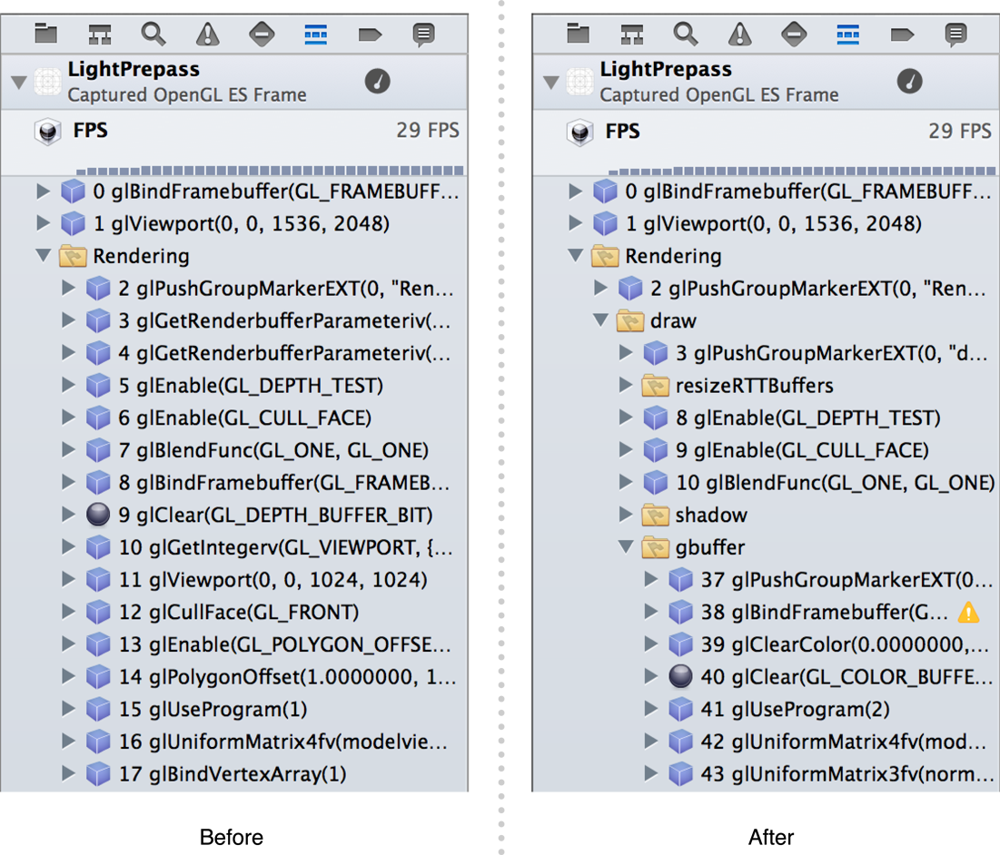
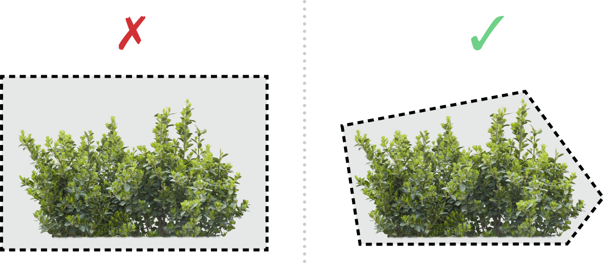

# Tuning Your OpenGL ES App

iOS에서 OpenGL ES 앱의 성능은 OS X나 다른 데스크탑 운영 체제의 OpenGL과 다르다. 비록 강력한 컴퓨팅 장치들이지만, iOS 기반 장치들은 데스크탑이나 노트북 컴퓨터가 가지고 있는 메로리나 CPU 파워를 가지고 있지 않다. 임베디드 GPU는 일반적인 데스크탑 또는 노트북 GPU와 다른 알고리즘을 사용하여 낮은 메모리 및 전력 사용량에 최적화되어 있다. 그래픽 데이터를 비효율적으로 렌더링하면 프레임률이 저하되거나 iOS 기반 장치의 배터리 수명을 획기적으로 줄일 수 있다.

이후 장에서는 앱의 성능을 향상시키기 위한 많은 기법을 설명한다. 이 장에서는 전반적인 전략을 다룬다. 라벨에 부착되지 않는 한, 이 장의 조언은 OpenGL ES의 모든 버전에 관련된다.

### Debug and Profile Your App with Xcode and Instruments

다양한 장치에서 다양한 시나리오에서 앱 성능을 테스트하기 전에는 앱을 최적화하지 마라. Xcode와 Instruments에는 앱에서 성능과 정확성 문제를 식별하는 데 도움이 되는 도구가 포함되어 있다.

* _Xcode 디버그 게이지_를 모니터링하여 일반적인 성능 개요를 확인하라. 이러한 게이지는 Xcode에서 앱을 실행할 때마다 표시되므로 앱을 개발하는 동안 성능 변화를 쉽게 발견할 수 있다.
* 런타임 성능에 대한 자세한 이해를 위해 Instruments의 OpenGL ES 분석 및 OpenGL ES 드라이버 도구를 사용하라. 앱의 리소스 사용 및 OpenGL ES 모범 사례에 대한 자세한 정보를 얻고 그래픽 파이프라인의 일부를 선택적으로 비활성화하여 앱에서 중요한 병목 현상이 되는 부분을 결정할 수 있다. 자세한 내용은 [_Instruments User Guide_](https://developer.apple.com/library/archive/documentation/DeveloperTools/Conceptual/InstrumentsUserGuide/index.html#//apple_ref/doc/uid/TP40004652)를 참조하라.
* 성능 문제 해결 및 렌더링 문제를 정확하게 해결하려면 Xcode의 OpenGL ES Frame Debugger 및 Performance Analyzer 도구를 사용하라. 단일 프레임을 렌더링하고 표시하는 데 사용되는 모든 OpenGL ES 명령을 캡처한 다음 해당 명령을 통해 OpenGL ES 상태, 바인딩된 리소스 및 출력 프레임 버퍼에 대한 각 명령의 효과를 확인하라. 또한 셰이더 소스 코드를 보고, 편집하며, 변경사항이 렌더링된 이미지에 어떤 영향을 미치는 지 볼 수 있다. OpenGL ES 3.0 지원 기기의 경우 ,프레임 디버거는 도한 어떤 그리기 호출과 셰이더 명령이 렌더링 시간에 가장 큰 기여를 하는지 표시한다. 이러한 도구에 대한 자세한 내용은 [Xcode OpenGL ES Tools Overview](https://developer.apple.com/library/archive/documentation/3DDrawing/Conceptual/OpenGLES_ProgrammingGuide/ToolsOverview/ToolsOverview.html#//apple_ref/doc/uid/TP40008793-A2-SW7)를 참조하라.

#### Watch for OpenGL ES Errors in Xcode and Instruments

OpenGL ES 오류는 앱이 OpenGL ES API를 잘못 사용할 때 발생한다. \(예를 들어, 기본 하드웨어가 수행할 수 없는 작업을 요청하여\). 콘텐츠가 올바르게 렌더링되더라도 이러한 오류는 성능 문제를 나타낼 수 있다. OpenGL ES 오류를 확인하는 기존 방법은 `glGetError` 함수를 호출하는 것이다. 그러나 이 함수를 반복적으로 호출하면 성능이 현저히 저하될 수 있다. 대신 위에 설명된 도구를 사용하려 오류를 테스트하라:

* Instruments에서 앱을 프로파일링할 때 OpenGL ES Analyzer 도구의 세부 정보 창을 참조하여 녹화하는 동안 보고된 OpenGL ES 오류를 확인하라.
* Xcode에서 앱을 디버깅하는 동안 프레임을 캡처하여 앱을 만드는 데 사용되는 그리기 명령과 해당 명령을 수행하는 동안 발생하는 오류를 검사하라.

또한 OpenGL ES 오류가 발생할 때 프로그램 실행을 중지하도록 Xcode를 구성할 수도 있다. \(자세한 내용은 OpenGL ES Error Breakpoint를 참조하라.\)

#### Annotate Your OpenGL ES Code for Informative Debugging and Profiling

OpenGL ES 명령을 논리 그룹으로 구성하고 OpenGL ES 객체에 의미 있는 레이블을 추가함으로써 디버깅과 프로파일링을 더욱 효율적으로 만들 수 있다. 이러한 그룹과 라벨은 Figure 7-1과 같이 Xcode의 OpenGL ES Frame Debugger와 Instruments의 OpenGL ES Analyzer에 나타난다. 그룹 및 레이블을 추가하려면 [EXT\_debug\_marker](http://www.khronos.org/registry/gles/extensions/EXT/EXT_debug_marker.txt) 및 [EXT\_debug\_label](http://www.khronos.org/registry/gles/extensions/EXT/EXT_debug_label.txt) 익스텐션을 사용하라.

**Figure 7-1** Xcode Frame Debugger before and after adding debug marker groups



게임 캐릭터 그리기와 같이 하나의 의미 있는 작업을 나타내는 일련의 그리기 명령이 있을 경우, 마커를 사용하여 디버깅을 위해 그룹을 만들 수 있다. Figure 7-1은 장면의 단일 요소에 대한 텍스처, 프로그램, 버텍스 배열 및 그리기 호출을 그룹화하는 방법을 보여준다. 먼저 `glPushGroupMarkerEXT` 함수를 불러 의미 있는 이름을 제공한 다음 명령 그룹을 발행한다. 마지막으로 `glPopGroupMarkerEXT` 함수에 대한 호출로 그룹을 닫는다.

**Listing 7-1**  Using a debug marker to annotate drawing commands

```objectivec
glPushGroupMarkerEXT(0, "Draw Spaceship");
glBindTexture(GL_TEXTURE_2D, _spaceshipTexture);
glUseProgram(_diffuseShading);
glBindVertexArrayOES(_spaceshipMesh);
glDrawElements(GL_TRIANGLE_STRIP, 256, GL_UNSIGNED_SHORT, 0);
glPopGroupMarkerEXT();
```

여러 개의 내포된 마커를 사용하여 복잡한 장면에서 의미 있는 그룹의 계층을 만들 수 있다. [`GLKView`](https://developer.apple.com/documentation/glkit/glkview) 클래스를 사용하여 OpenGL ES 콘텐츠를 그리면 그리기 메서드의 모든 명령이 포함된 "렌더링" 그룹이 자동으로 생성된다. 작성한 모든 마커는 이 그룹 내에 중첩되어 있다.

라벨은 텍스처, 셰이더 프로그램, 정점 배열 객체 등 OpenGL ES 객체에 의미 있는 이름을 제공한다. glLabelObjectEXT 함수를 호출하여 디버깅 및 프로파일링시 표시할 객체 이름을 지정하라. Listing 7-2는 이 함수를 사용해 정점 배열 객체에 레이블을 지정할 수 있다. [`GLKTextureLoader`](https://developer.apple.com/documentation/glkit/glktextureloader) 클래스를 사용하여 텍스처 데이터를 로드하면 파일 이름으로 작성한 OpenGL ES 텍스처 객체에 자동으로 레이블을 지정한다.

**Listing 7-2**  Using a debug label to annotate an OpenGL ES object

```objectivec
glGenVertexArraysOES(1, &_spaceshipMesh);
glBindVertexArrayOES(_spaceshipMesh);
glLabelObjectEXT(GL_VERTEX_ARRAY_OBJECT_EXT, _spaceshipMesh, 0, "Spaceship");
```

### General Performance Recommendations

상식적으로 성능 튜닝 작업을 안내하라. 예를 들어, 앱이 프레임당 몇 십 개의 삼각형만 그리는 경우, 정점 데이터를 제출하는 방법을 변경해도 성능이 향상될 것 같지 않다. 귀사의 노력에 가장 큰 성능 향상을 제공하는 최적화를 찾아봐라.

#### Redraw Scenes Only When the Scene Data Changes

당신의 앱은 새로운 프레임을 렌더링하기 전에 장면의 무언가가 바뀔때 때까지 기다려야 한다. Core Animation은 사용자가 제시된 마지막 이미지를 캐시하고 새로운 프레임이 표시될 때까지 계속 표시한다.

데이터가 변경되더라도 하드웨어 프로세스 명령의 속도로 프레임을 렌더링할 필요는 없다. 속도가 느리지만 고정된 프레임률이 빠르지만 가변 프레임률보다 사용자에게 더 부드럽게 나타나는 경우가 많다. 초당 30프레임의 고정 프레임률은 대부분의 애니메이션에 충분하며 전력 소비량을 줄이는 데 도움이 된다.

#### Disable Unused OpenGL ES Features

가장 좋은 계산은 당신의 앱이 절대 수행하지 않는 계산이다. 예를 들어, 결과를 미리 계산하여 모델 데이터에 저장할 수 있는 경우 런타임에 해당 계산을 수행하지 않아도 된다.

앱이 OpenGL ES 2.0 이상에 작성된 경우 앱이 장면을 렌더링하는 데 필요한 모든 작업을 수행하는 많은 스위치와 조건부로 단일 셰이더를 만들지 마라. 대신, 각각 특정 집중 작업을 수행하는 여러 셰이더 프로그램을 컴파일한다.

앱이 OpenGL ES 1.1을 사용하는 경우 장면을 렌더링하는 데 필요하지 않은 고정 기능 작업을 모두 비활성화하라. 예를 들어, 앱은 조명이나 블렌딩이 필요하지 않은 경우 해당 기능을 비활성화하라. 마찬가지로, 앱이 2D 모델만 그릴 경우 안개와 깊이 테스트를 비활성화해야 한다.

#### Simplify Your Lighting Models

이 가이드는 OpenGL ES 1.1의 고정 함수 조명 및 OpenGL ES 2.0 이상의 사용자 정의 셰이더에서 사용하는 셰이더 기반 조명 계산에 모두 적용된다.

* 가능한 최소의 조명과 가장 간단한 조명 종류를 당신의 앱에 사용하라. 더 많은 계싼이 필요한 스폿 조명 대신 방향 조명을 사용하는 것을 고려해보라. 셰이더는 모델 공간에서 조명 계산을 수행해야 한다. 좀 더 복잡한 조명 알고리즘보다 셰이더에 더 단순한 조명 방정식을 사용하는 것을 고려해보라.
* 조명을 미리 계산하고 프레그먼트 처리를 통해 샘플링할 수 있는 텍스처에 색상 값을 저장한다.

### Use Tile-Based Deferred Rendering Efficiently

iOS 기기에 사용되는 모든 _GPU 타일 기반 지연 렌더링 \(TBDR\)_을 사용한다. OpenGL ES 함수를 호출하여 렌더링 명령을 하드웨어에 제출하면 명령의 많은 목록이 축적될 때까지 명령이 버퍼링된다. 하드웨어는 사용자가 렌더버퍼를 표시하거나 명령 버퍼를 플러시할 때까지 정점과 음영 픽셀 처리를 시작하지 않는다. 그런 다음 프레임 버퍼를 타일로 나눈 다음 각 타일에 대해 명령을 한 번 그리며 각 타일에는 그 안에 보이는 원시 요소만 렌더버퍼를 표시한다. \(클래스는 그리기 메서드가 반환된 후 렌더버퍼를 표시한다. CAEAGLLayer 클래스를 사용하여 표시할 렌더버퍼를 직접 생성하는 경우 OpenGL ES 컨텍스트의 [`presentRenderbuffer:`](https://developer.apple.com/documentation/opengles/eaglcontext/1622257-presentrenderbuffer) 메서드를 사용하여 렌더버퍼를 표시하라.\) `glFlush` 또는 `glFinish` 함수는 명령 버퍼를 플러시한다.

타일 메모리는 GPU 하드웨어의 일부이기 때문에, 깊이 테스트와 혼합과 같은 렌더링 프로세스의 일부는 전통적인 스트림 기반 GPU 아키텍처에서보다 훨씬 더 효율적이다. 이 아키텍처는 전체 장면의 모든 정점을 한 번에 처리하기 때문에 GPU는 프레그먼트들이 처리되기 전에 숨겨진 표면 제거를 수행할 수 있다. 보이지 않는 픽셀은 샘플링 텍스처나 프레그먼트 처리를 하지 않고 폐기해, 타일을 렌더링하기 위해 GPU가 수행해야 하는 계산을 현저히 줄인다.

기존의 스트림 기반 렌더러에 유용한 일부 렌더링 전략은 iOS 그래픽 하드웨어의 높은 성능 비용을 가지고 있다. 아래 가이드를 따르면 TBDR 하드웨어에서 앱의 성능을 향상시킬 수 있다.

#### Avoid Logical Buffer Loads and Stores

TBDR 그래픽 프로세서가 타일을 렌더링하기 시작할 때, 먼저 프레임 버퍼의 해당 부분의 내용을 공유 메모리에서 GPU의 타일 메모리로 전송해야 한다. 논리 버퍼 로드로 불리는 이 메모리 전송은 시간과 에너지를 필요로 한다. 가장 흔히 프레임 버퍼의 이전 내용은 다음 프레임을 그리는데 필요하지 않다. 새 프레임을 렌더링하기 시작할 때마다 glClear를 호출하여 이전 버퍼 콘텐츠를 로드하는 데 드는 성능 비용을 피하라.

마찬가지로 GPU가 타일 렌더링을 마치면 타일의 픽셀 데이터를 공유 메모리에 다시 기록해야 한다. _logical buffer store_라고 불리는 이 이전에도 성능 비용이 들어간다. 그려진 각 프레임에 대해 적어도 하나의 전송이 필요하다. 화면에 표시되는 컬러 렌더버퍼를 공유 메모리로 전송해야 Core Animation에 의해 표시될 수 있다. 렌더링 알고리즘에 사용되는 다른 프레임버퍼 첨부 파일\(예를 들어 깊이, 스텐실 및 멀티샘플링 버퍼\)은 다음 프레임에서 콘텐츠가 다시 생성되기 때문에 보존할 필요가 없다. OpenGL ES는 명시적으로 무효화하지 않는 한 이러한 버퍼를 자동으로 공유 메모리에 저장\(성능 비용을 증가\)한다. 버퍼를 무효화하려면 OpenGL ES 3.0의 `glInvalidateFramebuffer` 명령 또는 OpenGL ES 1.1 또는 2.0의 `glDiscardFramebufferEXT` 명령을 사용하라. \(자세한 내용은 [Discard Unneeded Renderbuffers](https://developer.apple.com/library/archive/documentation/3DDrawing/Conceptual/OpenGLES_ProgrammingGuide/WorkingwithEAGLContexts/WorkingwithEAGLContexts.html#//apple_ref/doc/uid/TP40008793-CH103-SW20)을 참조하라.\) [`GLKView`](https://developer.apple.com/documentation/glkit/glkview) 클래스에서 제공하는 기본 그리기 주기를 사용하면 그리기 가능한 깊이, 스텐실 또는 멀티샘플링 버퍼가 자동으로 무효화된다.

렌더링 대상을 전환하면 논리적 버퍼 저장소 및 로드 작업도 수행된다. 텍스처로 렌더링한 다음 뷰의 프레임 버퍼로 렌더링한 다음 동일한 텍스처로 다시 렌더링한 경우 텍스처의 내용을 공유 메모리와 GPU 간에 반복적으로 전송해야 한다. 렌더링 대상으로의 모든 그리기가 함께 수행되도록 그리기 작업을 배치하라. 프레임 버퍼를 전환하면\(`glBindFramebuffer` 또는 `glFrameBufferTexture2D` 메서드를 사용하여\) 불필요한 프레임 버퍼 첨부 파일을 무효화하여 논리적 버퍼 저장소를 유발하지 않도록 하라.

#### Use Hidden Surface Removal Effectively

TBDR 그래픽 프로세서는 자동으로 깊이 버퍼를 사용하여 전체 장면에 대해 숨겨진 표면 제거를 수행함으로써 각 픽셀에 대해 단 하나의 프레그먼트 셰이더만 실행되도록 한다. 프레그먼트 처리를 줄이는 전통적인 기술은 필요하지 않다. 예를 들어, 앞에서 뒤로 깊이별로 객체나 원시 요소를 정렬하면 GPU가 수행하는 작업이 효과적으로 중복되어 CPU 시간이 낭비된다.

블렌딩 또는 알파 테스트가 활성화된 경우 또는 프레그먼트 셰이더가 `discard` 명령을 사용하거나 `gl_FragDepth` 출력 변수에 쓰는 경우 GPU는 숨겨진 표면 제거를 수행할 수 없다. 이러한 경우, GPU는 깊이 버퍼를 사용하여 프레그먼트의 가시성을 결정할 수 없으므로 각 픽셀을 덮는 모든 원시 요소에 대해 프레그먼트 셰이더를 실행해야하며 프레임 렌더링에 필요한 시간과 에너지를 크게 증가시킨다. 이러한 성능 비용을 피하기 위해 블렌딩, `discard` 명령 및 깊이 쓰기 사용을 최소화하라.

가이드를 혼합, 알파 테스트 또는 폐기하지 않을 수 없는 경우 성능 영향을 줄이기 위해 다음 전략을 고려하라:

* 불투명한 객체를 먼저 정렬하라. 다음은 폐기 작업\(또는 OpenGL ES 1.1\)을 사용하여 셰이더가 필요한 객체를 그린다. 마지막으로 알파 블렌딩 객체를 그린다.
* 처리된 프레그먼트의 수를 줄이기 위해 블렌딩 또는 discard 명령이 필요한 객체를 자르라. 예를 들어, 사각형을 그려 대부분 빈 공간이 포함된 2D 스프라이트 텍스처를 렌더링하는 대신 Figure 7-2와 같이 이미지의 모양에 더 가깝게 근접한 다각형을 그려라. 추가 정점 처리에 따른 성능 비용은 결과가 사용되지 않는 프레그먼트 셰이더 실행 비용보다 훨씬 작다.

**Figure 7-2** Trim transparent objects to reduce fragment processing



* 결과가 사용되지 않는 계산을 수행하지 않으려면 프레그먼트 셰이더에서 가능한 빨리 삭제 지침을 사용하라.
* 픽셀을 제거하기 위해 알파 테스트를 사용하거나 명령을 무시하는 대신 알파 세트를 0으로 설정한 알파 블렌딩을 사용하라. 컬러 프레임 버퍼는 수정되지 않지만 그래픽 하드웨어는 여전히 그것이 수행하는 어떤 Z 버퍼 최적화도 사용할 수 있다. 이렇게 하면 깊이 버퍼에 저장된 값이 변경되므로 투명 원소의 앞뒤 정렬이 필요할 수 있다.
* 부득이한 버리기 작업으로 인해 성능이 제한되는 경우, "Z-Prepass" 렌더링 전략을 고려하라. 깊이 버퍼를 채울 수 있도록 버리기 로직만 포함하는 간단한 프레그먼트 셰이더로 장면을 한 번 렌더링하라 \(비싼 조명 계산을 피하여\). 그런 다음 GL\_EQUAL을 사용하여 장면을 다시 렌더링하라. 멀티패스 렌더링은 일반적으로 성능 저하를 유발하지만, 이 접근방식은 많은 수의 버리기 작업을 수반하는 단일 패스 렌더보다 더 나은 성능을 산출할 수 있다.

#### Group OpenGL ES Commands for Efficient Resource Management

위에서 설명한 메모리 대역폭과 컴퓨터 절약은 대형 씬을 처리할 때 가장 효과적이다. 그러나 하드웨어가 더 작은 씬을 렌더링하도록 요구하는 OpenGL ES 명령을 수신하면 렌더러는 효율의 상당 부분을 잃게 된다. 예를 들어, 앱이 텍스처를 사용하여 삼각형 묶음을 렌더링한 다음 텍스처를 수정하는 경우 OpenGL ES 구현은 이러한 명령을 즉시 플러시하거나 텍스처를 복제해야 하며, 어떤 옵션도 하드웨어를 효율적으로 사용하지 않아야 한다. 마찬가지로, 프레임 버퍼에서 픽셀 데이터를 읽으려는 모든 시도는 프레임 버퍼에서 변경될 경우 이전 명령을 처리해야 한다.

이러한 성능 페널티를 방지하려면 각 렌더링 대상에 대한 모든 그리기 명령이 함께 수행되도록 OpenGL ES 호출 시퀀스를 구성하라.

### Minimize the Number of Drawing Commands

당신의 앱이 OpenGL ES에 의해 처리될 원시 요소를 제출할 때마다 CPU는 그래픽 하드웨어에 대한 명령을 준비한다. 앱에서 장면을 렌더링하기 위해 `glDrawArray` 또는 `glDrawElements` 호출을 많이 사용하는 경우 GPU를 완전히 사용하지 않고 CPU 자원에 의해 성능이 제한될 수 있다. 

이러한 오버헤드를 줄이려면 렌더링을 더 적은 수의 그리기 호출로 통합하는 방법을 찾아봐라. 유용한 전략에는 다음이 포함된다:

* 삼각형 스트립과 배치 정점 데이터 사용에 설명된 대로 여러 원시 요소를 단일 삼각형 스트립에 병합하라. 최상의 결과를 얻으려면 가까운 공간에 그려진 원시 요소를 통합하라. 대형 모델의 경우 프레임에 표시되지 않을 경우 앱이 효율적으로 도태하기가 더 어렵다.
* [Combine Textures into Texture Atlases](https://developer.apple.com/library/archive/documentation/3DDrawing/Conceptual/OpenGLES_ProgrammingGuide/TechniquesForWorkingWithTextureData/TechniquesForWorkingWithTextureData.html#//apple_ref/doc/uid/TP40008793-CH104-SW2)에 설명된 대로, 동일한 텍스처 이미지의 다른 부분을 사용하여 여러 프리미티브를 그리기 위해 텍스처 아틀라스를 작성하라.
* 아래에 설명된 것처럼 많은 유사 객체를 렌더링하기 위해 분할된 그리기를 사용하라.

#### Use Instanced Drawing to Minimize Draw Calls

분할된 그리기 명령을 사용하면 단일 그리기 호출을 사용하여 동일한 꼭지점 데이터를 여러 번 그릴 수 있다. CPU 시간을 사용하여 위치 오프셋, 변환 매트릭스, 색상 또는 텍스처 좌표와 같은 메쉬의 여러 인스턴스 간의 그리기를 설정하고 각 인스턴스에 대한 그리기 명령을 실행하는 대신, 인스턴스 그리기의 처리를 GPU에서 실행 중인 셰이더 코드로 이동시킨다.

여러 번 재사용되는 정점 데이터는 분할 그리기에 가장 적합한 대상이다. 예를 들어, Listing 7-3의 코드는 한 장면 내의 여러 위치에 객체를 그린다. `glUniform`과 `glDrawArray`의 많은 호출은 CPU 오버헤드를 추가하여 성능을 감소시킨다.

**Listing 7-3**  Drawing many similar objects without instancing

```objectivec
for (x = 0; x < 10; x++) {
    for (y = 0; y < 10; y++) {
        glUniform4fv(uniformPositionOffset, 1, positionOffsets[x][y]);
        glDrawArrays(GL_TRIANGLES, 0, numVertices);
    }
}
```

분할된 그리기를 채택하려면 두 가지 단계가 필요하다: 첫째, 위와 같은 루프를 `glDrawArraysInstanced` 또는 `glDrawElementsInstanced` 대한 단일 호출로 교체하라. 이러한 호출과 달리 glDrawArray 또는 glDrawElements와 동일하지만 그릴 인스턴스 수를 나타내는 추가 파라미터가 있다 \(Listing 7-3의 예시 100\). 두 번째, OpenGL ES가 제공하는 두 가지 전략 중 하나를 선택하여 구현하여 정점 세이더에서 인스턴스별 정보를 사용할 수 있도록 한다.

셰이더 인스턴스 ID 전략을 사용하여 버텍스 셰이더는 인스턴스당 정보를 얻거나 검색한다. 버텍스 셰이더가 실행될 때마다 gl\_InstanceID 내장 변수는 현재 그려지고 있는 인스턴스를 식별하는 숫자를 포함하고 있다. 셰이더 코드에서 위치 오프셋, 색상 또는 기타 인스턴스당 변화를 계산하거나, 균일한 배열 또는 기타 대량 저장소에서 인스턴스당 정보를 검색하려면 이 숫자를 사용하라. 예를 들어, Listing 7-4는 10x10 그리드에 위치한 메쉬의 100개 인스턴스를 그리기 위해 이 기술을 사용한다.

**Listing 7-4** OpenGL ES 3.0 vertex shader using `gl_InstanceID` to compute per-instance information

```text
#version 300 es
 
in vec4 position;
 
uniform mat4 modelViewProjectionMatrix;
 
void main()
{
    float xOffset = float(gl_InstanceID % 10) * 0.5 - 2.5;
    float yOffset = float(gl_InstanceID / 10) * 0.5 - 2.5;
    vec4 offset = vec4(xOffset, yOffset, 0, 0);
 
    gl_Position = modelViewProjectionMatrix * (position + offset);
}
```

초기화된 배열 전략을 사용하여 인스턴스당 정보를 정점 배열 속성에 저장하라. 그러면 정점 셰이더가 해당 속성에 접근하여 인스턴스별 정보를 사용할 수 있다. OpenGL ES가 각 인스턴스를 그릴 때 해당 속성이 어떻게 진전되는지 지정하려면 `glVertexAttribDivisor` 함수를 호출하라. Listing 7-5는 분할 그리기를 위한 정점 배열을 설정하는 것을 보여주고, Listing 7-6은 해당 셰이더를 보여준다.

**Listing 7-5**  Using a vertex attribute for per-instance information

```text
#define kMyInstanceDataAttrib 5
 
glGenBuffers(1, &_instBuffer);
glBindBuffer(GL_ARRAY_BUFFER, _instBuffer);
glBufferData(GL_ARRAY_BUFFER, sizeof(instData), instData, GL_STATIC_DRAW);
glEnableVertexAttribArray(kMyInstanceDataAttrib);
glVertexAttribPointer(kMyInstanceDataAttrib, 2, GL_FLOAT, GL_FALSE, 0, 0);
glVertexAttribDivisor(kMyInstanceDataAttrib, 1);
```

**Listing 7-6**  OpenGL ES 3.0 vertex shader using instanced arrays

```text
#version 300 es
 
layout(location = 0) in vec4 position;
layout(location = 5) in vec2 inOffset;
 
uniform mat4 modelViewProjectionMatrix;
 
void main()
{
    vec4 offset = vec4(inOffset, 0.0, 0.0)
    gl_Position = modelViewProjectionMatrix * (position + offset);
}
```

인스턴스 그리기는 core OpenGL ES 3.0 API와 OpenGL ES 2.0에서 [EXT\_draw\_instanced](http://www.khronos.org/registry/gles/extensions/EXT/draw_instanced.txt) 및 [EXT\_instanced\_arrays](http://www.khronos.org/registry/gles/extensions/EXT/EXT_instanced_arrays.txt) 익스텐션을 통해 사용할 수 있다.

### Minimize OpenGL ES Memory Usage

iOS 앱은 시스템 및 기타 iOS 앱과 메인 메모리를 공유한다. OpenGL ES에 할당된 메모리는 앱에서 다른 용도로 사용할 수 있는 메모리를 감소시킨다. 그것을 염두에 두고, 필요한 메모리만 할당하고 앱이 더 이상 필요하지 않음에 따라 할당하라. 메모리를 저장할 수 있는 몇 가지 방법은 다음과 같다:

* 이미지를 OpenGL ES 텍스처로 로드한 후 원본 이미지를 확보하라.
* 앱에 필요한 경우에만 깊이 버퍼를 할당하라.
* 앱에 모든 자원이 한 번에 필요하지 않으면 항목의 하위 집합만 로드하라. 예를 들어, 게임은 레벨로 나눌 수 있다. 각 게임마다 더 엄격한 자원 내에 맞는 총 자원의 하위 집합을 로드한다.

iOS의 가상 메모리 시스템은 스왑 파일을 사용하지 않는다. 낮은 메모리 상태가 감지되면, 휘발성 페이지를 디스크에 쓰는 대신, 가상 메모리는 비휘발성 메모리를 자유롭게 하여 실행 앱에 필요한 메모리를 제공한다. 당신의 앱은 가능한 적은 메모리를 사용하기 위해 노력해야 하며 당신의 앱에 필수적이지 않은 객체를 처분할 준비가 되어 있어야 한다. 낮은 메모리 조건에 대한 대응은 [_App Programming Guide for iOS_](https://developer.apple.com/library/archive/documentation/iPhone/Conceptual/iPhoneOSProgrammingGuide/Introduction/Introduction.html#//apple_ref/doc/uid/TP40007072)에 자세히 설명되어 있다.

### Be Aware of Core Animation Compositing Performance

Core Animation은 해당 레이어가 OpenGL ES, Quartz 또는 기타 그래픽 라이브러리로 그려졌는지 여부에 관계없이 렌더버퍼의 내용을 뷰 계층 구조 내의 다른 레이어와 함께 구성한다. 그것은 OpenGL ES가 Core Animation의 일급 시민이라는 것을 의미하기 때문에 도움이 된다. 그러나 OpenGL ES 콘텐츠를 다른 콘텐츠와 혼합하는 데는 시간이 걸린다. 부적절하게 사용할 경우, 앱의 성능이 너무 느려 대화형 프레임 속도에 도달할 수 없다.

최고의 성능을 위해 앱은 OpenGL ES에만 의존하여 콘텐츠를 렌더링해야 한다. OpenGL ES 콘텐츠를 화면과 일치하도록 유지하는 뷰의 크기를 조정하고 [`opaque`](https://developer.apple.com/documentation/quartzcore/calayer/1410763-isopaque) 속성이 `YES`\(GLKView 객체의 기본 값\)로 설정되어 있고 다른 뷰 또는 Core Animation 레이어가 표시되지 않는지 확인하라.

다른 레이어 위에 구성된 Core Animation 레이어로 렌더링할 경우 CAEAGLLayer 객체가 불투명해지므로 성능 비용이 절감되지만 제거되지는 않는다. CAEAGLLayer 객체가 레이어 계층 구조에서 그 아래 레이어 위에 혼합되면 렌더버퍼의 색상 데이터는 Core Animation에 의해 올바르게 합성되기 위해 사전에 곱해진 알파 형식이어야 한다. OpenGL ES 콘텐츠를 다른 콘텐츠 위에 혼합하는 것은 심각한 성능 페널티를 받는다.

