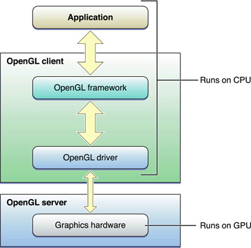

# OpenGL Programming Guide for Mac

> 중요: OpenGL은 macOS 10.14에서 더 이상 사용되지 않는다. GPU에서 고성능 코드를 만드려면 대신 [Metal](https://developer.apple.com/metal) 프레임워크를 사용하라.

OpenGL은 광범위한 산업 지원을 받는 개방형 교차 플랫폼 그래픽 표준이다. OpenGL은 현재와 미래의 하드웨어 가속기의 추상화를 지원하는 성숙하고 잘 문서화된 그래픽 처리 파이프라인을 제공하여 실시간 2D 또는 3D 그래픽 애플리케이션 작성 업무를 대폭 완화한다.

### At a Glance

OpenGL은 다음 이점을 제공하기 때문에 Machintosh 플랫폼에서 그래픽 개발을 위한 훌륭한 선택이다:

* **신뢰할 수 있는 구현.** OpenGL 클라이언트-서버 모델은 하드웨어 세부사항을 추상화하고 모든 호환 하드웨어 및 소프트웨어 구성에 대한 일관된 프레젠테이션을 보장한다. OpenGL의 모든 구현은 OpenGL 사양을 준수하여 일련의 적합성 테스트를 통과해야 한다.
* **성능.** 애플리케이션은 렌더링 속도와 품질을 개선하기 위해 그래픽 하드웨어의 상당한 힘을 활용할 수 있다.
* 산업계 수용. OpenGL의 사양은 업계 컨소시엄인 크로노스 그룹이 관리하는 데, 이 컨소시엄에는 애플을 포함한 컴퓨터 그래픽 업계의 주요 기업들이 다수 포함되어 있다. OX X용 OpenGL 외에도 Windows, Linux, lrix, Solaris 및 많은 게임 콘솔을 위한 OpenGL 구현이 있다.

