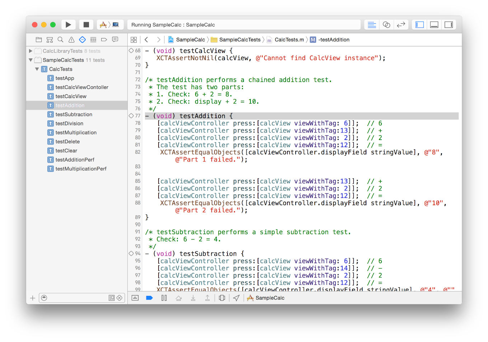

# Testing with Xcode

## Xcode를 사용한 테스팅 

Xcode는 광범위한 소프트웨어 테스트를 위한 기능을 제공한다. 프로젝트를 테스트하면 견고성이 향상되고 버그가 감소하며 제품을 유통 및 판매에 사영할 수 있는 속도가 빨라진다. 예상대로 작동하는 잘 테스트된 앱은 사용자 만족도를 향상시킨다. 테스트는 또한 여러분이 더 적은 노력으로 더 빠르고 더 많이 앱을 개발하는 데 도움을 줄 수 있고, 여러 사람의 개발 노력을 조화롭게 유지하는 데 사용될 수 있다.

### 한눈에

이 문서에서는 Xcode에 포함된 테스트 기능을 사용하는 방법을 배운다. XCTest 프레임워크는 모든 테스트 대상에 의해 자동으로 연결된다.

* **빠른 시작.** Xcode 5와 XCTest 프레임워크의 도입으로 시작하여 테스트 탐색기를 사용하여 테스트를 위한 프로젝트를 구성하는 프로세스가 간소화되고 자동화되어 테스트를 쉽게 시작하고 실행할 수 있다.
* **성능 측정.** Xcode 6 이상에는 기준선에 대한 성능 변화를 측정하고 추적할 수 있는 테스트를 작성할 수 있는 기능이 포함되어 있다.
* **UI 테스팅.** Xcode 7은 앱의 UI를 연습하는 쓰기 테스트를 위한 기능을 추가한다. 그것은 UI 상호작용을 테스트로 변환할 수 있는 소스 코드로 기록하는 기능을 포함한다.
* **지속적인 통합 및 Xcode.** Xcode 테스트는 명령줄 스크립트를 사용하여 실행하거나 Xcode Server를 자동으로 실행하는 Mac의 봇에 의해 실행되도록 구성할 수 있다.

### 선수학습

앱 디자인과 프로그래밍 개념을 숙지해야 한다.

### 참고 항목

Xcode 테스트 기능에 대한 자세한 내용은 WWDC의 다음 세션 비디오를 참조하라.

* WWDC 2013: [Testing in Xcode 5 \(409\)](https://developer.apple.com/videos/wwdc/2013/?id=409)
* WWDC 2014: [Testing in Xcode 6 \(414\)](https://developer.apple.com/videos/wwdc/2014/?id=414)
* WWDC 2015: [UI Testing in Xcode 7 \(406\)](https://developer.apple.com/videos/wwdc/2015/?id=406)
* WWDC 2015: [Continuous Integration and Code Coverage in Xcode 7 \(410\)](https://developer.apple.com/videos/play/wwdc2015/410/)

