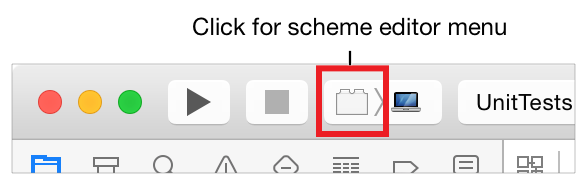
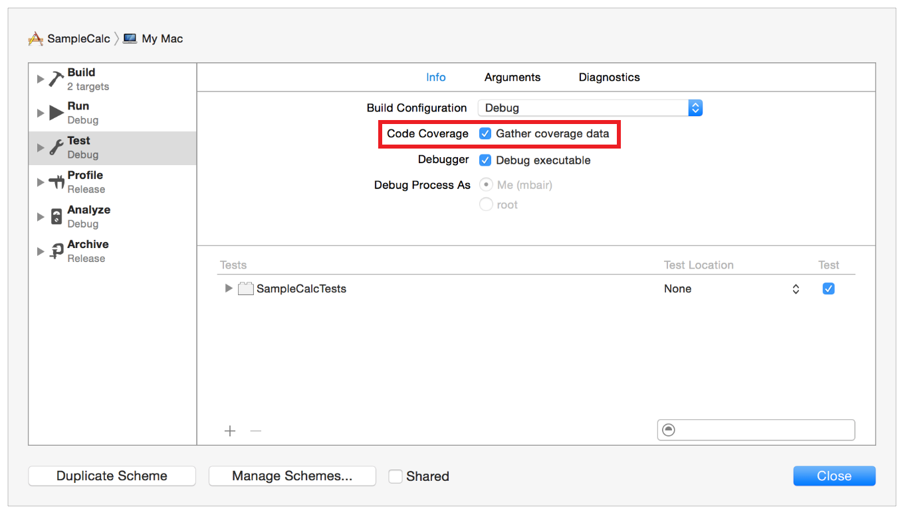
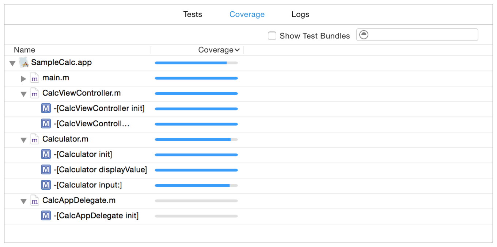
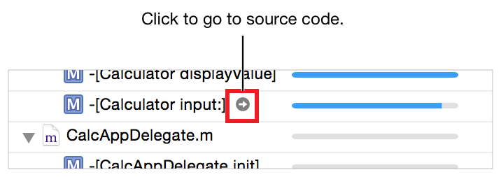
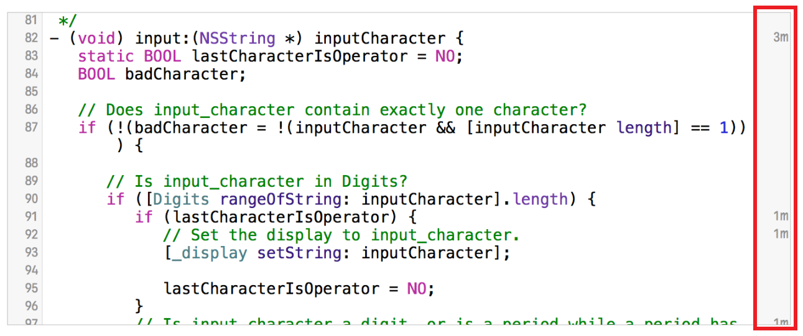
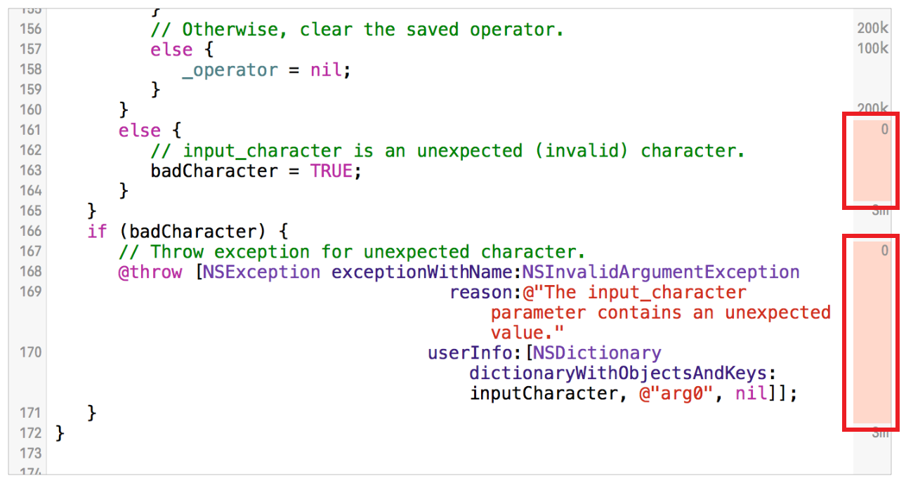

# Code Coverage

코드 커버리지는 Xcode 7의 기능으로, 테스트에 의해 얼마나 많은 코드가 행사되고 있는지를 시각화하고 측정할 수 있다. 코드 커버리지를 통해 테스트가 의도한 작업을 수행하는지 여부를 결정할 수 있다.

### 코드 커버리지 활성화

Xcode의 코드 커버리지는 LLVM에서 지원하는 테스트 옵션이다. 코드 커버리지를 활성화하는 LLVM은 메서드와 함수가 호출되는 빈도에 따라 커버리지 데이터를 수집하는 코드를 계측한다. 코드 커버리지 옵션은 단위 테스트나 UI 테스트에서 정확도 및 성능 테스트에 대해 보고할 데이터를 수집할 수 있다.

스킴의 테스트 액션을 편집하여 코드 커버리지를 활성화한다.

스킴 편집 메뉴에서 Edit Scheme을 선택한다.

Test 액션을 선택한다.

커버리지 데이터를 수집하려면 Code Coverage 체크박스를 활성화한다.

Close를 클릭한다.

> **참고:** 코드 커버리지 데이터 수집은 성능 저하를 초래한다. 패널티가 유무에 관계없이 코드는 선형 방식으로 코드 실행에 영향을 미치므로 성능 결과는 그것이 활성화되었을 때 테스트 실행에서 테스트 실행까지 비교 가능한 수준으로 유지되어야 한다. 그러나 테스트에서 루틴의 성능을 비판적으로 평가할 때 코드 커버리지를 활성화해야 하는지 여부를 고려해야 한다.

### 코드 커버리지가 테스팅에 적합한 방법

코드 커버리지는 테스트의 가치를 측정하는 도구이다. 그것은 질문에 대답한다.

* 테스트를 실행할 때 실제로 실행되고 있는 코드는 무엇인가?
* 얼마나 많은 테스트가 충분한가? 즉, 모든 코드의 정확성과 성능을 점검할 수 있도록 충분한 테스트를 설계했나?
* 코드의 어떤 부분이 테스트되지 않는가?

테스트 실행이 완료된 후 Xcode는 LLVM 커버리지 데이터를 사용하여 커버리지 창에 보이는 리포트 탐색기에서 커버리지 보고서를 작성한다. 테스트 실행에 대한 요약 정보, 파일 내의 소스 파일과 함수의 목록, 각 파일의 커버리지 비율을 보여준다.

소스 편집기는 파일의 각 코드 라인에 대한 카운트를 표시하고 실행되지 않은 코드를 강조 표시한다. 이미 커버된 영역보다 커버리지가 필요한 코드 영역을 강조한다.

예를 들어, 포인터를 위의 커버리지 보고서의 `-[Calculator input:]` 메서드 위에 놓으면 주석을 단 소스 코드로 이동하는 버튼이 나타난다.

커버리지 어노테이션은 오른쪽에 그려지며 테스트 중에 코드의 특정 부분이 몇 번을 hit 하였는지 카운트를 보여준다. 예를 들어:

`input:` 메서드는 위의 카운트에 의해 테스트에서 자주 호출되었다. 그러나 호출되지 않은 메서드의 섹션이 있었다. 그것은 아래와 같이 소스 편집기에 명확하게 표시되어 있다.

이 보고 데이터 및 디스플레이는 오류 처리가 의도한 대로 작동하는지 확인하기 위해 예기치 않거나 잘못된 문자가 포함된 테스트를 작성할 수 있는 기회를 제공한다.

