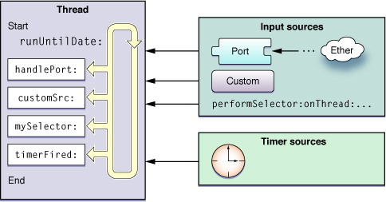

# Run Loops

런 루프는 쓰레드와 관련된 기본 인프라의 일부이다. 런 루프는 작업을 예약하고 들어오는 이벤트의 응답을 조정하는 데 사용하는 이벤트 처리 루프이다. 런 루프의 목적은 할 일이 있을 때 쓰레드를 계속 바쁘게 유지하고 일이 없을 때 쓰레드를 슬립하는 것이다.

런 루프 관리는 완전히 자동화된 것은 아니다. 적절한 시간에 런 루프를 시작하고 들어오는 이벤트에 응답하도록 여전히 쓰레드 코드를 설계해야 한다. 코코아와 코코아 파운데이션 모두 쓰레드의 런 루프를 구성하고 관리하는 데 도움이 되는 런 루프 객체를 제공한다. 애플리케이션이 이러한 객체를 명시적으로 생성할 필요는 없다. 애플리케이션의 메인 쓰레드를 포함한 각 쓰레드에는 관련 런 루프 객체가 있다. 그러나 보조 쓰레드는 해당 런 루프를 명시적으로 실행할 필요가 있다. 애플리케이션 프레임워크는 애플리케이션 시작 프로세스의 일부로 메인 쓰레드에서 런 루프를 자동으로 설정하고 실행한다.

다음 섹션에서는 런 루프와 애플리케이션에 대해 구성하는 방법에 대한 자세한 정보를 제공한다. 런 루프 객체에 대한 자세한 내용은 [_NSRunLoop Class Reference_](https://developer.apple.com/documentation/foundation/nsrunloop) __및 [_CFRunLoop Reference_](https://developer.apple.com/documentation/corefoundation/cfrunloop)를 참조하라.

### Anatomy of a Run Loop

런 루프는 그것의 이름을 듣는 것과 매우 흡사하다. 이것은 당신의 쓰레드가 들어가서 들어오는 이벤트에 대응하여 이벤트 핸들러를 실행하기 위해 사용하는 루프다. 당신의 코드는 런 루프의 일부를 구현하는 데 사용되는 제어문을 제공한다. 즉, 당신의 코드는 런 루프를 구동하는 동안 `while`또는 `for`루프를 제공한다. 루프 내에서 런 루프 객체를 사용하여 이벤트를 수신하고 설치된 핸들러를 호출하는 이벤트 처리 코드를 "실행"하라.

런 루프는 두 가지 다른 유형의 소스로부터 이벤트를 수신한다. _input source_는 비동기 이벤트를 전달하며, 일반적으로 다른 쓰레드 또는 다른 애플리케이션에서 보내는 메시지를 전달한다. _Timer source_는 예약된 시간 또는 반복된 간격에서 발생하는 동기식 이벤트를 전달한다. 두 유형의 소스 모두 애플리케이션별 처리 핸들러를 사용하여 도착 시 이벤트를 처리한다.

Figure 3-1은 런 루프의 개념적인 구조와 다양한 소스를 보여준다. 입력 소스는 해당 핸들러에 비동기 이벤트를 전달하고 종료하기 위해 [`runUntilDate:`](https://developer.apple.com/library/archive/documentation/LegacyTechnologies/WebObjects/WebObjects_3.5/Reference/Frameworks/ObjC/Foundation/Classes/NSRunLoop/Description.html#//apple_ref/occ/instm/NSRunLoop/runUntilDate:)메서드\(쓰레드와 연관된 [`NSRunLoop`](https://developer.apple.com/library/archive/documentation/LegacyTechnologies/WebObjects/WebObjects_3.5/Reference/Frameworks/ObjC/Foundation/Classes/NSRunLoop/Description.html#//apple_ref/occ/cl/NSRunLoop)객체에서 호출\)를 야기한다. 타이머 소스는 처리 핸들러에 이벤트를 전달하지만 런 루프가 종료되도록 하지는 않는다.

**Figure 3-1**  Structure of a run loop and its sources

런 루프는 입력 소스를 처리하는 것 외에도 런 루프의 동작에 대한 통지를 생성한다. 등록된 런 루프 옵저버는 이러한 알림을 수신하여 쓰레드에 대한 추가 처리를 수행할 수 있다. 코어 파운데이션을 사용하여 쓰레드에 런 루프 옵저버를 설치하라.

다음 섹션에서는 런 루프의 구성 요소와 작동 모드에 대한 자세한 정보를 제공한다. 그들은 또한 이벤트 처리 중에 다른 시간에 발생하는 알림을 설명한다.

#### Run Loop Modes

_run loop mode_는 모니터링할 입력 소스와 타이머의 집합이며, 통지할 런 루프 옵저버의 집합이다. 런 루프를 실행할 때마다 실행할 특정 "모드"를 명시적으로 또는 암시적으로 지정한다. 이 런 루프를 통과하는 동안, 해당 모드와 관련된 소스만 모니터링되고 이벤트 전달이 허용된다. \(마찬가지로, 해당 모드와 관련된 관찰자만 실행 루프의 진행 상황을 통지받는다.\) 다른 모드와 관련된 소스는 후속적으로 적절한 모드에서 루프를 통과할 때까지 새로운 이벤트를 유지한다.

당신의 코드에서, 당신은 이름별로 모드를 식별한다. 코코아 및 코어 파운데이션 기본 모드와 일반적으로 사용되는 몇 가지 모드를 정의하고 코드에 해당 모드를 지정하기 위한 문자열을 정의한다. 모드 이름에 대한 사용자 지정 문자열을 지정하기만 하면 사용자 지정 모드를 정의할 수 있다. 사용자 지정 모드에 할당하는 이름은 임의적이지만, 이러한 모드의 내용은 그렇지 않다. 하나 이상의 입력 소스, 타이머 또는 런 루프 옵저버를 사용자가 생성한 모드에 추가하여 유용해야 한다.

특정 통과가 런 루프를 통과하는 동안 원치 않은 소스에서 이벤트를 필터링하기 위해 모드를 사용하라. 대부분의 경우 시스템 정의 "기본" 모드에서 실행될 수 있다. 이 모드에서는 모드 패널과 관련된 소스만 쓰레드에 이벤트를 전달한다. 보조 쓰레드의 경우 사용자 지정 모드를 사용하여 우선순위가 낮은 소스가 시간에 중요한 작업 중에 이벤트를 전송하지 못하도록 할 수 있다.

> **참고**: 모드는 이벤트의 유형이 아니라 이벤트의 소스에 따라 차별화된다. 예를 들어, 마우스 다운 이벤트 또는 키보드 이벤트만 일치시키는 모드를 사용하지 않는다. 모드를 사용하여 다른 포트 집합을 듣거나, 일시적으로 타이머를 중지하거나, 현재 모니터링되고 있는 소스를 변경하고 루프 옵저버를 실행할 수 있다.

Table 3-1은 코코아 및 코어 파운데이션에서 정의한 표준 모드와 해당 모드를 사용하는 시점에 대한 설명을 나열한다. 이름 열에는 코드에 모드를 지정하는 데 사용하는 실제 상수가 나열되어 있다.

**Table 3-1** Predefined run loop modes

<table>
  <thead>
    <tr>
      <th style="text-align:left">Mode</th>
      <th style="text-align:left">Name</th>
      <th style="text-align:left">Description</th>
    </tr>
  </thead>
  <tbody>
    <tr>
      <td style="text-align:left">Default</td>
      <td style="text-align:left">
        
<a href="https://developer.apple.com/library/archive/documentation/LegacyTechnologies/WebObjects/WebObjects_3.5/Reference/Frameworks/ObjC/Foundation/TypesAndConstants/FoundationTypesConstants/Description.html#//apple_ref/c/data/NSDefaultRunLoopMode"><code>NSDefaultRunLoopMode</code></a> (Cocoa)

        
<a href="https://developer.apple.com/documentation/corefoundation/kcfrunloopdefaultmode"><code>kCFRunLoopDefaultMode</code></a> (Core
          Foundation)

      </td>
      <td style="text-align:left">&#xAE30;&#xBCF8; &#xBAA8;&#xB4DC;&#xB294; &#xB300;&#xBD80;&#xBD84;&#xC758;
        &#xC791;&#xC5C5;&#xC5D0; &#xC0AC;&#xC6A9;&#xB418;&#xB294; &#xBAA8;&#xB4DC;&#xB2E4;.
        &#xB300;&#xBD80;&#xBD84;&#xC758; &#xACBD;&#xC6B0; &#xC774; &#xBAA8;&#xB4DC;&#xB97C;
        &#xC0AC;&#xC6A9;&#xD558;&#xC5EC; &#xB7F0; &#xB8E8;&#xD504;&#xB97C; &#xC2DC;&#xC791;&#xD558;&#xACE0;
        &#xC785;&#xB825; &#xC18C;&#xC2A4;&#xB97C; &#xAD6C;&#xC131;&#xD558;&#xB77C;.</td>
    </tr>
    <tr>
      <td style="text-align:left">Connection</td>
      <td style="text-align:left"><a href="https://developer.apple.com/library/archive/documentation/LegacyTechnologies/WebObjects/WebObjects_3.5/Reference/Frameworks/ObjC/Foundation/TypesAndConstants/FoundationTypesConstants/Description.html#//apple_ref/c/data/NSConnectionReplyMode"><code>NSConnectionReplyMode</code></a> (Cocoa)</td>
      <td
      style="text-align:left">&#xCF54;&#xCF54;&#xC544;&#xB294; <a href="https://developer.apple.com/library/archive/documentation/LegacyTechnologies/WebObjects/WebObjects_3.5/Reference/Frameworks/ObjC/Foundation/Classes/NSConnection/Description.html#//apple_ref/occ/cl/NSConnection"><code>NSConnection</code></a> &#xAC1D;&#xCCB4;&#xC640;
        &#xD568;&#xAED8; &#xC774; &#xBAA8;&#xB4DC;&#xB97C; &#xC0AC;&#xC6A9;&#xD558;&#xC5EC;
        &#xC751;&#xB2F5;&#xC744; &#xBAA8;&#xB2C8;&#xD130;&#xB9C1;&#xD55C;&#xB2E4;.
        &#xC774; &#xBAA8;&#xB4DC;&#xB97C; &#xC9C1;&#xC811; &#xC0AC;&#xC6A9;&#xD560;
        &#xD544;&#xC694;&#xB294; &#xAC70;&#xC758; &#xC5C6;&#xB2E4;.</td>
    </tr>
    <tr>
      <td style="text-align:left">Modal</td>
      <td style="text-align:left"><a href="https://developer.apple.com/documentation/appkit/nsmodalpanelrunloopmode"><code>NSModalPanelRunLoopMode</code></a> (Cocoa)</td>
      <td
      style="text-align:left">&#xCF54;&#xCF54;&#xC544;&#xB294; &#xBAA8;&#xB2EC; &#xD328;&#xB110;&#xC744;
        &#xC704;&#xD55C; &#xC774;&#xBCA4;&#xD2B8;&#xB97C; &#xC2DD;&#xBCC4;&#xD558;&#xAE30;
        &#xC704;&#xD574; &#xC774; &#xBAA8;&#xB4DC;&#xB97C; &#xC0AC;&#xC6A9;&#xD55C;&#xB2E4;.</td>
    </tr>
    <tr>
      <td style="text-align:left">Event tracking</td>
      <td style="text-align:left"><a href="https://developer.apple.com/documentation/appkit/nseventtrackingrunloopmode"><code>NSEventTrackingRunLoopMode</code></a> (Cocoa)</td>
      <td
      style="text-align:left">&#xCF54;&#xCF54;&#xC544;&#xB294; &#xB9C8;&#xC6B0;&#xC2A4; &#xD2B8;&#xB798;&#xD0B9;
        &#xB8E8;&#xD504; &#xBC0F; &#xAE30;&#xD0C0; &#xC885;&#xB958;&#xC758; &#xC0AC;&#xC6A9;&#xC790;
        &#xC778;&#xD130;&#xD398;&#xC774;&#xC2A4; &#xCD94;&#xC801; &#xB8E8;&#xD504;
        &#xC911; &#xB4E4;&#xC5B4;&#xC624;&#xB294; &#xC774;&#xBCA4;&#xD2B8;&#xB97C;
        &#xC81C;&#xD55C;&#xD558;&#xAE30; &#xC704;&#xD574; &#xC774; &#xBAA8;&#xB4DC;&#xB97C;
        &#xC0AC;&#xC6A9;&#xD55C;&#xB2E4;.</td>
    </tr>
    <tr>
      <td style="text-align:left">Common modes</td>
      <td style="text-align:left">
        
<a href="https://developer.apple.com/documentation/foundation/runloop/mode/1408609-common"><code>NSRunLoopCommonModes</code></a> (Cocoa)

        
<a href="https://developer.apple.com/documentation/corefoundation/kcfrunloopcommonmodes"><code>kCFRunLoopCommonModes</code></a> (Core
          Foundation)

      </td>
      <td style="text-align:left">&#xC774;&#xAC83;&#xC740; &#xC77C;&#xBC18;&#xC801;&#xC73C;&#xB85C; &#xC0AC;&#xC6A9;&#xB418;&#xB294;
        &#xBAA8;&#xB4DC;&#xC758; &#xAD6C;&#xC131; &#xAC00;&#xB2A5;&#xD55C; &#xADF8;&#xB8F9;&#xC774;&#xB2E4;.
        &#xB610;&#xD55C; &#xC785;&#xB825; &#xC18C;&#xC2A4;&#xB97C; &#xC774; &#xBAA8;&#xB4DC;&#xC5D0;
        &#xC5F0;&#xACB0;&#xD558;&#xBA74; &#xADF8;&#xB8F9;&#xC758; &#xAC01; &#xBAA8;&#xB4DC;&#xC640;
        &#xC5F0;&#xACB0;&#xB41C;&#xB2E4;. &#xCF54;&#xCF54;&#xC544; &#xC560;&#xD50C;&#xB9AC;&#xCF00;&#xC774;&#xC158;&#xC758;
        &#xACBD;&#xC6B0;, &#xC774; &#xC138;&#xD2B8;&#xB294; &#xAE30;&#xBCF8;&#xC801;&#xC73C;&#xB85C;
        &#xB514;&#xD3F4;&#xD2B8;, &#xBAA8;&#xB2EC; &#xBC0F; &#xC774;&#xBCA4;&#xD2B8;
        &#xCD94;&#xC801; &#xBAA8;&#xB4DC;&#xB97C; &#xD3EC;&#xD568;&#xD55C;&#xB2E4;.
        &#xCF54;&#xC5B4; &#xD30C;&#xC6B4;&#xB370;&#xC774;&#xC158; &#xCD08;&#xC5D0;&#xB294;
        &#xAE30;&#xBCF8; &#xBAA8;&#xB4DC;&#xB9CC; &#xD3EC;&#xD568;&#xD55C;&#xB2E4;.
        <a
        href="https://developer.apple.com/documentation/corefoundation/1542137-cfrunloopaddcommonmode"><code>CFRunLoopAddCommonMode</code>
          </a>&#xD568;&#xC218;&#xB97C; &#xC0AC;&#xC6A9;&#xD558;&#xC5EC; &#xC138;&#xD2B8;&#xC5D0;
          &#xC0AC;&#xC6A9;&#xC790; &#xC9C0;&#xC815; &#xBAA8;&#xB4DC;&#xB97C; &#xCD94;&#xAC00;&#xD560;
          &#xC218; &#xC788;&#xB2E4;.</td>
    </tr>
  </tbody>
</table>#### Input Sources

입력 소스는 이벤트를 쓰레드에 비동기적으로 전달한다. 이벤트의 소스는 일반적으로 두 가지 카테고리 중 하나인 입력 소스의 유형에 따라 다르다. 포트 기반 입력 소스는 애플리케이션의 Mach 포트를 모니터링한다. 사용자 정의 입력 소스는 사용자 정의 이벤트 소스를 모니터링한다. 런 루프에 관한 한 입력 소스가 포트기반인지 사용자 지정인지는 중요하지 않다. 이 시스템은 일반적으로 당신이 사용할 수 있는 두 유형의 입력 소스를 그대로 구현한다. 두 소스의 유일한 차이점은 두 소스가 어떻게 신호되는가 하는 것이다. 포트 기반 소스는 커널에 의해 자동으로 시그널링되며, 사용자 지정 소스는 다른 쓰레드에서 수동으로 시그널링되어야 한다.

입력 소스를 생성할 때 하나 이상의 런 루프 모드에 해당 소스를 할당하라. 모드는 주어진 순간에 어떤 입력 소스를 감시하는가에 영향을 미친다. 대부분의 경우 기본 모드에서 실행 루프를 실행하지만 사용자 지정 모드도 지정할 수 있다. 입력 소스가 현재 모니터링 모드에 있지 않으면, 런 루프가 올바른 모드로 실행될 때까지 입력 소스가 생성하는 모든 이벤트가 유지된다.

다음 섹션에서는 입력 소스의 일부를 설명한다.

**Port-Based Sources**

코코아 및 코어 파운데이션은 포트 관련 객체 및 함수를 사용하여 포트 기반 입력 소스를 생성하기 위한 기본 지원을 제공한다. 예를 들어, 코코아에서는 입력 소스를 직접 생성할 필요가 전혀 없다. 포트 객체를 생성하고 [`NSPort`](https://developer.apple.com/documentation/foundation/nsport)의 메서드를 사용하여 해당 포트를 런 루프에 추가하라. 포트 객체는 필요한 입력 소스의 생성 및 설정을 처리한다.

코어 파운데이션에서는 포트와 해당 런 루프 소스를 수동으로 생성해야 한다. 두 경우 모두 포트 불투명 타입\([`CFMachPortRef`](https://developer.apple.com/documentation/corefoundation/cfmachport), [`CFMessagePortRef`](https://developer.apple.com/documentation/corefoundation/cfmessageport), 또는 [`CFSocketRef`](https://developer.apple.com/documentation/corefoundation/cfsocketref)\)과 관련된 함수를 사용하여 적절한 객체를 생성하라.

사용자 지정 포트 기반 소스를 설정하고 구성하는 방법은 [Configuring a Port-Based Input Source](https://developer.apple.com/library/archive/documentation/Cocoa/Conceptual/Multithreading/RunLoopManagement/RunLoopManagement.html#//apple_ref/doc/uid/10000057i-CH16-131281)를 참조하라.

**Custom Input Sources**

사용자 지정 입력 소스를 만들려면 코어 파운데이션의 불투명 타입 [`CFRunLoopSourceRef`](https://developer.apple.com/documentation/corefoundation/cfrunloopsource)와 관련된 함수를 사용해야 한다. 여러 콜백 함수를 사용하여 사용자 지정 입력 소스를 구성한다. 코어 파운데이션은 이러한 함수를 서로 다른 지점에서 호출하여 소스를 구성하고, 들어오는 이벤트를 처리하며, 런 루프에서 제거될 때 소스를 제거한다.

이벤트가 도착할 때 사용자 정의 소스의 동작을 정의하는 것 외에 이벤트 전달 메커니즘도 정의해야 한다. 소스의 이 부분은 별도의 쓰레드에서 실행되며 입력 소스에 데이터를 제공하고 데이터를 처리할 준비가 되었을 때 신호를 보낼 책임이 있다. 이벤트 전달 메커니즘은 당신에게 달려 있지만 지나치게 복잡할 필요는 없다.

사용자 정의 입력 소스를 생성하는 방법에 대한 예는 [Defining a Custom Input Source](https://developer.apple.com/library/archive/documentation/Cocoa/Conceptual/Multithreading/RunLoopManagement/RunLoopManagement.html#//apple_ref/doc/uid/10000057i-CH16-SW3)를 참조하라. 사용자 지정 입력 소스에 대한 참조 정보는 [_CFRunLoopSource Reference_](https://developer.apple.com/documentation/corefoundation/cfrunloopsource-rhr)를 참조하라.

**Cocoa Perform Selector Sources**

코코아는 포트 기반 소스 외에도 쓰레드에서 셀렉터를 수행할 수 있는 사용자 지정 입력 소스를 정의한다. 포트 기반 소스와 마찬가지로 셀렉터 요청을 대상 쓰레드에서 직렬화하여 한 쓰레드에서 여러 메서드를 실행할 때 발생할 수 있는 많은 동기화 문제를 완화한다. 포트 기반 소스와 달리 수행된 선택 소스는 셀렉터를 수행한 후 런 루프에서 자신을 제거한다.

> **참고**: OS X v10.5 이전에는 주로 메인 쓰레드에 메시지를 보내기 위해 선택 도구 소스를 사용했지만, OS X v10.5 이상과 iOS에서는 메시지를 사용하여 어떤 쓰레드로도 메시지를 보낼 수 있다.

다른 쓰레드에서 셀렉터를 수행할 때 대상 쓰레드에는 활성 런 루프가 있어야 한다. 이는 코드가 런 루프를 명시적으로 시작할 때까지 기다린다는 뜻이다. 그러나 메인 쓰레드가 자체 실행 루프를 시작하므로 애플리케이션이이 델리게이트 메서드인 `applicationDidFinishLaunching:`를 호출하는 즉시 해당 쓰레드에 대한 호출을 시작할 수 있다. 런 루프 프로세스는 모든 큐 수행 루프 반복 중에 하나를 처리하기보다는 루프를 통해 매번 셀렉터 호출을 수행한다.

Table 3-2는 `NSObject`에 정의된 메서드를 나열하고 있으며, 다른 쓰레드에서 셀렉터를 수행하는 데 사용할 수 있다. 이러한 메서드는 `NSObject`에 선언되므로 POSIX 쓰레드를 포함하여 Objective-C 객체에 접근할 수 있는 모든 쓰레드에서 사용할 수 있다. 이러한 메서드는 실제로 새로운 쓰레드를 생성하여 셀렉터를 수행하지 않는다.

**Table 3-2** Performing selectors on other threads

<table>
  <thead>
    <tr>
      <th style="text-align:left">Methods</th>
      <th style="text-align:left">Description</th>
    </tr>
  </thead>
  <tbody>
    <tr>
      <td style="text-align:left">
        
<a href="https://developer.apple.com/documentation/objectivec/nsobject/1414900-performselector"><code>performSelectorOnMainThread:withObject:waitUntilDone:</code></a>
        

        
<a href="https://developer.apple.com/documentation/objectivec/nsobject/1411637-performselectoronmainthread"><code>performSelectorOnMainThread:withObject:waitUntilDone:modes:</code></a>
        

      </td>
      <td style="text-align:left">&#xD574;&#xB2F9; &#xC4F0;&#xB808;&#xB4DC;&#xC758; &#xB2E4;&#xC74C; &#xB7F0;
        &#xB8E8;&#xD504; &#xC0AC;&#xC774;&#xD074; &#xB3D9;&#xC548; &#xC560;&#xD50C;&#xB9AC;&#xCF00;&#xC774;&#xC158;&#xC758;
        &#xBA54;&#xC778; &#xC4F0;&#xB808;&#xB4DC;&#xC5D0; &#xC9C0;&#xC815;&#xB41C;
        &#xC140;&#xB809;&#xD130;&#xB97C; &#xC218;&#xD589;&#xD558;&#xB77C;. &#xC774;&#xB7EC;&#xD55C;
        &#xBA54;&#xC11C;&#xB4DC;&#xB97C; &#xC0AC;&#xC6A9;&#xD558;&#xBA74; &#xC140;&#xB809;&#xD130;&#xAC00;
        &#xC218;&#xD589;&#xB420; &#xB54C;&#xAE4C;&#xC9C0; &#xD604;&#xC7AC; &#xC4F0;&#xB808;&#xB4DC;&#xB97C;
        &#xCC28;&#xB2E8;&#xD560; &#xC218; &#xC788;&#xB2E4;.</td>
    </tr>
    <tr>
      <td style="text-align:left">
        
<a href="https://developer.apple.com/documentation/objectivec/nsobject/1414476-performselector"><code>performSelector:onThread:withObject:waitUntilDone:</code></a>
        

        
<a href="https://developer.apple.com/documentation/objectivec/nsobject/1417922-perform"><code>performSelector:onThread:withObject:waitUntilDone:modes:</code></a>
        

      </td>
      <td style="text-align:left"><a href="https://developer.apple.com/library/archive/documentation/LegacyTechnologies/WebObjects/WebObjects_3.5/Reference/Frameworks/ObjC/Foundation/Classes/NSThread/Description.html#//apple_ref/occ/cl/NSThread"><code>NSThread</code></a>&#xAC1D;&#xCCB4;&#xAC00;
        &#xC788;&#xB294; &#xBAA8;&#xB4E0; &#xC4F0;&#xB808;&#xB4DC;&#xC5D0;&#xC11C;
        &#xC9C0;&#xC815;&#xB41C; &#xC140;&#xB809;&#xD130;&#xB97C; &#xC218;&#xD589;&#xD55C;&#xB2E4;.
        &#xC774;&#xB7EC;&#xD55C; &#xBA54;&#xC11C;&#xB4DC;&#xB294; &#xC140;&#xB809;&#xD130;&#xAC00;
        &#xC218;&#xD589;&#xB420; &#xB54C;&#xAE4C;&#xC9C0; &#xD604;&#xC7AC; &#xC4F0;&#xB808;&#xB4DC;&#xB97C;
        &#xCC28;&#xB2E8;&#xD560; &#xC218; &#xC788;&#xB2E4;.</td>
    </tr>
    <tr>
      <td style="text-align:left">
        
<a href="https://developer.apple.com/library/archive/documentation/LegacyTechnologies/WebObjects/WebObjects_3.5/Reference/Frameworks/ObjC/Foundation/Classes/NSObject/Description.html#//apple_ref/occ/instm/NSObject/performSelector:withObject:afterDelay:"><code>performSelector:withObject:afterDelay:</code></a>
        

        
<a href="https://developer.apple.com/library/archive/documentation/LegacyTechnologies/WebObjects/WebObjects_3.5/Reference/Frameworks/ObjC/Foundation/Classes/NSObject/Description.html#//apple_ref/occ/instm/NSObject/performSelector:withObject:afterDelay:inModes:"><code>performSelector:withObject:afterDelay:inModes:</code></a>
        

      </td>
      <td style="text-align:left">&#xB2E4;&#xC74C; &#xB7F0; &#xB8E8;&#xD504; &#xC0AC;&#xC774;&#xD074; &#xB3D9;&#xC548;
        &#xBC0F; &#xC120;&#xD0DD;&#xC801; &#xC9C0;&#xC5F0; &#xC2DC;&#xAC04; &#xD6C4;&#xC5D0;
        &#xD604;&#xC7AC; &#xC4F0;&#xB808;&#xB4DC;&#xC5D0; &#xC9C0;&#xC815;&#xB41C;
        &#xC140;&#xB809;&#xD130;&#xB97C; &#xC218;&#xD589;&#xD558;&#xB77C;. &#xC140;&#xB809;&#xD130;&#xB97C;
        &#xC2E4;&#xD589;&#xD558;&#xAE30; &#xC704;&#xD574; &#xB2E4;&#xC74C; &#xB7F0;
        &#xB8E8;&#xD504; &#xC0AC;&#xC774;&#xD074;&#xAE4C;&#xC9C0; &#xB300;&#xAE30;&#xD558;&#xAE30;
        &#xB54C;&#xBB38;&#xC5D0;, &#xC774; &#xBA54;&#xC11C;&#xB4DC;&#xB4E4;&#xC740;
        &#xD604;&#xC7AC; &#xC2E4;&#xD589; &#xC911;&#xC778; &#xCF54;&#xB4DC;&#xC5D0;&#xC11C;
        &#xC790;&#xB3D9;&#xC73C;&#xB85C; &#xC791;&#xC740; &#xB51C;&#xB808;&#xC774;&#xB97C;
        &#xC81C;&#xACF5;&#xD55C;&#xB2E4;. &#xBCF5;&#xC218;&#xC758; &#xD050;&#xC758;
        &#xC140;&#xB809;&#xD130;&#xB294; &#xC21C;&#xC11C;&#xB300;&#xB85C; &#xD558;&#xB098;&#xC529;
        &#xC218;&#xD589;&#xB41C;&#xB2E4;.</td>
    </tr>
    <tr>
      <td style="text-align:left">
        
<a href="https://developer.apple.com/documentation/objectivec/nsobject/1417611-cancelpreviousperformrequests"><code>cancelPreviousPerformRequestsWithTarget:</code></a>
        

        
<a href="https://developer.apple.com/library/archive/documentation/LegacyTechnologies/WebObjects/WebObjects_3.5/Reference/Frameworks/ObjC/Foundation/Classes/NSObject/Description.html#//apple_ref/occ/clm/NSObject/cancelPreviousPerformRequestsWithTarget:selector:object:"><code>cancelPreviousPerformRequestsWithTarget:selector:object:</code></a>
        

      </td>
      <td style="text-align:left"> <a href="https://developer.apple.com/library/archive/documentation/LegacyTechnologies/WebObjects/WebObjects_3.5/Reference/Frameworks/ObjC/Foundation/Classes/NSObject/Description.html#//apple_ref/occ/instm/NSObject/performSelector:withObject:afterDelay:"><code>performSelector:withObject:afterDelay:</code></a> &#xB610;&#xB294;
        <a
        href="https://developer.apple.com/library/archive/documentation/LegacyTechnologies/WebObjects/WebObjects_3.5/Reference/Frameworks/ObjC/Foundation/Classes/NSObject/Description.html#//apple_ref/occ/instm/NSObject/performSelector:withObject:afterDelay:inModes:"><code>performSelector:withObject:afterDelay:inModes:</code>
          </a>&#xB97C; &#xC0AC;&#xC6A9;&#xD558;&#xC5EC; &#xD604;&#xC7AC; &#xC4F0;&#xB808;&#xB4DC;&#xB85C;
          &#xBCF4;&#xB0B8; &#xBA54;&#xC2DC;&#xC9C0;&#xB97C; &#xCDE8;&#xC18C;&#xD560;
          &#xC218; &#xC788;&#xB2E4;.</td>
    </tr>
  </tbody>
</table>이러한 각 메서드에 대한 자세한 내용은 [_NSObject Class Reference_](https://developer.apple.com/documentation/objectivec/nsobject)를 참조하라.

#### Timer Sources

타이머 소스는 미래에 미리 설정된 시간에 이벤트를 쓰레드에 동기식으로 전달한다. 타이머는 쓰레드가 스스로에게 무언가를 하라고 알리는 방법이다. 예를 들어, 검색 필드는 타이머를 사용하여 사용자로부터 연속적인 키 스트로크 사이에 일정 시간이 지나면 자동 검색을 시작할 수 있다. 이 지연 시간을 사용하면 사용자는 검색을 시작하기 전에 원하는 검색 문자열을 최대한 많이 입력할 수 있다.

비록 그것이 시간 기반 알림을 생성하지만, 타이머는 실시간 메커니즘이 아니다. 입력 소스와 마찬가지로 타이머도 런 루프의 특정 모드와 연관되어 있다. 타이머가 현재 런 루프에 의해 감시되고 있는 모드에 있지 않은 경우, 타이머가 지원하는 모드 중 하나에서 런 루프를 실행할 때까지 점화되지 않는다. 마찬가지로, 런 루프가 핸들러 루틴을 실행하는 도중에 타이머가 점화되면 타이머는 런 루프를 통해 다음 시간까지 대기하여 핸들러 루틴을 호출한다. 런 루프가 전혀 실행되고 있지 않으면 타이머는 절대 점화되지 않는다.

한 번만 또는 반복적으로 이벤트를 생성하도록 타이머를 구성할 수 있다. 반복 타이머는 실제 시작 시간이 아닌 예정된 시작 시간을 기준으로 자동으로 재조정된다. 예를 들어, 타이머가 특정 시간에 그리고 그 후 5초마다 시작하도록 예정인 경우, 실제 시작 시간이 지연되더라도 예정된 시작 시간은 항상 원래 5초 간격으로 떨어진다. 시작 시간이 너무 늦어 예정된 시작 시간을 1회 이상 놓치면 타이머는 놓친 시간 동안 한 번만 시작된다. 놓친 시간 동안 시작한 후에 타이머는 다음 예정된 시작 시간으로 다시 예약된다.

타이머 소스 구성에 대한 자세한 내용은 [Configuring Timer Sources](https://developer.apple.com/library/archive/documentation/Cocoa/Conceptual/Multithreading/RunLoopManagement/RunLoopManagement.html#//apple_ref/doc/uid/10000057i-CH16-SW6)를 참조하라. 참조 정보는 [_NSTimer Class Reference_](https://developer.apple.com/documentation/foundation/timer) __또는 [_CFRunLoopTimer Reference_](https://developer.apple.com/documentation/corefoundation/cfrunlooptimer-rhk)를 참조하라.

#### Run Loop Observers

적절한 비동기 또는 동기 이벤트가 발생할 때 시작되는 소스와는 달리, 루프 옵저버는 런 루프 자체의 실행 중에 특수 위치에서시작한다. 런 루프 옵저버를 사용하여 지정된 이벤트를 처리하기 위해 쓰레드를 준비하거나 쓰레드가 잠자기 전에 쓰레드를 준비할 수 있다. 런 루프 옵저버를 런 루프의 다음 이벤트와 연결할 수 있다:

* 런 루프의 출입구.
* 런 루프가 타이머를 처리하려고 할 때.
* 런 루프가 입력 소스를 처리하려고 할 때.
* 런 루프가 슬립하려고 할 때.
* 런 루프가 깨어났을 때, 그러나 런 루프가 이벤트를 처리하기전에 깨워졌을 때.
* 런 루프의 출구.

코어 파운데이션을 사용하여 앱에 런 루프 옵저버를 추가할 수 있다. 런 루프 옵저버를 작성하려면 [`CFRunLoopObserverRef`](https://developer.apple.com/documentation/corefoundation/cfrunloopobserver)불투명 타입의 새 인스턴스를 작성하라. 이 타입은 사용자 지정 콜백 함수와 관심 있는 활동을 추적한다.

타이머와 마찬가지로 런 루프 옵저버는 한 번 또는 반복해서 사용할 수 있다. 원샷 옵저버는 시작 후 런 루프에서 자신을 제거하는 반면, 반복 옵저버는 여전히 부착되어 있다. 옵저버를 생성할 때 한 번 실행할지 아니면 반복 실행할지 지정하라.

런 루프 옵저버를 생성하는 방법에 대한 예는 [Configuring the Run Loop](https://developer.apple.com/library/archive/documentation/Cocoa/Conceptual/Multithreading/RunLoopManagement/RunLoopManagement.html#//apple_ref/doc/uid/10000057i-CH16-SW18)를 참조하라. 참조 정보는 [_CFRunLoopObserver Reference_](https://developer.apple.com/documentation/corefoundation/cfrunloopobserver)를 참조하라.

#### The Run Loop Sequence of Events

실행할 때마다 쓰레드의 런 루프는 보류 중인 이벤트를 처리하고 연결된 옵저버에 대한 알림을 생성한다. 이 작업을 수행하는 순서는 매우 구체적이며 다음과 같다:

1. 옵저버에게 런 루프가 입력되었음을 알린다.
2. 옵저버에게 모든 준비된 타이머가 곧 시작할 것임을 알린다.
3. 옵저버에게 포트를 기반으로 하지 않는 입력 소스가 곧 시작될 것임을 통지한다.
4. 시작 준비가 된 모든 비 포트 기반 입력 소스를 시작한다.
5. 포트 기반 입력 소스가 준비되어 있고 시작이 대기 중인 경우 이벤트를 즉시 처리하라. 9단계로 이동하라.
6. 옵저버에게 그 쓰레드가 곧 잠들 것이라고 알린다.
7. 다음 이벤트 중 하나가 발생할 때까지 쓰레드를 슬립 상태로 놓아라: - 포트 기반 입력 소스를 위한 이벤트가 도착한다. - 타이머가 시작한다. - 런 루프에 대해 설정된 시간 초과 값이 만료된다. - 런 루프가 분명히 깨어난다.
8. 옵저버에게 쓰레드가 방금 깨어났다고 알려라.
9. 보류 중인 이벤트를 처리하라. - 사용자 정의 타이머가 실행된 경우 타이머 이벤트를 처리하고 루프를 다시 시작하라. 2단계로 이동하라. - 입력 소스가 실행된 경우 이벤트를 전송하라. - 런 루프가 명시적으로 깨어났지만 아직 시간 초과되지않은 경우 루프를 다시 시작하라. 2단계로 이동하라.
10. 옵저버에게 런 루프가 종료되었음을 통지하라.

타이머와 입력 소스에 대한 옵저버 알림은 실제로 그러한 이벤트가 발생하기 전에 전달되기 때문에, 알림 시간과 실제 이벤트의 시간 사이에 간격이 있을 수 있다. 이러한 이벤트 간의 타이밍이 중요한 경우 절전 및 절전 모드에서 해제된 알림을 사용하여 실제 이벤트 간의 타이밍을 상호 연관시킬 수 있다.

런 루프를 실행할 때 타이머와 다른 주기적 이벤트가 전달되기 때문에, 그 루프를 피하면 그러한 이벤트의 전달이 방해된다. 이러한 동작의 일반적인 예는 루프를 입력하고 반복적으로 애플리케이션에 이벤트를 요청하여 마우스 추적 루틴을 구현할 때마다 발생한다. 당신의 코드가 직접 이벤트를 포착하기 때문에, 애플리케이션이 그러한 이벤트를 정상적으로 전송하도록 놔두지 않기 때문에, 당신의 마우스 트래킹 루틴을 종료하고 애플리케이션으로 제어권을 반환할 때까지 활성 타이머는 시작할 수 없을 것이다.

런 루프는 런 루프 객체를 사용하여 명시적으로 깨울 수 있다. 다른 이벤트도 런 루프를 깨울 수 있다. 예를 들어, 다른 비 포트 기반 입력 소스를 추가하면 다른 이벤트가 발생할 때까지 기다리지 않고 입력 소스를 즉시 처리할 수 있도록 런 루프가 해제된다.

